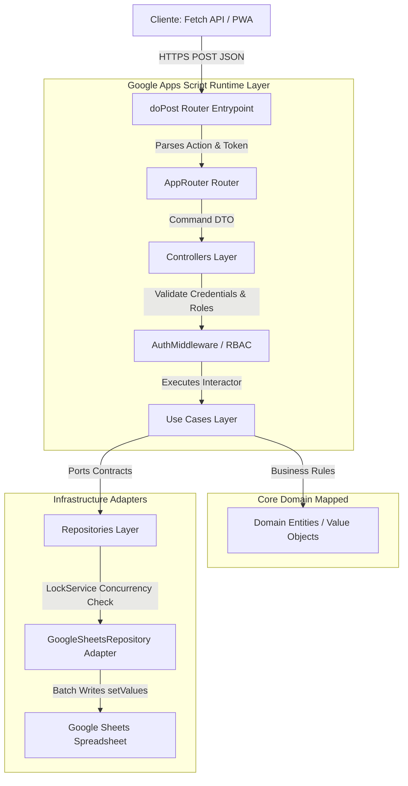

# GUIA DE ARQUITETURA BACK-END GOOGLE APPS SCRIPT
## Camada de Execução Serverless Desacoplada e Alta Confiabilidade (Big Tech Grade)

---

## 1. Arquitetura do Backend & Fluxo das Requisições

Projetamos a infraestrutura do backend no **Google Apps Script (GAS)** sob a ótica de portas e adaptadores (*Hexagonal Architecture*), tratando o GAS estritamente como um ambiente de execução de funções serverless temporárias (*Function as a Service - FaaS*), análogo ao AWS Lambda ou Google Cloud Functions.



### 1.1 Responsabilidades de Camadas
*   **`doPost(e)` Router Entrypoint:** Captura a requisição HTTPS POST em texto plano (evitando *CORS preflight* bloqueantes) e traduz o JSON no envelope DTO padrão.
*   **AppRouter Router:** Encaminha a requisição de acordo com a propriedade `action` contida no payload para o respectivo Controller.
*   **AuthMiddleware / RBAC:** Valida o JWT através de criptografia local em memória sem realizar I/O com a planilha, bloqueando o acesso de pacientes a rotas administrativas.

---

## 2. Organização Física dos Arquivos `.gs` (Apps Script Editor)

Como o editor web nativo do Google Apps Script não aceita subdiretórios físicos, emulamos a árvore lógica de pastas do projeto por meio da **Convenção de Pontos (`Namespace Dot Notation`)** na nomenclatura dos arquivos `.gs`.

```
Planilha vinculada ao Script
├── config.SystemConfiguration.gs ............. (Design tokens e variáveis de ambiente)
├── domain.valueObjects.Email.gs .............. (Value Object imutável de e-mail)
├── domain.valueObjects.UUID.gs ............... (Value Object imutável de UUID)
├── domain.entities.Paciente.gs ............... (Entidade agregada paciente)
├── application.dto.LoginDTO.gs ............... (DTO de autenticação)
├── application.useCases.LoginUseCase.gs ...... (Caso de uso de login)
├── infrastructure.repositories.SheetsRepo.gs . (Base Sheets Repository con LockService)
├── infrastructure.services.TokenService.gs ... (Gerador HMAC-SHA256 JWT)
├── presentation.controllers.AuthController.gs  (Controller de Autenticação)
├── presentation.AppRouter.gs ................. (Router central de requisições)
└── app.main.gs ............................... (doPost, doGet e triggers do GAS)
```

### 2.1 Regra de Nomenclatura e Deploy (ADR 010)
Essa organização garante que o repositório GitHub permaneça estruturado em subpastas limpas de acordo com a Clean Architecture, e no momento do deploy via CLI do **Google Clasp (`npm install -g @google/clasp`)**, o arquivo de configuração `.clasp.json` mapeia e converte a árvore de pastas local do Git nos respectivos nomes pontuados `.gs` no servidor do Google Drive de forma transparente.

---

## 3. Guia de Uso dos Serviços Nativos do Google Apps Script

Mapeamos a utilização dos recursos nativos do ecossistema do Google Workspace para delimitar quando utilizá-los e quando evitar por motivos de cota e performance.

### 3.1 Matriz de Utilização de Recursos GAS

| Recurso GAS | Responsabilidade no Sistema | Quando Utilizar (Best Practices) | Quando Evitar (Anti-patterns) |
| :--- | :--- | :--- | :--- |
| **`SpreadsheetApp`** | Leitura/Escrita física do banco. | Apenas dentro de adaptadores concretos de repositórios, usando `getValues` e `setValues`. | **Nunca** chamar dentro de Use Cases, Controllers ou validações de tela. |
| **`CacheService`** | Memória rápida temporária (TTL). | Guardar dados estáticos de protocolos, sessões válidas JWT e design tokens de layout. | Armazenar dados médicos pessoais sensíveis não criptografados (risco LGPD). |
| **`LockService`** | Exclusão mútua contra concorrência. | Em rotas transacionais de check-in e escrita clínica simultânea. Limite de 10s de espera. | Em rotas puras de leitura de dados (causa fila desnecessária). |
| **`PropertiesService`** | Variáveis de ambiente e segredos. | Reter IDs de planilhas de produção, chaves secretas de assinatura JWT e chaves de APIs. | Gravar dados de histórico ou cadastros de pacientes (limite de 9KB por propriedade). |
| **`MailApp`** | Envio de e-mails do sistema. | Notificações de boas-vindas para novos pacientes e alertas críticos de segurança. | Envio de marketing massivo (limites de cota diária de 100/1500 e-mails do Gmail). |

---

## 4. O Roteador Interno (Router) e Mapeamento de Rotas

O arquivo `presentation.AppRouter.gs` gerencia de forma centralizada o mapa de ações da API.

```typescript
// presentation.AppRouter.gs
import { AuthController } from './controllers/AuthController.js';
import { PatientController } from './controllers/PatientController.js';

export class AppRouter {
  #routes = new Map();

  constructor() {
    this.#setupRoutes();
  }

  #setupRoutes() {
    // Cadastro de Rotas e respectivos métodos controladores
    this.#routes.set('login', (payload) => AuthController.login(payload));
    this.#routes.set('registrarCheckin', (payload) => PatientController.checkin(payload));
    this.#routes.set('criarPaciente', (payload) => PatientController.criar(payload));
  }

  route(action, payload) {
    if (!this.#routes.has(action)) {
      throw new Error(`Rota de ação não encontrada: ${action}`);
    }
    const handler = this.#routes.get(action);
    return handler(payload);
  }
}
```

---

## 5. Estratégia de LockService & Prevenção de Concorrência

Para mitigar conflitos de gravação e inconsistência de dados (como duplicidade de check-ins no mesmo horário), implementamos o **LockService** com timeout estrito.

```
       REQUISITÃO DE CHECK-IN SIMULTÂNEA
       Paciente ──► POST /checkin ──► LockService.getScriptLock() (Adquire bloqueio)
                                              │
                                              ▼ (Lê linha do Sheets)
                                     Existe check-in? ──► Sim ──► Lança CheckinDuplicadoException
                                              │ (Não)
                                              ▼ (Grava no Sheets)
                                     SpreadsheetApp.flush()
                                              │
                                              ▼
                                     lock.releaseLock()
```

### 5.1 Prevenção de Condições de Corrida
1.  **Fila Sequencial:** A chamada `lock.waitLock(10000)` garante que qualquer requisição concorrente aguarde até 10 segundos em fila. Caso o tempo expire, o sistema retorna erro 409 (Conflict), instruindo o cliente a tentar novamente.
2.  **Double-Check na Gravação:** Logo após adquirir o Lock e antes de realizar o append da linha, o repositório realiza um `readAllRows` filtrando pelo ID e horário da dose para garantir que a outra thread que acabou de liberar o lock já não gravou o check-in correspondente.

---

## 6. Triggers e Processamentos em Background

Para contornar o limite de tempo máximo de execução síncrona do Apps Script (6 minutos por requisição), o sistema utiliza **Triggers Schedulers** automatizados para processar tarefas assíncronas em lote.

```
                  TRIGGERS DO APPS SCRIPT
                  
   ┌────────────────────────────────────────────────────────┐
   │ 1. TIME-DRIVEN TRIGGER (A cada 15 minutos)             │
   │  - Varre aba Notificacoes                              │
   │  - Envia lembretes para pacientes com doses atrasadas  │
   └──────────────────────────┬─────────────────────────────┘
                              │
   ┌──────────────────────────▼─────────────────────────────┐
   │ 2. DAILY TRIGGER (Todo dia às 02:00 AM)                │
   │  - Executa rotina de Backup da planilha                │
   │  - Reseta streaks quebrados na aba Gamificacao         │
   └────────────────────────────────────────────────────────┘
```

*   **Evitar Triggers de Planilha (`onEdit`):** Evitamos o uso de triggers simples `onEdit` em produção, pois eles rodam sob privilégios do usuário ativo e falham silenciosamente quando editados via API/Use Cases, dando preferência exclusiva a triggers instaláveis agendados.

---

## 7. Cota, Limites Operacionais & Plano de Mitigação do GAS

O Google Apps Script possui restrições físicas de execução corporativa. Mapeamos as quotas do Google Workspace e desenhamos estratégias de contorno:

*   **Limite de 6 minutos de runtime (Script Timeout):**
    *   *Mitigação:* Processamento em lote de e-mails em blocos curtos de até 20 envios por execução do trigger. Acompanhamento de cursor de paginação física para reiniciar de onde parou no próximo disparo do gatilho cron.
*   **Cota diária de envio de e-mails (Gmail Quota):**
    *   *Mitigação:* O serviço de e-mail é encapsulado em uma interface `NotificationService`. Se o número de pacientes escalar e batermos na cota diária de 100/1500 envios, alteramos apenas o adaptador da infraestrutura para integrar com o SendGrid ou AWS SES via `UrlFetchApp` sem alterar os Casos de Uso.
*   **Limitação de Conexões de Rede Simultâneas:**
    *   *Mitigação:* O frontend executa chamadas otimizadas agregando dados locais, minimizando o volume de requisições de API concorrentes.

---

## 8. Segurança no Backend (OWASP API Top 10 Countermeasures)

Implementamos contramedidas para as principais ameaças de API no ambiente GAS:

*   **Broken Function Level Authorization:** Verificação de privilégios de perfil (`ADMIN` vs `PACIENTE`) encapsulada em um utilitário do `AuthMiddleware`. O token JWT armazena a role de forma criptografada na assinatura HMAC-SHA256, impedindo a manipulação no client-side.
*   **Mass Assignment Protection:** O `GasController` filtra as propriedades de entrada com base nos esquemas definidos pelos DTOs específicos de cada caso de uso, descartando quaisquer chaves indesejadas que tentem injetar valores diretamente nas colunas.

---

## 9. Plano de Escalabilidade: Roteiro Evolutivo

Quando o SaaS atingir volumetria incompatível com as quotas de execução do Google Workspace, a infraestrutura migrará para uma arquitetura nativa em nuvem sem reescrever o domínio do sistema:

```
        FASE 1 (MVP) ──► FASE 2 (Transição de Runtime) ──► FASE 3 (Enterprise Cloud)
        GAS WebApp       FastAPI / Node.js no GCP          NestJS / Spring Boot
        Sheets DB        GCP Cloud Functions               GCP Kubernetes (GKE)
                         Supabase PostgreSQL DB            GCP Cloud SQL (Postgre)
```

Na **Fase 2**, os arquivos `.gs` são migrados diretamente para funções JavaScript executadas no Google Cloud Functions ou AWS Lambda, alterando apenas os adaptadores de I/O do Sheets para PostgreSQL.

---

## 10. Decisões Arquiteturais de Infraestrutura (ADRs)

### ADR 011: Assinatura JWT Local baseada em HMAC-SHA256
*   **Decisão:** Assinar e validar os tokens JWT localmente utilizando a classe `Utilities.computeHmacSignature` com segredo criptográfico armazenado no `PropertiesService`.
*   **Justificativa:** Evita ter que consultar a planilha a cada requisição de API para validar sessões, derrubando o tempo de resposta do servidor e reduzindo o consumo de conexões simultâneas do Sheets.

### ADR 012: Desativação do HtmlService para APIs
*   **Decisão:** Retornar exclusivamente JSON estruturado via `ContentService.createTextOutput` nas requisições do Web App, bloqueando renderizações do `HtmlService` no backend.
*   **Justificativa:** Acelera as respostas de API, reduz o tráfego de dados e previne vulnerabilidades de injeção XSS/HTML no lado do servidor.

---

## 11. Matriz de Maturidade da Arquitetura Google Apps Script

Abaixo, avaliamos o nível de maturidade de engenharia de software da nossa solução em relação a implementações corporativas.

### 11.1 Matriz de Maturidade

```
Nível 1 (Script Macro) ──► Nível 2 (Estruturado) ──► Nível 3 (Modular Clasp) ──► Nível 4 (Big Tech Grade) ──► Nível 5 (Cloud Ready)
                                                                                          ▲
                                                                                [ Nosso Projeto ]
```

*   **Nível 1:** Scripts gravados como macros na planilha, sem controle de versão, lógica misturada com formatação de células, sem segurança ou autenticação.
*   **Nível 2:** Código separado em arquivos `.gs` estruturando funções, mas acoplado com manipulações diretas de planilhas ao longo de todo o fluxo.
*   **Nível 3:** Versionado via Git local, deploy automático com Clasp, mas sem desacoplamento estrito de regras de negócio em relação ao ambiente GAS.
*   **Nível 4 (Nossa Arquitetura):** Nível 3 somado a Clean Architecture rígida, emulação de Namespaces dot-notation, JWT nativo em Apps Script, concorrência blindada por `LockService`, cacheamento otimizado de I/O via `CacheService` e testes offline baseados em Web Web APIs padrão.
*   **Nível 5 (Cloud Ready):** Migração das funções do Apps Script para contêineres Docker executados sob demanda no Google Cloud Run ou AWS Lambda, consumindo bancos relacionais gerenciados.

---
> Guia de Arquitetura Backend do Google Apps Script homologado. Pronto para guiar o desenvolvimento do projeto no servidor.
