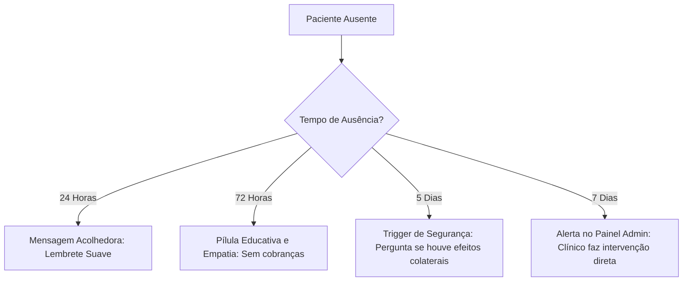

# BEHAVIORAL DESIGN & PATIENT EXPERIENCE HANDBOOK
## Psicologia, Mudança de Comportamento e Adesão Terapêutica de 90 Dias

---

## 1. Framework Científico da Experiência do Paciente

Este manual define a arquitetura comportamental e a estratégia de mudança de hábito para o aplicativo de Acompanhamento Clínico Integrativo. Nosso objetivo é estruturar o aplicativo não como uma ferramenta de controle, mas como um **facilitador de autonomia**, baseado em evidências científicas de psicologia clínica e da saúde.

```
                      ┌────────────────────────────────────────┐
                      │            OPORTUNIDADE                │
                      │  Facilidade física (Interface Limpa)   │
                      │  Janelas de Tolerância de 60 min       │
                      └───────────────────┬────────────────────┘
                                          │
                                          ▼
┌────────────────────────┐    ┌────────────────────────┐    ┌────────────────────────┐
│       CAPACIDADE       │───►│      COMPORTAMENTO     │◄───│       MOTIVAÇÃO        │
│ Física: Sem fricção    │    │   (Check-in Saudável)  │    │ Intrínseca: Autoestima │
│ Cognitiva: Sem spam    │    └────────────────────────┘    │ Extrínseca: XP/Badges  │
└────────────────────────┘                                  └────────────────────────┘
```

### 1.1 Modelo COM-B (Michie et al.)
O comportamento humano ($B$) resulta da interação entre três fatores essenciais:
*   **Capacidade (Capability - $C$):** O aplicativo minimiza a carga cognitiva. Informações são entregues em pílulas diárias de educação em saúde (*Micro-learning*), impedindo a sobrecarga de informações.
*   **Oportunidade (Opportunity - $O$):** Facilidade de acesso físico (PWA responsivo de carregamento instantâneo) e gatilhos que se adaptam dinamicamente à rotina real do paciente.
*   **Motivação (Motivation - $M$):** Estimulada em nível reflexivo (fortalecendo a crença de autoeficácia) e automático (reforços positivos imediatos ao concluir o check-in).

### 1.2 Teoria da Autoeficácia (Albert Bandura)
A adesão ao tratamento depende diretamente da crença do paciente em sua própria capacidade de realizar o protocolo. Nós a fortalecemos através de:
*   **Experiências de Domínio (Mastery Experiences):** Divisão do protocolo de 90 dias em pequenos blocos diários e semanais. Concluir uma "Semana Perfeita" gera a percepção de sucesso acumulativo.
*   **Estados Fisiológicos Acolhidos:** Mensagens adaptativas que normalizam dias de cansaço, mantendo a sensação de progresso ativo mesmo quando o check-in ocorre com atraso.

### 1.3 Terapia de Aceitação e Compromisso (ACT) e Entrevista Motivacional
*   **Acolhimento de Flutuações (Lapse Normalization):** A ausência não é punida. Em vez disso, aplicamos a Entrevista Motivacional: a perda de consistência é tratada como parte natural do ciclo de mudança.
*   **Ações Baseadas em Valores:** O foco da comunicação está no valor pessoal que o tratamento carrega (autoestima, vitalidade, cuidado pessoal), e não na obrigação de seguir regras clínicas.

---

## 2. A Jornada Emocional de 90 Dias: Análise Detalhada das 8 Fases

Mapeamos a jornada em 8 fases emocionais para criar intervenções específicas:

| Fase | Período | Emoções Esperadas | Risco de Abandono | Estratégia Psicológica | Elemento de Interface (UI) |
| :--- | :--- | :--- | :---: | :--- | :--- |
| **1. Expectativa** | Dia 1 | Ansiedade, esperança alta, medo de falhar novamente. | Baixo | Alinhamento de expectativas e onboarding transparente. | Card de progresso doado (*Endowed Progress* de 5%). |
| **2. Empolgação** | Dias 2 a 7 | Determinação, dopamina alta devido ao início recente. | Baixo | Recompensa imediata por cada micro-vitória inicial. | Animação suave de check-in e liberação do nível 2. |
| **3. Dificuldades** | Dias 8 a 15 | Desconforto com a nova rotina, pequenos esquecimentos. | Médio | Normalizar deslizes. Reduzir atrito de registro. | Popup de "Streak Freeze" automático no primeiro erro. |
| **4. Queda de Motivação**| Dias 16 a 30 | Desânimo, questionamento dos resultados invisíveis da pele. | Alto | Mostrar progresso sistêmico oculto (renovação celular). | Pílula educativa: *"O que está acontecendo sob a sua pele hoje"*. |
| **5. Adaptação** | Dias 31 a 45 | Hábito começa a se fixar; sensação de rotina comum. | Médio | Celebrar o marco da metade da jornada (*Peak-End Rule*). | Badge especial "Metade do Caminho" + Gráfico de constância. |
| **6. Confiança** | Dias 46 a 60 | Percepção clara de melhora estética e disposição física. | Baixo | Estimular autoeficácia reflexiva e autocompaixão. | Comparativo visual de dias ativos no calendário. |
| **7. Autonomia** | Dias 61 a 75 | Independência. O check-in ocorre com mínima fricção mental. | Baixo | Transformar motivação externa em identidade interna. | Customização de temas visuais e horários de lembrete. |
| **8. Conclusão** | Dias 76 a 90 | Orgulho, triunfo pessoal, prontidão para a manutenção. | Muito Baixo | Consolidação do aprendizado e transição de ciclo. | Emissão do Certificado Clínico e Protocolo de Manutenção. |

---

## 3. Diretrizes de Comunicação e UX Writing Compassivo

Nossa linguagem é projetada para ser **humana, elegante, científica e acolhedora**, eliminando palavras que denotem culpa, vergonha ou controle clínico absoluto.

### 3.1 Guia de Tom de Voz (Do's e Dont's)
*   **Do:** *"Registrar a sua dose diária é uma demonstração de cuidado com a sua saúde. Como está sendo sua rotina hoje?"* (Promove autonomia e relacionamento).
*   **Don't:** *"Você esqueceu de tomar o seu suplemento! Faça o check-in para não perder a sua sequência perfeita."* (Gera culpa e motivação extrínseca baseada em medo/ansiedade).
*   **Do:** *"Credenciais inválidas. Por favor, verifique se o e-mail ou a senha possuem algum erro de digitação."* (Segurança sem agressividade).
*   **Don't:** *"Senha incorreta! Conta bloqueada por falha crítica."* (Gera pânico).

### 3.2 Banco de UX Writing (Exemplos Variáveis de Mensagens)

```
       ┌────────────────────────┐       ┌────────────────────────┐       ┌────────────────────────┐
       │      BOAS-VINDAS       │       │    RETORNO DE PAUSA    │       │       CONCLUSÃO        │
       │ "Seu tempo é precioso. │       │ "Que bom ver você! O   │       │ "90 dias de cuidado.   │
       │  Esta jornada é sua.   │       │  cuidado não exige     │       │  Você escolheu sua     │
       │  Vamos juntas."        │       │  perfeição."           │       │  saúde todos os dias." │
       └────────────────────────┘       └────────────────────────┘       └────────────────────────┘
```

*   **Lembrete de Ingestão de Suplementos (Manhã):** *"Bom dia, [Nome]. Que tal começar o dia com o seu protocolo de desinflamação? Reserve esse instante para você."*
*   **Lembrete de Ingestão de Suplementos (Noite):** *"Olá, [Nome]. Finalize o dia registrando o seu cuidado clínico de hoje. Desejamos uma noite tranquila."*
*   **Mensagem Pós-Lapse (Ao retornar após 3 dias ausente):** *"Olá! Que bom ter você de volta. Lembra que a nossa jornada é construída passo a passo? Seu progresso continua salvo bem aqui."*
*   **Celebração Mensal (30 Dias):** *"Parabéns, [Nome]. Há 30 dias você escolhe cuidar de si mesma diariamente. A renovação da sua pele é o reflexo da sua constância."*

---

## 4. Protocolo de Resgate de Paciente (Lapse Mitigations)

A ausência de check-ins é tratada de forma escalonada, adaptando o tom de acordo com o tempo decorrido, sempre livre de pressões desnecessárias.



### 4.1 Ações Escalonadas de Resgate
1.  **Ausência de 1 Dia:**
    *   *Trigger:* Sem check-in nas últimas 24 horas.
    *   *Ação:* Lembrete suave no final do dia. *"A rotina corrida às vezes nos afasta do autocuidado. Se conseguir, registre sua dose de hoje."*
2.  **Ausência de 3 Dias:**
    *   *Trigger:* Sem check-in por 72 horas.
    *   *Ação:* Foco em empatia e curiosidade científica. *"Olá, [Nome]. Lembra que o processo de renovação celular é contínuo? Se precisar de ajuda para ajustar o horário das doses, estamos aqui."*
3.  **Ausência de 5 Dias:**
    *   *Trigger:* Sem check-in por 120 horas.
    *   *Ação:* Abordagem baseada em bem-estar e tolerância física. *"Oi, [Nome]. Queremos apenas saber se você está se sentindo bem com as fórmulas do protocolo. Sua segurança é nossa prioridade."*
4.  **Ausência de 7 Dias:**
    *   *Trigger:* Sem check-in por uma semana completa.
    *   *Ação:* Notificação no Painel do Clínico para contato ativo via WhatsApp. A IA sugere uma mensagem de apoio humano direto.

---

## 5. Painel Comportamental do Clínico (Admin Dashboard)

O clínico visualiza a adesão do ponto de vista da psicologia do paciente, identificando perfis de engajamento para realizar intervenções humanas personalizadas.

### 5.1 Classificação de Perfis Comportamentais
*   **Perfil Autônomo Constante (Adesão > 90%):** Paciente com alto índice de autoeficácia. Recebe feedbacks automáticos curtos que reforçam a competência.
*   **Perfil Vulnerável Oscilante (Adesão entre 65% e 80%):** Apresenta múltiplos esquecimentos semanais. A IA sugere ao clínico propor uma simplificação de posologia ou alteração de gatilhos diários.
*   **Perfil em Risco de Evasão (Sem check-ins > 48h ou queda acentuada):** Indica possível intolerância física às fórmulas ou frustração com o ritmo dos resultados. Requer contato humanizado urgente do clínico.

### 5.2 Estrutura do Painel Admin
```
┌────────────────────────────────────────────────────────────────────────┐
│ PAINEL COMPORTAMENTAL DE PACIENTES                                     │
├────────────────────────────────────────────────────────────────────────┤
│ Paciente: Carla Souza        | IAG: 72% (Oscilante)                    │
│ Status: Risco de Evasão (Ausente há 72h)                               │
│                                                                        │
│ [!] SUGESTÃO DE INTERVENÇÃO CLÍNICA:                                   │
│ "Olá Carla, notei que não registrou as últimas doses. Está se sentindo  │
│ confortável com o sabor ou a digestão dos ativos? Me conte como está." │
│ [ Enviar via WhatsApp ]                                                │
└────────────────────────────────────────────────────────────────────────┘
```

---

## 6. Decisões Arquiteturais Comportamentais (ADRs)

### ADR 023: Exclusão de Alarmes Sonoros Repetitivos (Anti-Estresse)
*   **Decisão:** Não implementar alarmes insistentes ou invasivos que interrompam as atividades diárias do paciente.
*   **Justificativa:** Pacientes dermatológicos sofrem com estresse crônico (um dos principais gatilhos para ativação de cortisol e piora de quadros inflamatórios/melasma). Lembretes agressivos geram micro-estresse diário, sabotando o objetivo clínico do tratamento.

### ADR 024: Check-in Simplificado em Bloco
*   **Decisão:** Permitir a marcação rápida de doses do dia ("Marcar todas as pendentes de hoje") com um único toque, mantendo a restrição de retroatividade de dias anteriores.
*   **Justificativa:** Minimiza a fricção de uso (*Habilidade* no modelo de Fogg). Se a paciente tomou os ativos nos horários corretos, mas não pôde abrir o app no momento exato, ela não deve ser punida com múltiplos cliques cansativos no final do dia.

---

## 7. Auditoria e Matriz de Maturidade da Experiência Psicológica

Comparamos a solução de design comportamental proposta com as maiores referências globais de bem-estar digital:

```
Nível 1 (Clínico Frio) ──► Nível 2 (Invasivo) ──► Nível 3 (Gamificado Básico) ──► Nível 4 (Parceiro de Hábitos) ──► Nível 5 (Mindfulness Grade)
                                                                                            ▲
                                                                                    [ Nosso Sistema ]
```

*   **Nível 1 (Clínico Frio - Portais Médicos Padrão):** Foco exclusivo em cobrança clínica. Nenhuma empatia, linguagem fria e punitiva em caso de falhas.
*   **Nível 2 (Invasivo/Ansioso - Apps de Lembrete Genéricos):** Dispara dezenas de alarmes barulhentos por dia. Gera ansiedade e culpa instantânea por falhas.
*   **Nível 3 (Gamificado Básico - Fitbit/MyFitnessPal):** Rastreia estatísticas, mas não aborda as dores emocionais do paciente dermatológico e estético.
*   **Nível 4 (Parceiro de Hábitos - Nosso Sistema / Noom):** Altamente centrado na autonomia, com protocolo de resgate humanizado, mensagens adaptativas anti-culpa baseadas em psicologia positiva, e painel clínico com intervenção humana.
*   **Nível 5 (Mindfulness Grade - Headspace / Calm):** Design de interface focado em desaceleração mental total, transições orgânicas relaxantes e suporte psicológico ativo integrado.

---
> Behavioral Design & Patient Experience Handbook homologado para implementação de interface humanizada e fluxos de retenção acolhedores.
