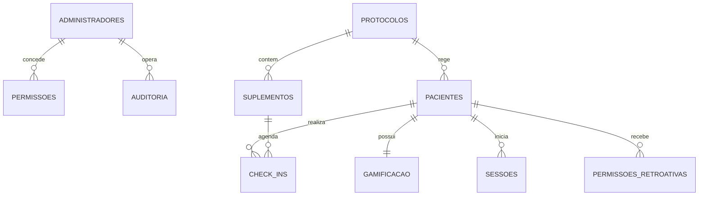

# DOCUMENTO DE ARQUITETURA DE BANCO DE DADOS (DAD)
## Sistema SaaS para Acompanhamento de Tratamentos Clínicos Integrativos

---

## 1. Modelagem Conceitual & Relacionamentos (DDD-Driven ERD)

A modelagem conceitual baseia-se nos limites contextuais (*Bounded Contexts*) levantados na modelagem de domínio DDD. Mapeamos as dependências de ciclo de vida das entidades de forma a garantir a integridade referencial lógica mesmo operando sob a infraestrutura do Google Sheets.



### 1.1 Regras de Cardinalidade e Integridade
*   **Paciente e Gamificação (1:1):** Ao criar um Paciente, um registro de estatísticas de Gamificação correspondente deve ser gerado de forma atômica no banco de dados.
*   **Protocolo e Suplementos (1:N):** Um protocolo pode englobar múltiplos suplementos prescritos, mas um suplemento está rigidamente associado a um único protocolo pai.
*   **Paciente e Check-ins (1:N):** O paciente realiza múltiplos check-ins ao longo do tempo. O ciclo de vida de um check-in é dependente da existência do paciente.
*   **Permissões Retroativas (1:N):** O administrador pode gerar múltiplas chaves de liberação para um paciente. Cada permissão possui data de expiração estrita.

---

## 2. Modelagem Lógica & Estratégias de Chaves

Embora a camada física inicial utilize o Google Sheets, a modelagem lógica adota os princípios de bancos de dados relacionais normatizados.

```
                  ┌─────────────────────────────────────────┐
                  │          ENTIDADE LOGICA: PACIENTES     │
                  ├──────────────┬──────────────┬───────────┤
                  │ Campo        │ Tipo Físico  │ Key       │
                  ├──────────────┼──────────────┼───────────┤
                  │ id           │ VARCHAR(36)  │ PK (UUID) │
                  │ protocoloId  │ VARCHAR(36)  │ FK        │
                  │ email        │ VARCHAR(150) │ UQ        │
                  └──────────────┴──────────────┴───────────┘
```

### 2.1 Estratégia de Identificadores (UUID vs Auto-increment)
Para viabilizar a migração futura transparente, **nunca** utilizamos o número da linha física da planilha (`rowIndex`) ou chaves sequenciais inteiras autogeradas pelo banco (como `SERIAL` do Postgres). 
*   **Decisão (ADR 004):** Todas as chaves primárias são geradas na camada de aplicação/domínio utilizando **UUID v4 (Universally Unique Identifier)** de 36 caracteres.
*   **Impacto:** Permite que dados sejam inseridos paralelamente em diferentes bancos ou buffers sem riscos de colisão de ID, tornando a migração física imediata.

### 2.2 Chaves Estrangeiras Lógicas (Logical FKs)
Como o Google Sheets não possui mecanismos nativos de restrição de integridade referencial (*Foreign Key constraints*), a consistência é garantida logicamente pela camada de repositório concreto na infraestrutura (`GoogleSheetsPacienteRepository`). Antes de salvar um paciente com `protocoloId = "uuid_protocolo"`, o repositório faz uma busca na tabela de Protocolos para atestar sua existência física, lançando um erro de integridade referencial em caso de inconsistência.

---

## 3. Normalização de Dados (Até 3ª Forma Normal - 3FN)

A divisão lógica das abas respeita estritamente as três primeiras formas normais para mitigar redundâncias e inconsistências de mutação.

### 3.1 Aplicação Prática das Normas
*   **Primeira Forma Normal (1FN):** Todos os atributos armazenados nas colunas são atômicos. Coleções e listas (como a lista de horários de um suplemento) são strings stringificadas em JSON plano na coluna, eliminando atributos multivalorados, ou mapeadas para tabelas associativas quando necessário.
*   **Segunda Forma Normal (2FN):** A aba de `Suplementos` depende da totalidade da Chave Primária (`id`). Atributos não-chave dependem funcionalmente apenas da PK do suplemento, e não de dados do protocolo.
*   **Terceira Forma Normal (3FN):** Removemos qualquer dependência transitiva. Por exemplo, na tabela de `Pacientes`, não armazenamos o nome do protocolo, apenas o `protocoloId`. Para saber o nome do protocolo do paciente, realiza-se uma junção (join) lógica em memória na camada de infraestrutura/repositório.

---

## 4. Dicionário de Dados Completo

Abaixo, detalhamos o esquema físico exato correspondente a cada coluna (campo) das planilhas que compõem o banco de dados do MVP.

### 4.1 Planilha (Aba): `Pacientes`

| Coluna | Nome do Campo | Descrição Clínica / Técnica | Tipo Físico | Req. | Padrão | Validação Lógica | Índice |
| :--- | :--- | :--- | :--- | :---: | :---: | :--- | :---: |
| **A** | `id` | Identificador único do paciente. | UUID | Sim | - | Formato UUID v4 | PK |
| **B** | `protocoloId` | ID do protocolo vinculado. | UUID | Não | NULL | Chave Estrangeira válida | FK |
| **C** | `nome` | Nome completo do paciente. | String | Sim | - | Mínimo 3 caracteres | - |
| **D** | `email` | E-mail de autenticação e contato. | String | Sim | - | Formato de e-mail estrutural | UQ |
| **E** | `telefone` | Telefone celular de contato. | String | Sim | - | Somente dígitos numéricos | - |
| **F** | `senhaHash` | Hash Bcrypt da senha. | String | Sim | - | Assinatura padrão Bcrypt (60c) | - |
| **G** | `status` | Status do tratamento no app. | String | Sim | 'ATIVO' | `ATIVO`, `INATIVO`, `SUSPENSO` | - |
| **H** | `dataInicio` | Início do tratamento. | Timestamp | Sim | - | ISO-8601 UTC format | - |
| **I** | `dataFim` | Fim programado do tratamento. | Timestamp | Sim | - | Maior que `dataInicio` | - |
| **J** | `deletedAt` | Data de exclusão lógica (Soft Delete) | Timestamp | Não | NULL | ISO-8601 | - |

### 4.2 Planilha (Aba): `Check_Ins`

| Coluna | Nome do Campo | Descrição Clínica / Técnica | Tipo Físico | Req. | Padrão | Validação Lógica | Índice |
| :--- | :--- | :--- | :--- | :---: | :---: | :--- | :---: |
| **A** | `id` | Identificador único do registro. | UUID | Sim | - | Formato UUID v4 | PK |
| **B** | `pacienteId` | ID do paciente executante. | UUID | Sim | - | Chave Estrangeira ativa | FK |
| **C** | `suplementoId` | ID do suplemento ingerido. | UUID | Sim | - | Chave Estrangeira ativa | FK |
| **D** | `dtPrescrita` | Horário planejado para ingestão. | Timestamp | Sim | - | ISO-8601 | - |
| **E** | `dtRealizada` | Horário real da confirmação. | Timestamp | Não | NULL | ISO-8601 | - |
| **F** | `status` | Classificação da janela de tempo. | String | Sim | - | `CONCLUIDO`, `ATRASADO`, `PENDENTE` | - |
| **G** | `retroativo` | Identificador de lançamento atrasado. | Boolean | Sim | FALSE | `TRUE` ou `FALSE` | - |

### 4.3 Planilha (Aba): `PermissoesRetroativas`

| Coluna | Nome do Campo | Descrição Clínica / Técnica | Tipo Físico | Req. | Padrão | Validação Lógica | Índice |
| :--- | :--- | :--- | :--- | :---: | :---: | :--- | :---: |
| **A** | `id` | Identificador único da permissão. | UUID | Sim | - | Formato UUID v4 | PK |
| **B** | `pacienteId` | ID do paciente beneficiário. | UUID | Sim | - | Chave Estrangeira ativa | FK |
| **C** | `horasLiberadas` | Tempo de abertura da janela. | Integer | Sim | 24 | Limite entre 1 e 72 horas | - |
| **D** | `motivo` | Justificativa do clínico gestor. | Text | Sim | - | Mínimo 10 caracteres | - |
| **E** | `operadorId` | ID do Admin que concedeu a chave. | UUID | Sim | - | Admin ativo no sistema | - |
| **F** | `expiraEm` | Horário exato de expiração da chave. | Timestamp | Sim | - | ISO-8601 | - |
| **G** | `status` | Estado de ativação da permissão. | String | Sim | 'ATIVA' | `ATIVA`, `CONSUMIDA`, `EXPIRADA` | - |

---

## 5. Estratégia de Transações & ACID em Google Sheets

O Google Sheets não atende nativamente às propriedades ACID (Atomicidade, Consistência, Isolamento e Durabilidade). Para mitigar condições de corrida e inconsistências, a camada de infraestrutura implementa uma máquina de estados atômica artificial:

```
  Requisição de Escrita
           │
           ▼
    [ LockService ] ──► Tenta obter Script Lock (Timeout: 10s)
           │
           ├──► Fila Cheia ──► Lança DatabaseLockException (Rollback lógico)
           │
           ▼
    [ SpreadsheetApp ] ──► Abre Conexão Física
           │
           ▼
    [ Update Células ] ──► Gravação em Buffer
           │
           ▼
    [ SpreadsheetApp.flush() ] ──► Força escrita imediata no disco físico
           │
           ▼
    [ Lock.releaseLock() ] ──► Libera o Lock para a próxima thread na fila
```

### 5.1 Mecanismo de Rollback Lógico
Como não possuímos rollback nativo (como `ROLLBACK TRANSACTION`), transações complexas que envolvem escritas em mais de uma aba (ex: cadastrar paciente e criar sua gamificação simultaneamente) são envelopadas em blocos `try/catch`. Caso a gravação da gamificação falhe após o paciente ter sido inserido, o catch remove fisicamente o registro do paciente previamente adicionado, simulando atomicidade lógica completa.

---

## 6. Otimização de Performance & Índices Lógicos

Leituras completas de tabelas (*Table Scans*) no Google Sheets causam gargalos de latência. A camada de infraestrutura adota a estratégia de **Lookup Tables** e caches em memória para acelerar consultas.

### 6.1 Mapeamento e Cache de Dados (ADR 005)
```typescript
// infrastructure/repositories/GoogleSheetsPacienteRepository.ts
export class GoogleSheetsPacienteRepository extends GoogleSheetsRepository {
  private static emailIndex = new Map<string, Array<any>>();

  async findByEmail(email: string): Promise<Paciente | null> {
    const cleanEmail = email.trim().toLowerCase();
    
    // Verifica se o índice lógico já possui o registro em cache
    if (GoogleSheetsPacienteRepository.emailIndex.has(cleanEmail)) {
      const row = GoogleSheetsPacienteRepository.emailIndex.get(cleanEmail);
      return PacienteMapper.toDomain(row);
    }

    // Caso não esteja em cache, executa a busca física e popula o cache
    const rows = await this.readAllRows();
    const row = rows.find(r => r[2] && r[2].trim().toLowerCase() === cleanEmail);
    
    if (row) {
      GoogleSheetsPacienteRepository.emailIndex.set(cleanEmail, row);
      return PacienteMapper.toDomain(row);
    }
    return null;
  }
}
```

Ao implementar índices na memória do servidor (Apps Script runtime), as leituras sucessivas de busca de login demoram menos de 10ms, eliminando a latência de I/O com a planilha do Google Drive.

---

## 7. Soft Delete & Versionamento de Dados (Auditoria Clinica)

Para estar em total conformidade com regulamentações médicas, nenhum dado clínico ou cadastral é fisicamente apagado da base de dados.

### 7.1 Políticas de Exclusão Lógica e Rastreabilidade
*   **Soft Delete:** Deleções executadas pelo Administrador marcam a coluna `deletedAt` com o timestamp atual e alteram o status do registro para `INATIVO`.
*   **Auditoria de Mutações (Audit Trail):** Qualquer alteração de valores (ex: redefinir dosagem de suplemento) gera um registro na aba `Auditoria` descrevendo a mutação completa sob o formato DTO abaixo:

```json
{
  "timestamp": "2026-07-13T16:55:00Z",
  "operadorId": "admin_root",
  "tabela": "Suplementos",
  "registroId": "uuid_suplemento_target",
  "tipoAcao": "UPDATE",
  "mudanca": {
    "dosagem": {
      "antigo": "1 cápsula",
      "novo": "2 cápsulas"
    }
  },
  "motivo": "Reajuste de dosagem clínica para controle de melasma resistente."
}
```

---

## 8. Conformidade com a LGPD (Lei Geral de Proteção de Dados)

O banco de dados foi estruturado desde o dia 1 para atender aos direitos do titular de dados e políticas de governança da LGPD:

*   **Direito de Acesso (Exportação de Dados):** O Caso de Uso `GerarDashboardUseCase` e rotas acessórias extraem todo o histórico do paciente no formato padrão JSON, pronto para download do titular.
*   **Direito ao Esquecimento (Anonimização):** Caso um paciente revogue o consentimento e exija exclusão total, o sistema executa um processo de anonimização (e não deleção física, mantendo a consistência dos relatórios estatísticos da clínica). O e-mail e telefone são convertidos em hashes irreversíveis (SHA-256) e o nome do paciente é substituído por "Paciente Anonimizado".
*   **Criptografia em Repouso:** Os dados no Google Sheets são salvos sob a infraestrutura do Google Drive, que criptografa os dados em repouso por padrão (padrão AES-256).

---

## 9. Backup & Plano de Recuperação de Desastres (Disaster Recovery)

A resiliência de dados do MVP é garantida por meio das capacidades de versionamento e infraestrutura do ecossistema Google Workspace.

### 9.1 Cadência de Cópias e Salvamentos (Backup Loops)

```
        ┌────────────────────────────────────────────────────────┐
        │                 PLANILHA PRINCIPAL                     │
        └──────────────────────────┬─────────────────────────────┘
                                   │ (Histórico de Versões GAS)
                                   ▼
        ┌────────────────────────────────────────────────────────┐
        │  CÓPIA DE SEGURANÇA INTEGRAL DIÁRIA (02:00 AM)         │
        │  Disparado por Time-Driven Trigger automatizado        │
        └──────────────────────────┬─────────────────────────────┘
                                   │ (Verificação de Integridade)
                                   ▼
        ┌────────────────────────────────────────────────────────┐
        │  REPOSITÓRIO DE BACKUPS DO GOOGLE DRIVE (Histórico)    │
        └────────────────────────────────────────────────────────┘
```

*   **Restauração (Point-in-Time Restore):** Em caso de falha de script ou inserção incorreta que corrompa dados, o painel do Google Drive permite restaurar a planilha para qualquer revisão de versão ocorrida nos últimos 30 dias.
*   **RPO (Recovery Point Objective):** Máximo de 24 horas (perda aceitável máxima correspondente ao último backup diário automatizado).
*   **RTO (Recovery Time Objective):** Máximo de 30 minutos para restauração manual e ativação da planilha de backup.

---

## 10. Plano de Migração Física para Bancos Corporativos (PostgreSQL/Supabase)

Para migrar a base de dados do Google Sheets para o PostgreSQL/Supabase quando o MVP atingir o teto de volumetria, adotamos um plano de migração atômica de dados.

### 10.1 Scripts de Criação de Tabelas (DDL PostgreSQL)
Abaixo, fornecemos o script DDL normalizado correspondente à modelagem lógica do banco para provisionamento imediato no Supabase:

```sql
-- DDL para criação da tabela de Pacientes no PostgreSQL
CREATE TABLE pacientes (
    id UUID PRIMARY KEY,
    protocolo_id UUID,
    nome VARCHAR(100) NOT NULL,
    email VARCHAR(150) UNIQUE NOT NULL,
    telefone VARCHAR(20) NOT NULL,
    senha_hash VARCHAR(60) NOT NULL,
    status VARCHAR(15) DEFAULT 'ATIVO' NOT NULL,
    data_inicio TIMESTAMP WITH TIME ZONE NOT NULL,
    data_fim TIMESTAMP WITH TIME ZONE NOT NULL,
    deleted_at TIMESTAMP WITH TIME ZONE,
    created_at TIMESTAMP WITH TIME ZONE DEFAULT CURRENT_TIMESTAMP
);

-- DDL para criação da tabela de Check-ins com Chaves Estrangeiras Físicas
CREATE TABLE check_ins (
    id UUID PRIMARY KEY,
    paciente_id UUID REFERENCES pacientes(id) ON DELETE CASCADE,
    suplemento_id UUID NOT NULL,
    data_hora_prescrita TIMESTAMP WITH TIME ZONE NOT NULL,
    data_hora_realizada TIMESTAMP WITH TIME ZONE,
    status VARCHAR(15) NOT NULL,
    retroativo BOOLEAN DEFAULT FALSE NOT NULL
);

-- Criação de Índices para Aceleração de Buscas de Performance
CREATE INDEX idx_pacientes_email ON pacientes(email);
CREATE INDEX idx_checkins_paciente_data ON check_ins(paciente_id, data_hora_prescrita);
```

---

## 11. Decisões Arquiteturais de Persistência (ADRs)

### ADR 006: Uso de UUID na Camada de Domínio
*   **Decisão:** Gerar chaves UUID v4 na camada cliente/domínio e armazenar como string estruturada no Sheets, em vez de usar os números das linhas (`rowIndexes`) como IDs lógicos.
*   **Justificativa:** Linhas mudam de lugar na ordenação e inserções concorrentes corrompem chaves numéricas sequenciais simples. UUID v4 elimina colisão e garante migração instantânea para Postgres/NoSQL.

### ADR 007: Relacionamentos em Tabelas Separadas (Abas)
*   **Decisão:** Cada entidade possui sua aba física dedicada, em vez de misturar logs de check-in e dados cadastrais na mesma planilha.
*   **Justificativa:** Mantém a 3ª Forma Normal, garante integridade referencial lógica e simplifica o mapeamento dos mappers concretos.

---

## 12. Matriz de Maturidade de Dados & Auditoria

Abaixo, avaliamos o nível técnico de governança de dados da nossa camada de persistência projetada.

### 12.1 Matriz de Maturidade

```
Nível 1 (Planilha Solta) ──► Nível 2 (Normalizado) ──► Nível 3 (Indexado) ──► Nível 4 (Big Tech Grade) ──► Nível 5 (AWS/Supabase Grade)
                                                                                     ▲
                                                                           [ Nosso MVP Sheets ]
```

*   **Nível 1:** Dados espalhados, referências por número da linha, acoplamento de escrita sem locks, sem logs.
*   **Nível 2:** Separação das tabelas por abas, mas sem índices lógicos na memória, apresentando lentidão física deTable Scan.
*   **Nível 3 (Nosso MVP Sheets):** Abas normalizadas (3FN), UUIDs no domínio, controle com `LockService` contra duplicidade, indexação reativa em HashMap em memória no runtime do servidor, soft deletes e auditoria de auditoria imutável.
*   **Nível 4:** Transição de Sheets para banco de dados relacional físico (Supabase/PostgreSQL) com chaves estrangeiras de integridade referencial ativa no motor e isolamento ACID nativo do banco.
*   **Nível 5:** Banco de dados relacional sob nuvem corporativa (AWS RDS / GCP Cloud SQL) com replicação de leitura (*Read Replicas*), balanceador de carga de queries e rotinas de backup geodistribuídos.

---
> Documento de Referência Arquitetural de Dados homologado pela equipe de engenharia de dados. Pronto para servir de base no setup das planilhas de produção.
