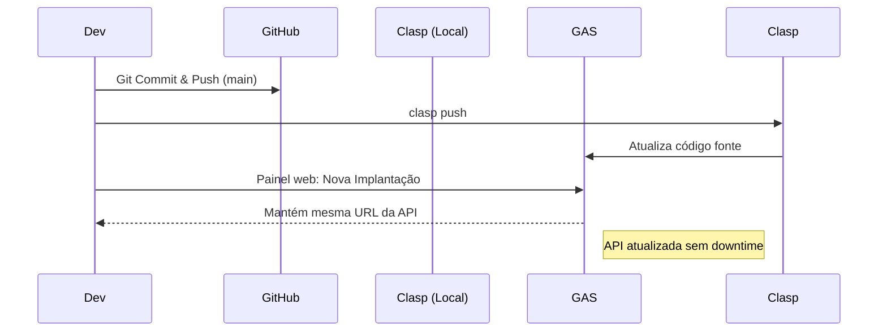

# 🚀 Deployment Bible & Operations Manual (Módulo 21)

> **Documento Definitivo de Implantação e Operação**
> Elaborado por: Principal SREs, DevOps Engineers e System Architects.
> Este manual descreve o processo de deploy, do zero (máquina vazia) à produção, garantindo que qualquer desenvolvedor consiga publicar e operar o Acompanhamento Clínico Integrativo.

---

## 🏗️ CAPÍTULO 1 — VISÃO GERAL

A arquitetura atual foi projetada para ser **Serverless e Gratuita (Tier 0)** na sua versão inicial (MVP/V1), utilizando as ferramentas do ecossistema Google e GitHub. 

```mermaid
flowchart TD
    subgraph "Camada de Apresentação"
        C[Cliente (Navegador/Celular)]
        PWA[Service Worker (Offline)]
        C <--> PWA
    end

    subgraph "Hospedagem Frontend"
        GHP[GitHub Pages]
    end

    subgraph "Camada de Lógica (Backend Serverless)"
        GAS[Google Apps Script - Web App]
        GC[GasController]
        GR[GasRouter]
        UC[Use Cases]
        GAS --> GC --> GR --> UC
    end

    subgraph "Camada de Dados"
        GS[(Google Sheets)]
    end

    C -- "HTTPS GET (Baixa estáticos)" --> GHP
    C -- "HTTPS POST (text/plain)" --> GAS
    UC -- "Sheets API" --> GS
```

**Motivo da Arquitetura:** Minimizar custos infraestruturais iniciais enquanto o produto prova product-market fit, mantendo uma fundação de **Clean Architecture** que permite migrar o backend (GAS → Node.js) e o banco (Sheets → PostgreSQL) sem alterar as regras de negócio.

---

## 🛠️ CAPÍTULO 2 — PRÉ-REQUISITOS

Para realizar o deploy e manutenção do sistema, prepare o ambiente de desenvolvimento:

1. **Google Chrome** (Navegador principal para dev/testes, com DevTools).
2. **VSCode (Visual Studio Code):** Editor de código oficial.
3. **Git:** Instalado e configurado com sua chave SSH ou token.
4. **Node.js (LTS):** Requerido futuramente para linting, tooling e migração.
5. **Contas Necessárias:**
   - Conta Google (Preferencialmente Workspace, mas funciona com Gmail padrão para a clínica).
   - Conta GitHub.
6. **Extensões VSCode Recomendadas:**
   - ESLint
   - Prettier - Code formatter
   - Google Apps Script (clasp)
   - Live Server (para testar frontend localmente)

---

## 📂 CAPÍTULO 3 — ESTRUTURA DO PROJETO

A estrutura atual do repositório deve refletir a seguinte árvore:

```text
/
├── frontend/             # SPA Vanilla JS
│   ├── index.html        # Entrypoint e App Shell
│   ├── src/              # Source code do frontend (API, componentes, páginas)
│   └── assets/           # Imagens e ícones (PWA)
├── backend/              # Lógica de negócio e API
│   ├── src/
│   │   ├── app/          # Entrypoints do GAS (main.js)
│   │   ├── application/  # Use Cases e Interfaces (Clean Arch)
│   │   ├── domain/       # Entidades, Value Objects e Eventos
│   │   ├── infrastructure/# Repositórios (Sheets), Services (Crypto, Token)
│   │   └── shared/       # Configurações e Utilitários (Sanitização)
│   └── tests/            # Testes locais (run_tests.js)
├── Documentação/         # Handbooks e arquitetura
└── manual/               # Portal de documentação HTML iterativo
```

---

## 🐙 CAPÍTULO 4 — GITHUB

O GitHub atua como fonte de verdade do código e provedor de hospedagem para o frontend.

### Passo a Passo:
1. **Criar Repositório:** Crie um repositório privado (ex: `clinica-integrativa-saas`).
2. **Configurar README.md:** Essencial para onboarding. Deve conter Badges, Setup e Contato.
3. **Branches:**
   - `main`: Reflete o código em produção.
   - `develop`: Código em homologação/teste.
4. **Proteção de Branch:** Em `Settings > Branches`, proteja a `main`: exija PRs e proíba force pushes.
5. **.gitignore:** Garanta que arquivos de sistema (`.DS_Store`, `node_modules`, chaves temporárias locais) sejam ignorados.
6. **GitHub Pages:**
   - Vá em `Settings > Pages`.
   - Source: Deploy from a branch.
   - Branch: `main`, folder: `/ (root)` ou `/frontend` (dependendo de como você empacota). *(Recomendado: servir a partir da raiz com symlinks ou build step futuro, mas por enquanto, sirva a pasta onde está o index.html)*.
   - Force HTTPS.

---

## 📊 CAPÍTULO 5 — GOOGLE SHEETS

A planilha atua como banco de dados.

### Configuração Inicial:
1. Acesse `sheets.google.com` e crie uma planilha: **"Banco de Dados - Clínica"**.
2. **Abas Obrigatórias (Devem ter o nome exato para os repositórios funcionarem):**
   - `Pacientes`
   - `Check_Ins`
   - `Gamificacao`
   - `Protocolos`
   - `Suplementos`
   - `Permissoes`
   - `Logs_Auditoria`

### Estrutura de Colunas Críticas:
*Sempre a primeira linha (Row 1) é o Cabeçalho.*
- **Pacientes:** `ID` (A), `Nome` (B), `Email` (C), `SenhaHash` (D), `Telefone` (E), `Status` (F), `DataCriacao` (G).
- **Check_Ins:** `ID` (A), `PacienteID` (B), `SuplementoID` (C), `DataHoraPrescrita` (D), `DataHoraRealizada` (E), `Status` (F).

### Permissões e Segurança:
- A planilha **NÃO PODE** ser pública.
- Apenas o administrador (Conta Google que fará o deploy do Apps Script) deve ter permissão de Edição.
- Oculte (Hide) a planilha da interface principal se possível, para evitar edições manuais acidentais que quebrem a integridade referencial.

---

## ⚙️ CAPÍTULO 6 — GOOGLE APPS SCRIPT

Onde a "mágica" do backend acontece.

### Passo a Passo (Deploy Manual Seguro):
1. Na planilha, clique em `Extensões > Apps Script`.
2. Renomeie o projeto para **"API Clínica Integrativa"**.
3. **Módulos:** Você deve replicar a estrutura da pasta `backend/src/` no editor do GAS.
   - *Nota de Engenharia:* Como o GAS padrão achata os arquivos, você pode usar um empacotador (como Rollup) futuramente, ou copiar arquivo por arquivo garantindo que `main.js` seja exposto globalmente. A ordem de declaração das classes importa no GAS se não estiver usando módulos ES6 empacotados.
4. **Propriedades do Script (Variáveis de Ambiente):**
   - Vá em `Configurações (engrenagem) > Propriedades do script`.
   - Adicione `JWT_SECRET` = `[sua-chave-forte-gerada-aleatoriamente]`.
   - Adicione `DATABASE_SPREADSHEET_ID` = `[id-da-sua-planilha]`.
   *(Isso resolve a vulnerabilidade crítica apontada na auditoria).*

---

## 🌐 CAPÍTULO 7 — WEB APP (Deploy Backend)

### Publicando a API:
1. No editor do Apps Script, clique em **Implantar > Nova implantação**.
2. Tipo: **App da Web (Web App)**.
3. Descrição: `v1.0.0 - Release de Produção`.
4. **Executar como:** `Eu (seu-email@gmail.com)` — *Crucial: isso permite que pacientes sem conta Google escrevam na planilha usando sua permissão de forma abstrata.*
5. **Quem pode acessar:** `Qualquer pessoa` (Any).
6. **Autorizar acessos:** O Google pedirá para revisar permissões. Clique em "Avançado > Acessar (inseguro)" e conceda permissão de leitura/escrita no Sheets.
7. Ao finalizar, copie a **URL do App da Web** (`https://script.google.com/macros/s/.../exec`). Esta é sua **API_BASE_URL**.

---

## 🔌 CAPÍTULO 8 — CONEXÃO FRONTEND

Com a URL do backend em mãos, conecte o frontend.

### Configuração:
1. No código fonte local, abra `frontend/src/shared/config/SystemConfiguration.js` (ou onde o frontend guarda a config).
2. Configure a `API_BASE_URL` ou crie um mecanismo de inicialização para definir isso (como o localStorage apontado no `ApiClient.js`, embora deva ser fixado em build/código para evitar XSS).
3. **Mecanismo de Conexão:**
   - O `ApiClient.js` utiliza requisições `POST` com body json stringificado via `text/plain` para contornar o CORS Preflight (limitação do GAS).
   - O JWT é enviado dentro do payload `{"token": "..."}` em vez do header `Authorization` (GAS lida mal com custom headers no CORS nativo).

---

## 🚀 CAPÍTULO 9 — GITHUB PAGES (Deploy Frontend)

1. Faça o commit da `API_BASE_URL` atualizada no repositório.
2. Push para a branch `main`.
3. O GitHub Pages fará o build/deploy automático (se configurado nas Actions) ou deploy direto da branch.
4. Acesse a URL do GitHub Pages (ex: `https://seu-usuario.github.io/clinica-integrativa-saas/frontend/`).
5. **Domínio Customizado (Opcional):**
   - No GitHub Settings > Pages, insira seu domínio (ex: `app.suaclinica.com.br`).
   - Configure o CNAME no seu provedor de DNS.
   - Habilite "Enforce HTTPS".

---

## 📱 CAPÍTULO 10 — PWA (Progressive Web App)

Para que o app se comporte como um aplicativo nativo no iOS e Android:

1. **Manifest.json:** Na raiz do frontend, garanta que existe um `manifest.json` válido (ícones 192x192 e 512x512, `display: standalone`, `theme_color`).
2. **Service Worker (SW):** O SW deve interceptar requisições para oferecer suporte offline.
3. **Instalação:** Quando o paciente abrir no Safari/Chrome móvel, a opção "Adicionar à Tela de Início" aparecerá.

---

## 🔔 CAPÍTULO 11 — NOTIFICAÇÕES

*Fase 1 (Atual):* Notificações são intra-app. Aparecem no Dashboard ou disparam eventos visuais/sonoros (AudioContext chime) no momento do check-in.
*Fase Futura:* Web Push API. Como o iOS agora suporta Web Push, o Service Worker será atualizado para receber pushes do servidor (exige Firebase Cloud Messaging ou VAPID backend Node).

---

## 👤 CAPÍTULO 12 — O PRIMEIRO PACIENTE (Onboarding)

### Procedimento do Admin:
1. O administrador acessa a URL do sistema (GitHub Pages).
2. Faz login com o e-mail de admin (configurado no backend/PropertiesService).
3. Acessa o **Painel Administrativo**.
4. Clica em "Novo Paciente".
5. Preenche Nome, E-mail e Telefone.
6. O sistema dispara a rotina: cria a entidade `Paciente`, gera senha temporária, dispara o evento `PacienteCriadoEvent`.
7. **Importante:** A senha temporária deve ser repassada ao paciente via canal seguro (WhatsApp/Telegram), visto que o envio de e-mail automático via GAS pode cair em spam.

---

## 🔑 CAPÍTULO 13 — O PRIMEIRO LOGIN

### Procedimento do Paciente:
1. O paciente recebe o link (PWA) e suas credenciais.
2. Na tela inicial, insere o e-mail e a senha temporária.
3. *Boas Práticas:* O sistema o forçará a aceitar os termos (futuro LGPD consent) e recomenda-se trocar a senha.
4. O Dashboard do Paciente carrega: Skeleton loader → Fetch na API → Dados (Gamificação, Protocolos) → Renderiza UI de Hoje.

---

## 🧪 CAPÍTULO 14 — TESTES EM PRODUÇÃO

Assim que estiver no ar, realize um **Sanity Check**:
1. Login Admin → Passou?
2. Criar Paciente Dummy → Passou?
3. Logout Admin, Login Dummy → Passou?
4. Tentar fazer um check-in de suplemento → Passou? (Ouvir o áudio de confirmação).
5. Observar se o "Streak" aumentou.
6. Logout e inativação do Paciente Dummy no admin.

---

## 💾 CAPÍTULO 15 — BACKUP E VERSIONAMENTO

### Backup do Banco (Sheets):
- **Diário Automático:** O Google Workspace já salva o histórico de revisões. Porém, recomenda-se criar uma trigger no Apps Script que copie a planilha para uma pasta "Backups" diariamente às 03:00.

### Código Fonte:
- Tudo que está no GitHub é a fonte de verdade. Sempre use `git` e PRs, nunca edite código diretamente no editor do Apps Script em produção.

### Restauração (Disaster Recovery):
Se a planilha for corrompida:
1. Vá no Histórico de Versões do Google Sheets e restaure a última versão íntegra.
2. Como as leituras são cacheadas (CacheService), você deve purgar o cache do Apps Script.

---

## 🛡️ CAPÍTULO 16 — SEGURANÇA OPERACIONAL

- **Não altere permissões da Planilha:** Nunca coloque "Qualquer pessoa com link pode visualizar" na Planilha de Banco de Dados. Ela deve ser restrita apenas à sua conta Google.
- **Log de Auditoria:** Todos os acessos de Login são gravados na aba `Logs_Auditoria`. Verifique acessos estranhos.
- **Rate Limit:** Se você notar muitos erros na aba de logs (ex: brute force), o `RateLimiter` deve ser ativado bloqueando o IP/Email temporariamente.
- **Rotação de Chaves:** A cada 6 meses, altere o `JWT_SECRET` no Apps Script e republique (isso forçará todos a logarem novamente).

---

## 🛠️ CAPÍTULO 17 — MANUTENÇÃO CONTÍNUA

### Deploy de Nova Versão de Frontend (Sem impacto de Backend)
1. Commit na `main` → Git push.
2. Aguarde o build do GitHub Pages. Pacientes receberão a nova versão ao recarregar (o SW pode requerer fechar e abrir o app).

### Deploy de Nova Versão de Backend (GAS)
1. Atualize o código no Apps Script.
2. **CRÍTICO:** Editar código não muda a URL de produção. Você deve ir em `Implantar > Gerenciar implantações`.
3. Edite a implantação atual e mude a versão para **Nova versão**. Salve. Só assim as mudanças entram em vigor sem mudar a URL.

---

## 🚑 CAPÍTULO 18 — TROUBLESHOOTING (Resolução de Problemas)

| Problema | Possível Causa | Solução |
|:---|:---|:---|
| **Erro CORS ao fazer Login** | URL do App da Web incorreta no Frontend ou Deploy não foi feito como "Eu / Qualquer pessoa". | Re-implantar o Web App garantindo que "Executar como" seja seu e-mail e "Quem tem acesso" seja "Qualquer pessoa". |
| **Página branca ao carregar** | Erro de JS no `app.js` ou cache agressivo. | F12 > Console. Limpar Application > Storage. Reload. |
| **Check-in demora 10s+** | Google Sheets LockService congestionado ou timeout na Sheets API. | Verificar refatoração Módulo 19 (CacheService). |
| **UUID inválido no backend** | Fallback de `Math.random` gerou hash incorreto (Bug de infra). | Atualizar o gerador de UUID para padrão RFC 4122 correto. |
| **Admin dashboard só mostra mock data** | `DashboardAdminPage.js` chamando lista mockada em vez da API (Bug apontado no Módulo 20). | Remover bloco de dados fake e habilitar a chamada `readAllRows()` de pacientes. |
| **Token Expired constante** | Relógio do cliente muito defasado em relação ao servidor. | Orientar paciente a ajustar fuso horário do celular. |
| **Edição retroativa falha** | A permissão não tem entidade de domínio, falha no repositório. | Atualizar o Use Case para utilizar repositório corretamente. |

---

## 🚦 CAPÍTULO 19 — CHECKLIST DE PUBLICAÇÃO (GO-LIVE)

- [ ] Credenciais hardcoded removidas do código e migradas para `PropertiesService`.
- [ ] JWT Secret configurado no Properties do GAS.
- [ ] Planilha de Banco estruturada (7 abas) e restrita ao Owner.
- [ ] Web App GAS implantado como "Eu" + "Qualquer pessoa".
- [ ] URL do Web App atualizada no Frontend (`SystemConfiguration.js`).
- [ ] CSS de Produção finalizado (estilos do dashboard).
- [ ] XSS mitigado no Painel Admin (uso de `.textContent` em vez de `.innerHTML`).
- [ ] GitHub Pages forçando HTTPS.
- [ ] Acessos de teste validados com sucesso no Chrome Web e Safari iOS.

---

## 📅 CAPÍTULO 20 — CHECKLIST DE MANUTENÇÃO PERIÓDICA

**Semanal:**
- Conferir Aba `Logs_Auditoria` em busca de falhas de autenticação sucessivas.
- Validar se a Aba `Check_Ins` não ultrapassou 10.000 linhas (lentidão pode começar a ocorrer no GAS).

**Mensal:**
- Backup manual da planilha completa (Baixar como `.xlsx`).
- Revisar acessos concedidos na Planilha (remover ex-funcionários).

**Semestral:**
- Rotacionar `JWT_SECRET`.
- Executar auditoria de segurança OWASP ASVS (Pentest).

---

## 📈 CAPÍTULO 21 — ROTEIRO DE EVOLUÇÃO (ROADMAP)

A arquitetura Serverless/Sheets é perfeita para a V1 (até ~500 pacientes ativos). O momento de migrar chegará quando:
1. **Sintomas de Fadiga:** Check-ins ultrapassarem consistentemente 3 segundos de resposta; Cotas de leitura do Google Apps Script estourarem (Quota Exceeded limits).
2. **Plano de Migração Backend (V2):**
   - Reescrever Repositórios (Substituir `GoogleSheets*Repository` por `Postgres*Repository`). Graças à Clean Architecture, Use Cases, Entities e VOs permanecerão **intactos**.
   - Hospedar a API Node.js/Express no Railway ou Render.
3. **Plano de Migração Frontend (V3):**
   - Migrar de Vanilla SPA para Next.js ou Vite/React.
   - Deploy via Vercel.

---

## 🔄 FLUXOGRAMAS DE OPERAÇÃO

### Fluxo de Deploy de Atualização do Backend


---

## ✅ CHECKLISTS INTERATIVOS

### Primeiro Paciente
- [ ] Admin logado com sucesso.
- [ ] Botão "Novo Paciente" clicado.
- [ ] Dados validados.
- [ ] Senha temporária copiada para área de transferência.
- [ ] WhatsApp de boas vindas enviado ao paciente com login e senha.
- [ ] Paciente confirmou o primeiro acesso.

---

## ❓ FAQ (Perguntas Frequentes)

**P: Posso renomear as abas da planilha?**
R: NÃO. O backend busca as abas pelos nomes exatos (ex: `Check_Ins`). Mudar o nome quebrará o repositório, a menos que alterado no código.

**P: O que acontece se a linha do header da planilha for apagada?**
R: A maioria dos repositórios começará a inserir os dados de forma desorganizada e lerá o primeiro registro como se fosse cabeçalho. Não exclua a Linha 1.

**P: O GAS é realmente seguro para dados médicos?**
R: Sim, o tráfego é criptografado (TLS/HTTPS), a planilha é privada (só o robô do Google lê), e nós não armazenamos tokens do lado do servidor (JWT stateless). Porém, para compliance estrito com LGPD corporativa e HIPAA (EUA), recomenda-se a migração futura para um banco isolado (PostgreSQL) com criptografia at-rest nativa de banco e TDE.

---

## 📖 GLOSSÁRIO

- **GAS:** Google Apps Script. Ambiente de execução serverless do Google.
- **PWA:** Progressive Web App. Site que pode ser instalado como aplicativo.
- **JWT:** JSON Web Token. Token criptografado de sessão.
- **Clean Architecture:** Padrão arquitetural que isola as regras de negócio das tecnologias (banco, web, etc.).
- **DIP:** Dependency Inversion Principle. Padrão onde o alto nível (Use Case) não depende do baixo nível (Banco), ambos dependem de abstrações.

---

## 🏛️ ADRS DE IMPLANTAÇÃO (Architecture Decision Records)

- **ADR-001 (Deployment):** Escolha de GitHub Pages + GAS. Justificativa: Custo $0, tempo de setup < 1h, sem necessidade de servidores gerenciados, permite validação rápida do MVP.
- **ADR-002 (CORS):** Envio de POST usando `text/plain`. Justificativa: O Google Apps Script não permite manipulação customizada do CORS preflight (`OPTIONS`). O fallback `text/plain` anula o preflight e permite comunicação segura cross-origin.

---

## 📊 MATRIZ DE PRONTIDÃO & RUNBOOK OPERACIONAL

### Avaliação de Maturidade de Deploy
| Área | Nível (1-5) | Comentário Operacional |
|:---|:---:|:---|
| **Infra Cloud (Frontend)** | 4 | GitHub Pages é altamente redundante e confiável. |
| **Infra Backend (GAS)** | 3 | Excelente para V1, mas carece de ambientes segregados (Staging vs Prod). |
| **Database (Sheets)** | 2 | Cumpra a função, mas sem tipagem forte, constraints de foreign key reais ou backup point-in-time granular. |
| **Monitoramento** | 2 | Depende da aba `Logs` (lenta e limitada). Deve evoluir para Stackdriver/GCP. |

### Runbook de Incidentes
**Incidente: "O sistema saiu do ar para todos os pacientes (Erro CORS ou 500)"**
1. **Triagem:** Acesse o Painel Admin. Se carregar o HTML mas não fizer login, o problema é na API.
2. **Verificação GAS:** Vá ao editor Apps Script > Execuções. Verifique a taxa de erros.
3. **Limite Excedido (Quota):** Se a aba de execuções mostrar "Quota Exceeded", a cota diária do Google de operações (URL Fetch, Triggers, LockService) foi atingida.
   *Mitigação imediata:* Troque o ID do projeto para uma conta Google de contingência e mude a URL no Frontend.
4. **Permissões Revogadas:** O Google periodicamente pode revogar a autorização se achar que o script é inseguro. No editor GAS, clique em "Executar" em qualquer função de teste e conceda a permissão (re-autorização) novamente.

---
> **Fim do Módulo 21 — O projeto está formalmente documentado para Go-Live Operacional.**
