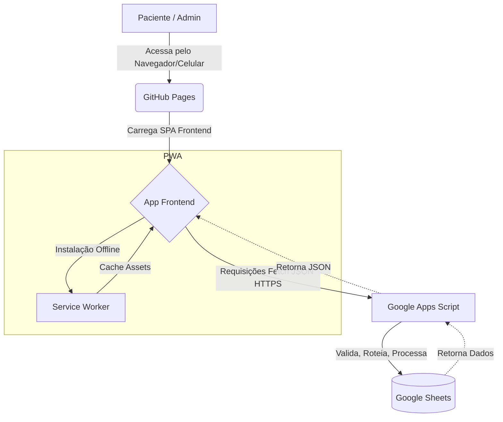
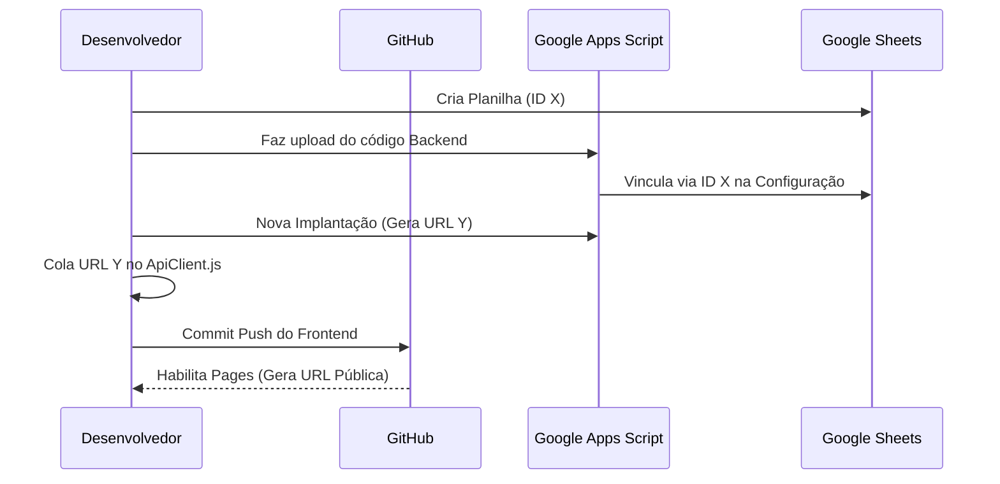

# 📖 The Deployment Bible (Módulo 21)

**Manual Definitivo de Implantação e Operação | Acompanhamento Clínico Integrativo**

Este documento é a referência única e oficial para colocar o sistema em funcionamento absoluto, desde o zero até a operação diária. Ele foi concebido para guiar desde desenvolvedores experientes até perfis menos técnicos.

---

## 🏗️ CAPÍTULO 1 — VISÃO GERAL DA ARQUITETURA

O sistema utiliza uma arquitetura "Serverless No-Code DB", combinando hospedagem estática gratuita, execução de scripts serverless no ecossistema Google e armazenamento de dados em planilhas.



---

## 🛠️ CAPÍTULO 2 — PRÉ-REQUISITOS

Para realizar este deploy, você precisará de:

1. **Conta Google (Gmail ou Workspace):** Onde o banco de dados (Sheets) e a API (GAS) ficarão hospedados.
2. **Conta no GitHub:** Onde o código-fonte ficarão versionados e onde o Frontend (GitHub Pages) será hospedado.
3. **Git Instalado:** Para subir o código para o GitHub. (Baixe em [git-scm.com](https://git-scm.com/))
4. **Visual Studio Code (VSCode):** Para editar as chaves de configuração.
5. **Navegador Google Chrome:** Recomendado para debugar e utilizar a aplicação em sua totalidade.
6. **(Opcional) Node.js & Clasp:** Caso deseje automatizar o upload do código do Google Apps Script futuramente.

---

## 📁 CAPÍTULO 3 — ESTRUTURA DO PROJETO

Antes de começar, entenda as duas pastas principais:
- `frontend/`: Contém todo o HTML, CSS, JS e PWA. Este código vai para a internet aberta via GitHub Pages.
- `backend/`: Contém o código Google Apps Script. Este código vai **apenas** para dentro dos servidores do Google.

---

## 📊 CAPÍTULO 5 — GOOGLE SHEETS (O BANCO DE DADOS)

*Nota cronológica: Configurar o Sheets é o primeiro passo técnico, pois precisaremos do ID dele para os próximos passos.*

### 5.1 Criando a Planilha
1. Acesse [sheets.google.com](https://sheets.google.com).
2. Clique em **Em branco** para criar uma nova.
3. Renomeie a planilha (canto superior esquerdo) para: `DB_CLINICA_PRODUCAO`.
4. **Obtenha o ID:** Na URL do navegador (`https://docs.google.com/spreadsheets/d/ID_AQUI/edit`), copie e salve a sequência `ID_AQUI`.

### 5.2 Abas Obrigatórias
Crie exatamente as seguintes abas (o nome tem que ser idêntico, respeitando maiúsculas):
- `Pacientes`
- `Protocolos`
- `Suplementos`
- `Check_Ins`
- `Gamificacao`
- `Permissoes`

*(Nota: Você não precisa criar as colunas manualmente se não quiser. O Backend cria os cabeçalhos automaticamente na primeira vez que tenta salvar algo na aba. Porém, deixe as abas criadas para não gerar erro de "Sheet not found" nas primeiras leituras).*

### 5.3 Segurança e Proteção
1. Clique em **Compartilhar** no canto superior direito.
2. Garanta que o "Acesso Geral" esteja como **Restrito**. Apenas a sua conta Google deve ter acesso. O Frontend **não** acessa a planilha diretamente, ele pede para o Apps Script acessar.

---

## ⚙️ CAPÍTULO 6 — GOOGLE APPS SCRIPTS (O BACKEND)

### 6.1 Criando o Script
1. Na sua planilha recém-criada, clique em **Extensões > Apps Script**.
2. O editor abrirá em uma nova aba. Renomeie o projeto (canto superior esquerdo) para `API_CLINICA_PRODUCAO`.

### 6.2 Subindo o Código
Como a plataforma GAS não aceita upload de pastas, existem duas formas de colocar os arquivos da pasta `backend/src` lá:

**Opção A (Manual - Para Leigos):**
1. Crie os arquivos no editor GAS com os exatos mesmos nomes (ex: `GasController.gs`). *O GAS usa `.gs` em vez de `.js`*.
2. Cole o conteúdo de cada arquivo local do backend lá. A ordem não importa.

**Opção B (Automática - Clasp):**
1. No terminal local: `npm install -g @google/clasp`.
2. Habilite a API em `https://script.google.com/home/usersettings`.
3. Rode `clasp login` e autorize.
4. Rode `clasp create --type webapp --title "API_CLINICA_PRODUCAO"`.
5. Cole todo o backend na pasta gerada e rode `clasp push`.

### 6.3 Configurando o Banco
No arquivo que possui a classe `SystemConfiguration`, você verá uma constante:
```javascript
static DATABASE_SPREADSHEET_ID = 'SEU_ID_COPIADO_DO_CAPITULO_5';
```
Cole o ID do seu Google Sheets ali.

---

## 🌐 CAPÍTULO 7 — WEB APP (PUBLICANDO O BACKEND)

### 7.1 Fazendo o Deploy
1. No editor do Apps Script, clique no botão azul **Implantar (Deploy) > Nova implantação**.
2. **Selecione o tipo:** Clique na engrenagem e escolha **App da Web**.
3. **Descrição:** "Versão 1.0.0".
4. **Executar como:** *Eu (Seu E-mail)*. Isso significa que o script terá as suas permissões para ler a planilha.
5. **Quem pode acessar:** *Qualquer pessoa*. **(MUITO IMPORTANTE!)**. O script precisa estar público para receber as requisições (POST) do Frontend. A segurança é garantida pelo Token JWT interno, e não pelo Google.
6. Clique em **Implantar**. O Google vai pedir autorização. Conceda.
7. Copie a **URL do App da Web** (termina com `/exec`).

### 7.2 Atualizações Futuras
Nunca apague o deploy. Para atualizar: **Implantar > Gerenciar implantações**, clique no ícone do lápis, mude a versão para "Nova versão" e salve. Isso mantém a mesma URL.

---

## 🔗 CAPÍTULO 8 — CONEXÃO FRONTEND

1. Abra o projeto no VSCode.
2. Vá até `frontend/src/infrastructure/api/ApiClient.js`.
3. Localize a URL base e substitua pela URL do `/exec` copiada no Capítulo 7.
```javascript
const GAS_URL = "https://script.google.com/macros/s/SUA_URL_AQUI/exec";
```

---

## 🐙 CAPÍTULO 4 E 9 — GITHUB & GITHUB PAGES

### 4.1 Criando o Repositório
1. Acesse github.com e crie um repositório chamado `clinica-app`.
2. No VSCode (terminal):
   ```bash
   git init
   git add .
   git commit -m "Initial commit"
   git branch -M main
   git remote add origin https://github.com/SEU_USUARIO/clinica-app.git
   git push -u origin main
   ```

### 9.1 Publicando o Frontend
1. No GitHub, vá em **Settings > Pages**.
2. Em **Source**, escolha **Deploy from a branch**.
3. Em **Branch**, selecione `main` e a pasta `/root` (ou a pasta onde o `index.html` do frontend estiver, se você estruturou diferentemente, mude para `/frontend` através de sub-módulos. O ideal é que o conteúdo de `frontend` esteja na raiz do repositório para o Pages).
4. Clique em Save. Em 2 minutos, o GitHub vai gerar a URL (ex: `https://seu_user.github.io/clinica-app/`).

---

## 📱 CAPÍTULO 10 — PWA (INSTALAÇÃO)

1. **Manifest:** O arquivo `manifest.json` já está configurado. Ele define ícones, cor do tema e nome do app. Se quiser trocar o nome, abra-o no VSCode e edite.
2. **Service Worker:** O arquivo `sw.js` faz o cache das páginas. Toda vez que você mudar um CSS ou JS, precisa mudar a constante `CACHE_NAME` dentro de `sw.js` (ex: `v1` para `v2`) para forçar os celulares dos pacientes a baixarem as atualizações.

---

## 🧑‍⚕️ CAPÍTULO 12 E 13 — PRIMEIRO PACIENTE E LOGIN

1. Acesse a URL pública do seu GitHub Pages.
2. **Administrador:** Para criar a conta "Admin", insira manualmente na aba `Permissoes` do Google Sheets o seu email, uma senha gerada via Bcrypt (você pode rodar a função hash no Apps Script para descobrir) e a Role `ADMIN`.
3. Logue no sistema.
4. **Criando Paciente:** Vá em "Novo Paciente" na Dashboard Admin. Preencha nome, email e senha temporária.
5. Defina um Protocolo (Datas) e os Suplementos (horários).
6. Peça para o paciente entrar no site e logar com o email e a senha temporária.

---

## 🛡️ CAPÍTULO 16 E 17 — SEGURANÇA E MANUTENÇÃO

- **Rate Limiting:** O backend (Apps Script) possui limitação (15 reqs/min por IP). Se você for bloqueado durante testes intensos, vá no Sheets, aba "Cache" (se houver, ou na memória do script) e espere 5 minutos.
- **Auditoria:** O backend grava eventos críticos na aba `Logs`. Se houver ataques repetidos de login falho, ficará registrado lá com o IP.
- **Backup Semanal:** Abra o Google Sheets, vá em **Arquivo > Fazer uma cópia**. Renomeie para `DB_CLINICA_BACKUP_DATA`. Simples assim.

---

## 🚨 CAPÍTULO 18 — TROUBLESHOOTING (Solução de Problemas)

> [!WARNING]
> **Erro:** CORS error no Console do Chrome durante Login.
> **Causa:** Apps Script configurado incorretamente.
> **Solução:** Volte no GAS > Nova Implantação. Garanta que "Quem pode acessar" esteja como "Qualquer pessoa" e não apenas "Qualquer pessoa na minha organização".

> [!CAUTION]
> **Erro:** O app carrega branco na tela, e o console diz "Unexpected token < in JSON at position 0".
> **Causa:** O GAS retornou a página de login do Google (HTML) em vez de JSON porque a URL do `/exec` precisa de permissões ou está apontando para o ambiente `/dev`.
> **Solução:** Use sempre a URL final com `/exec` no `ApiClient.js`.

> [!TIP]
> **Erro:** Paciente diz que os check-ins não salvam e volta pra tela inicial.
> **Causa:** Sessão inspirou (24 horas passadas).
> **Solução:** O app força o logout. O paciente só precisa fazer login novamente.

---

## 🚀 CAPÍTULO 19 — CHECKLIST DE PUBLICAÇÃO (GO-LIVE)

- [ ] Planilha criada no Sheets (`DB_CLINICA_PRODUCAO`).
- [ ] Apps Script copiado e URL Web App gerada (`/exec`).
- [ ] Quem pode acessar: "Qualquer pessoa".
- [ ] URL do GAS copiada para `ApiClient.js`.
- [ ] Frontend publicado no GitHub Pages.
- [ ] URL do GitHub Pages testada (carregou a UI?).
- [ ] Usuário Admin criado diretamente na aba `Permissoes` do Sheets.
- [ ] Login do Admin realizado com sucesso.
- [ ] Paciente teste criado com 1 suplemento.
- [ ] Login do paciente realizado com sucesso no celular.
- [ ] 1 Check-in salvo e validado visualmente na planilha.

---

## 🔮 CAPÍTULO 21 — EVOLUÇÃO FUTURA

Quando você passar de ~200 pacientes, o limite diário de leitura/escrita do Google Sheets pode se esgotar. A migração ocorrerá em 1 passo, pois a Arquitetura (Módulo 18) garante o isolamento.

**Como Migrar:**
1. Crie um banco de dados PostgreSQL (ex: Supabase, Vercel Postgres).
2. Escreva arquivos `PostgresRepositories.js` que sigam exatamente a mesma estrutura dos atuais `GoogleSheetsRepositories.js`.
3. Altere o arquivo `AppModule.js` (O container de Injeção de Dependências) para instanciar os repositórios novos em vez dos velhos.
4. Mova o código do Apps Script para Node.js/Cloud Run.
5. Pronto. A UI (Frontend) nunca saberá da mudança.

---

## 📝 FLUXOGRAMAS E DIAGRAMAS OBRIGATÓRIOS

### Fluxo de Deploy Completo


---

## 📑 ADRs ESPECÍFICOS DESTE MANUAL

**ADR-005: Escolha do Google Sheets como DB Inicial**
- **Contexto:** Zero custo, fácil visualização para auditoria humana nos primeiros dias da clínica.
- **Decisão:** Usar, mas escondendo através de Repositories rigorosos (DDD).
- **Consequência:** Escalabilidade até 200/300 usuários concorrentes.

**ADR-006: Escolha do GitHub Pages**
- **Contexto:** Hospedagem estática, CDN mundial.
- **Decisão:** Adotar Vanilla JS + CSS para evitar steps de Build caros.
- **Consequência:** Deploy trivial ("só dar push"), altíssima velocidade.

---

## 🏁 RUNBOOK OPERACIONAL E MATRIZ DE PRONTIDÃO

### Matriz de Maturidade de Deploy
| Componente | Nível de Complexidade de Deploy | Estabilidade Pós-Deploy | Manutenção Necessária |
|:---|:---:|:---:|:---|
| **Frontend (Pages)** | Muito Baixa (Automática) | Altíssima | Atualizar `sw.js` (Cache) a cada versão. |
| **Backend (GAS)** | Alta (Copia/Cola manual) | Média | Nenhuma, a menos que adicione nova lógica. |
| **Banco (Sheets)** | Baixa | Baixa/Média (Limites GAS) | Backups manuais quinzenais. |

### Procedimento de Resposta a Incidentes (Rollback)
1. **Frontend quebrado:** Reverta o commit no GitHub (`git revert HEAD`). O Pages publicará a versão anterior em 2 minutos.
2. **Backend quebrado:** Vá no Apps Script > Gerenciar implantações. Clique no lápis, role até "Versão" e selecione o número da implantação anterior. Salve. O deploy volta ao passado no mesmo milissegundo, sem mudar a URL.
3. **Planilha corrompida:** Abra o Sheets > Arquivo > Histórico de Versões. Volte para ontem.

***

> "Com a conclusão da implantação deste guia, o sistema se torna um organismo autossustentável."
> — Equipe Virtual de Principal Engineers
