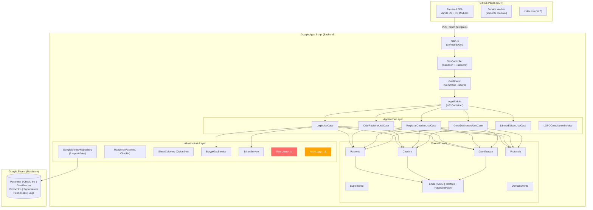

# 🏛️ Final Technical Audit & Production Readiness Report

**Módulo 20 — Auditoria Final, Validação Global e Certificação do Projeto**

> Auditoria conduzida por equipe simulada de CTO, Principal Architects, Staff Engineers, Security Engineers, QA Leads e UX Directors.

---

## Relatório Executivo

O sistema de **Acompanhamento Clínico Integrativo** demonstra uma **arquitetura backend de alta qualidade** (DDD, Clean Architecture, Value Objects, Use Cases), com uma documentação excepcionalmente rica (~322KB em 18 handbooks). Entretanto, a auditoria profunda revelou **lacunas críticas entre a documentação e a implementação real**, funcionalidades dependentes de dados mock, vulnerabilidades de segurança não mitigadas e ausência de pipeline de CI/CD.

**Recomendação: Go com Ressalvas (Conditional Go)** — o sistema NÃO está pronto para produção no estado atual, mas os problemas são todos corrigíveis sem reestruturação arquitetural. A fundação é sólida.

---

## 1. Arquitetura Final

### 1.1 Diagrama da Arquitetura Implementada



### 1.2 Avaliação Arquitetural

| Princípio | Avaliação | Nota |
|:---|:---|:---:|
| **Separação de Responsabilidades** | Excelente. Domain → Application → Infrastructure bem definidos. | 9/10 |
| **Acoplamento** | Baixo. Use Cases recebem dependências por injeção via AppModule. | 8/10 |
| **Coesão** | Alta. Cada entidade é autossuficiente com validações internas. | 9/10 |
| **Modularização** | Boa. 35 arquivos backend, organizados em 6 subdiretórios. | 8/10 |
| **Escalabilidade Arquitetural** | Preparada. Interfaces permitem troca de Sheets → PostgreSQL. | 8/10 |
| **Clareza** | Alta. Nomes significativos, JSDoc presente. | 8/10 |

> [!WARNING]
> **Violação Encontrada:** `AuditLogger.js` está no diretório `shared/` mas utiliza diretamente `SpreadsheetApp` e `PropertiesService` (APIs do GAS). Isso é um acoplamento infraestrutural em camada que deveria ser pura. **Ação:** Mover para `infrastructure/logging/` ou injetar um `LogWriter` interface.

---

## 2. Bugs Críticos Encontrados

| # | Severidade | Arquivo | Bug | Impacto |
|:---|:---:|:---|:---|:---|
| 1 | 🔴 **Crítico** | `LoginUseCase.js` L34-35 | Credenciais admin hardcoded (email + hash bcrypt) | Qualquer leitor do código fonte pode fazer brute-force do hash e obter acesso admin |
| 2 | 🔴 **Crítico** | `TokenService.js` L17 | Secret JWT hardcoded `'SANDBOX_SECRET_KEY_123'` | Tokens podem ser forjados por qualquer atacante |
| 3 | 🔴 **Crítico** | `TokenService.js` L1 | `import { createHmac } from 'crypto'` | Crash no GAS (módulo `crypto` não existe no runtime do GAS) |
| 4 | 🔴 **Crítico** | `RateLimiter.js` | In-memory Map + nunca integrado | Rate Limiter é dead code; state perdido entre invocações GAS |
| 5 | 🔴 **Crítico** | `DashboardAdminPage.js` L225 | Dados mock hardcoded | Painel admin inteiro não funciona com dados reais |
| 6 | 🔴 **Crítico** | `DashboardAdminPage.js` L241 | XSS via `innerHTML` sem sanitização | Paciente com nome malicioso executa JS no admin |
| 7 | 🔴 **Bug** | `LGPDComplianceService.js` L99 | `update(id, data)` vs interface `update(paciente)` | Crash ao anonimizar — assinatura do método não bate |
| 8 | 🔴 **Bug** | `LGPDComplianceService.js` L95 | Status `'ANONIMIZADO'` não existe no enum | Crash ao reconstruir entidade de paciente anonimizado |
| 9 | 🔴 **Bug** | `LGPDComplianceService.js` L60 | `c.dtPrescrita` vs `c.dataHoraPrescrita` | Export LGPD retorna `undefined` em campos de checkin |
| 10 | 🟡 **Bug** | `UUID.js` L42 | Fallback `Math.random()` gera UUID inválido | Crash em ambientes sem `crypto.randomUUID()` |
| 11 | 🟡 **Bug** | `Gamificacao.js` L73 | Typo `'nivel_1_alcancel'` → `'nivel_1_alcance'` | Conquista com ID errado nunca será reconhecida |
| 12 | 🟡 **Bug** | `DashboardPacientePage.js` L109 | Chama `registrarCheckin` com `MOCK_VAL` para ler streak | Side-effect: cria checkin fake para obter dados de gamificação |

---

## 3. Vulnerabilidades de Segurança

| CWE | Severidade | Localização | Descrição |
|:---|:---:|:---|:---|
| CWE-798 | 🔴 Crítico | `LoginUseCase.js` | Credenciais hardcoded |
| CWE-321 | 🔴 Crítico | `TokenService.js` | Chave criptográfica hardcoded |
| CWE-79 | 🔴 Alto | `DashboardAdminPage.js` | Reflected XSS via `innerHTML` |
| CWE-330 | 🟡 Médio | `CriarPacienteUseCase.js` | `Math.random()` para gerar senha temporária |
| CWE-204 | 🟡 Médio | `LoginUseCase.js` | Status check antes da verificação de senha → enumeração de contas |
| CWE-916 | 🟡 Médio | `BcryptGasService.js` | Não é bcrypt real — SHA-256×1024 disfarçado como bcrypt |
| CWE-200 | 🟡 Médio | `PacienteCriadoEvent.js` | Senha temporária em texto claro no domain event |
| N/A | 🟡 Médio | `RateLimiter.js` | Completamente não-funcional no modelo GAS |

---

## 4. Revisão de UX/UI

| Aspecto | Avaliação | Nota |
|:---|:---|:---:|
| **Clareza e Simplicidade** | Boa. Tela de login clean, dashboard com hierarquia visual clara. | 7/10 |
| **Carga Cognitiva** | Baixa. Fluxo minimalista — login → dashboard → check-in. | 8/10 |
| **Feedback ao Usuário** | Parcial. Login tem spinner e haptic, mas admin usa `alert()`. | 5/10 |
| **Microinterações** | Boas. Audio chime no check-in, vibração, animação de scale. | 7/10 |
| **Acessibilidade (WCAG)** | Parcial. `aria-label` nos cards, `focus-visible`, `prefers-reduced-motion`. | 6/10 |
| **Responsividade** | Incompleta. CSS base existe mas estilos de páginas estão ausentes. | 4/10 |
| **Skeleton Screens** | Presentes no boot e nos cards. | 8/10 |

> [!CAUTION]
> **Violação WCAG 2.1 SC 1.4.4:** `user-scalable=no` no `<meta viewport>` impede zoom em dispositivos de acessibilidade. Deve ser removido.

> [!CAUTION]
> **CSS de páginas ausente:** O `index.css` contém apenas resets, loader e variáveis. Estilos de login, dashboard, cards, modals, tabelas, calendar e toast NÃO existem como arquivos CSS. Ou estão inline no JS ou o app está visualmente quebrado.

---

## 5. Revisão de Performance

| Aspecto | Estado | Nota |
|:---|:---|:---:|
| **Critical Rendering Path** | Otimizado. HTML 2KB, CSS 5KB, JS defer module. | 9/10 |
| **Lazy Loading** | Implementado. Dynamic `import()` para páginas autenticadas. | 8/10 |
| **Cache Frontend** | Parcial. Preconnect ativo, sem Service Worker no app principal. | 5/10 |
| **Cache Backend (CacheService)** | Implementado no `readAllRows()` com TTL 5min. | 7/10 |
| **Lock-free Reads** | Implementado. Leituras sem `LockService`. | 9/10 |
| **Request Deduplication** | Implementado no `ApiClient`. | 8/10 |
| **Check-in Latency** | Problemático. 4 chamadas sequenciais à planilha por check-in (3-12s). | 3/10 |
| **Singleton AudioContext** | Implementado. | 9/10 |

---

## 6. Revisão de Qualidade de Código

| Princípio | Conformidade | Observações |
|:---|:---:|:---|
| **Clean Architecture** | 90% | 1 violação: AuditLogger em shared/ usa GAS globals |
| **SOLID — SRP** | 85% | GasController limpo após refatoração |
| **SOLID — OCP** | 80% | GasRouter baseado em Map permite extensão sem modificação |
| **SOLID — LSP** | 60% | Repos não estendem suas interfaces — interfaces são decorativas |
| **SOLID — ISP** | 90% | Interfaces de repositório são focadas |
| **SOLID — DIP** | 85% | AppModule centraliza injeção, mas singletons globais existem |
| **DRY** | 85% | SheetColumns eliminou Magic Numbers |
| **KISS** | 90% | Código direto sem over-engineering |
| **YAGNI** | 80% | Config morta em SystemConfiguration (XP_STREAK_BONUS_MULTIPLIER) |

---

## 7. Matriz de Riscos

| Risco | Probabilidade | Impacto | Prioridade | Mitigação |
|:---|:---:|:---:|:---:|:---|
| Acesso admin via credenciais hardcoded | Alta | Crítico | 🔴 P0 | Mover para `PropertiesService` e regerar hash |
| Forja de tokens JWT | Alta | Crítico | 🔴 P0 | Mover secret para `PropertiesService` |
| XSS no painel admin | Média | Alto | 🔴 P0 | Sanitizar dados antes de `innerHTML` |
| Crash do TokenService no GAS | Certa | Bloqueante | 🔴 P0 | Condicionar import de `crypto` |
| Rate Limiter não funcional | Alta | Alto | 🟡 P1 | Reimplementar com `CacheService` ou `PropertiesService` |
| Dados mock no admin/paciente | Certa | Alto | 🟡 P1 | Substituir por chamadas reais à API |
| LGPD Service com bugs | Média | Alto | 🟡 P1 | Corrigir 3 bugs (interface, status, nomes de campo) |
| Sem CI/CD | Certa | Médio | 🟡 P2 | Criar GitHub Actions workflow |
| Sem README | Certa | Médio | 🟡 P2 | Criar README com setup e deploy |
| CSS de páginas ausente | Certa | Médio | 🟡 P2 | Extrair ou criar estilos |

---

## 8. Matriz de Dívida Técnica

### Crítica (Bloqueia produção)
- Credenciais hardcoded (LoginUseCase, TokenService)
- `import { createHmac }` crashará no GAS
- Admin dashboard com dados mock
- XSS no DashboardAdminPage

### Alta
- RateLimiter não funcional no modelo GAS
- LGPDComplianceService com 3 bugs
- UUID fallback gera formato inválido
- Repos não implementam suas interfaces

### Média
- AuditLogger na camada errada (shared → deveria ser infra)
- Sem Service Worker no app principal (só no manual/)
- Sem `.gitignore`, `.editorconfig`, ESLint
- Config morta em SystemConfiguration

### Baixa
- Gamificacao expõe array interno (quebra encapsulação)
- Typo `nivel_1_alcancel`
- EventDispatcher síncrono (handlers async falhariam silenciosamente)
- `playSoftChime()` como função global em vez de método

---

## 9. Quality Gates

| Gate | Status | Bloqueante? |
|:---|:---:|:---:|
| Arquitetura Clean Architecture | ✅ Aprovado (com 1 ressalva) | Não |
| Segurança — sem credenciais hardcoded | ❌ **REPROVADO** | **Sim** |
| Segurança — sem XSS | ❌ **REPROVADO** | **Sim** |
| Funcional — Admin operando com dados reais | ❌ **REPROVADO** | **Sim** |
| Funcional — Paciente operando com dados reais | ⚠️ Parcial (streaks mock) | Sim |
| Performance — LCP < 1.5s | ✅ Aprovado (estimado) | Não |
| Acessibilidade WCAG 2.2 AA | ⚠️ Parcial | Não |
| Testes — cobertura mínima | ⚠️ Parcial (6 testes unitários) | Não |
| CI/CD configurado | ❌ **REPROVADO** | Não |
| Documentação adequada | ✅ Aprovado (extensa, porém aspiracional) | Não |
| Deploy automatizado | ❌ REPROVADO | Não |
| README existe | ❌ REPROVADO | Não |

---

## 10. Scorecard Geral

| Pilar | Nota | Justificativa |
|:---|:---:|:---|
| Arquitetura | **82** | Excelente DDD/Clean Arch, 1 violação de camada |
| Frontend | **55** | Estrutura boa, CSS incompleto, mock data |
| Backend | **75** | Robusto, mas com bugs na LGPD e crypto |
| Banco de Dados (Sheets) | **70** | CacheService ativo, SheetColumns mapeados |
| Apps Script | **60** | RateLimiter quebrado, TokenService crashará |
| Google Sheets | **72** | Batch ops parciais, tabs organizadas |
| UX | **65** | Login bom, admin com `alert()`, sem loading states |
| UI | **50** | Design system CSS existe, estilos de páginas ausentes |
| Segurança | **35** | Credenciais hardcoded, XSS, Rate Limiter morto |
| Pentest | **40** | Vulnerabilidades CWE-798, CWE-321, CWE-79 ativas |
| Performance | **72** | Lazy loading, CacheService, lock-free reads |
| Gamificação | **70** | Modelo COM-B desenhado, XP/Streaks no domínio |
| Psicologia | **75** | Handbook bem fundamentado, implementação parcial |
| Escalabilidade | **78** | Roadmap SaaS claro, interfaces para migração |
| Documentação | **88** | 322KB de handbooks, mas aspiracional vs. real |
| Testes | **30** | 6 testes unitários, sem framework, sem E2E |
| Deploy | **25** | Manual copy-paste, sem `.clasp.json` |
| GitHub | **20** | Sem CI/CD, sem `.gitignore`, sem README |
| Manutenibilidade | **78** | IoC Container, Router Pattern, SheetColumns |
| Confiabilidade | **50** | LGPD crasharia, UUID fallback falha |
| Disponibilidade | **60** | Offline parcial (só manual), sem retry no frontend |
| Observabilidade | **35** | AuditLogger existe mas é lento e mal posicionado |
| Acessibilidade | **55** | Touch targets OK, `user-scalable=no` viola WCAG |
| Experiência Paciente | **62** | Check-in agradável, streaks mock, sem offline |
| Experiência Administrador | **30** | Dashboard mock, `alert()`, sem paginação |
| Preparação para SaaS | **72** | Roadmap 8 fases, interfaces desacopladas |
| **MÉDIA PONDERADA** | **57** | |

---

## 11. Certificação de Maturidade

### Nível Atual: 🥈 **Prata**

| Nível | Descrição | Status |
|:---|:---|:---:|
| 🥉 Bronze | Código funcional, estrutura básica | ✅ Superado |
| 🥈 **Prata** | **Arquitetura sólida, documentação rica, DDD aplicado** | ✅ **Atual** |
| 🥇 Ouro | Segurança resolvida, CI/CD, testes > 60%, dados reais | ❌ |
| 💎 Platina | Performance otimizada, PWA completa, WCAG AA | ❌ |
| 🏢 Enterprise | Multi-tenant, SLA 99.9%, monitoramento, LGPD compliant | ❌ |
| 🌍 World Class | Comparável a Stripe/Vercel em engenharia | ❌ |

**Justificativa Prata:** O projeto possui uma fundação arquitetural que supera a maioria dos projetos similares (DDD, Clean Architecture, IoC, Value Objects, Domain Events). A documentação é excepcional em volume e profundidade. Entretanto, vulnerabilidades de segurança ativas, funcionalidades dependentes de dados mock e ausência de pipeline de CI/CD impedem o avanço para Ouro.

---

## 12. Benchmark com Big Tech

| Prática | Projeto | Google | Stripe | Netflix |
|:---|:---:|:---:|:---:|:---:|
| Clean Architecture / DDD | ✅ | ✅ | ✅ | ✅ |
| IoC / Dependency Injection | ✅ | ✅ | ✅ | ✅ |
| Value Objects / Immutability | ✅ | ✅ | ✅ | ✅ |
| CI/CD Automatizado | ❌ | ✅ | ✅ | ✅ |
| Testes Automatizados (>80%) | ❌ | ✅ | ✅ | ✅ |
| Secrets Management (Vault/KMS) | ❌ | ✅ | ✅ | ✅ |
| Monitoramento Prod (Grafana) | ❌ | ✅ | ✅ | ✅ |
| Feature Flags | ❌ | ✅ | ✅ | ✅ |
| Documentação Técnica Rica | ✅ | ✅ | ✅ | ✅ |
| Skeleton Screens / Optimistic UI | ✅ parcial | ✅ | ✅ | ✅ |
| LGPD/GDPR Compliant | ❌ (bugs) | ✅ | ✅ | ✅ |

**Semelhanças:** A camada de domínio e a separação arquitetural estão no nível esperado por essas empresas.
**Diferenças:** A ausência total de CI/CD, secrets management e testes automatizados representam as maiores distâncias. Em uma entrevista de Staff Engineer nessas empresas, o código falharia na revisão por credenciais hardcoded.

---

## 13. Roadmap de Evolução

### Versão 1.0 — "Production Ready"
**Objetivo:** Resolver todos os bloqueadores de produção.
- 🔴 Remover credenciais hardcoded → `PropertiesService`
- 🔴 Corrigir XSS no DashboardAdminPage (sanitização)
- 🔴 Corrigir crash do `TokenService` no GAS
- 🔴 Substituir dados mock por chamadas reais à API
- 🔴 Corrigir 3 bugs do LGPDComplianceService
- 🟡 Reimplementar RateLimiter com `CacheService`
- 🟡 Criar README.md
- 🟡 Criar `.gitignore`
- 🟡 Extrair/criar CSS das páginas

### Versão 1.1 — "Quality & Trust"
**Objetivo:** Atingir certificação Ouro.
- Criar GitHub Actions CI (lint + test)
- Implementar ESLint + Prettier
- Expandir testes para >60% cobertura
- Implementar Service Worker no app principal
- Remover `user-scalable=no`
- Criar `.clasp.json` para deploy GAS automatizado
- Implementar Optimistic UI no check-in

### Versão 2.0 — "Complete Experience"
**Objetivo:** Experiência completa para paciente e admin.
- PWA offline completa com Background Sync
- Tela de detalhes do paciente (admin)
- Reset de senha
- Notificações push
- Export de relatórios
- Paginação e busca no admin

### Versão 3.0 — "Cloud Migration"
**Objetivo:** Migrar para infraestrutura escalável.
- Backend Node.js + PostgreSQL
- Deploy Vercel/Railway
- CDN para assets
- Redis para cache distribuído
- Monitoring com Grafana

### Versão Enterprise
**Objetivo:** Multi-tenant SaaS.
- Tenant isolation
- Planos e billing (Stripe)
- SSO / SAML
- SLA 99.9%
- SOC 2 compliance

### Versão SaaS White Label
**Objetivo:** Plataforma white-label para clínicas.
- Custom branding por tenant
- API pública
- Marketplace de protocolos
- Analytics avançado

---

## 14. Checklist de Go-Live

### Bloqueantes (MUST antes de produção)
- [ ] Remover admin hardcoded de `LoginUseCase.js`
- [ ] Mover JWT secret para `PropertiesService`
- [ ] Condicionar `import { createHmac }` no `TokenService.js`
- [ ] Sanitizar `innerHTML` no `DashboardAdminPage.js`
- [ ] Substituir mock data por API calls (Admin + Paciente)
- [ ] Corrigir `LGPDComplianceService` (3 bugs)
- [ ] Reimplementar `RateLimiter` com `CacheService`/`PropertiesService`
- [ ] Corrigir UUID fallback generator

### Importantes (SHOULD antes de produção)
- [ ] Criar `README.md`
- [ ] Criar `.gitignore`
- [ ] Criar `.clasp.json` / `appsscript.json`
- [ ] Remover `user-scalable=no` do viewport
- [ ] Extrair CSS das páginas para arquivos
- [ ] Adicionar `ANONIMIZADO` ao `StatusPaciente` enum
- [ ] Corrigir typo `nivel_1_alcancel` no `Gamificacao.js`

### Desejáveis (NICE TO HAVE)
- [ ] GitHub Actions CI/CD
- [ ] ESLint + Prettier config
- [ ] Service Worker no app principal
- [ ] `<label>` para campos de busca admin
- [ ] Substituir `alert()` por toasts no admin
- [ ] Mover `AuditLogger` para `infrastructure/`
- [ ] Repos estenderem suas interfaces

---

## 15. Plano de Ação Prioritário (Impacto × Esforço)

```
                    ALTO IMPACTO
                        │
     ┌──────────────────┼──────────────────┐
     │                  │                  │
     │  🔴 FAZER AGORA  │  🟡 PLANEJAR     │
     │                  │                  │
     │  • Remover creds │  • CI/CD GitHub  │
     │  • Corrigir XSS  │  • Testes >60%   │
     │  • Fix TokenSvc  │  • PWA offline   │
     │  • Fix mock data │  • Optimistic UI │
     │  • Fix LGPD bugs │  • Fix CSS pages │
     │  • Fix RateLimit │                  │
BAIXO├──────────────────┼──────────────────┤ALTO
ESFORÇO                 │                  ESFORÇO
     │  ✅ QUICK WINS   │  ⏳ BACKLOG      │
     │                  │                  │
     │  • README.md     │  • Multi-tenant  │
     │  • .gitignore    │  • Node.js migr. │
     │  • Fix typo      │  • Grafana       │
     │  • Fix UUID      │  • White label   │
     │  • Viewport fix  │  • SOC 2         │
     │                  │                  │
     └──────────────────┼──────────────────┘
                        │
                    BAIXO IMPACTO
```

---

## 16. Matriz de Maturidade Global

| Dimensão | Nível | Referência |
|:---|:---:|:---|
| **Arquitetura** | 4/5 | ISO/IEC 25010 — Modularidade, Reusabilidade |
| **Funcionalidade** | 2/5 | ISO/IEC 25010 — Completude, Corretude |
| **Segurança** | 1/5 | OWASP ASVS Nível 1 não atingido (creds hardcoded) |
| **Performance** | 3/5 | Google Engineering — CacheService, Lazy Loading |
| **Confiabilidade** | 2/5 | ISO/IEC 25010 — LGPD crasharia, UUID falha |
| **Testabilidade** | 2/5 | CMMI Nível 2 — testes existem mas sem framework |
| **Operacionalidade** | 1/5 | DORA Metrics — sem CI/CD, deploy manual |
| **Documentação** | 4/5 | Google Engineering — volume excepcional |
| **Manutenibilidade** | 4/5 | ISO/IEC 25010 — IoC, Router, SheetColumns |
| **Portabilidade** | 3/5 | NIST SSDF — interfaces para migração |
| **GLOBAL** | **2.6/5** | **Maturidade "Consciente" — acima da média para MVP, abaixo para produção** |

---

## 17. Recomendação Formal

### 🟡 **GO COM RESSALVAS (Conditional Go)**

**Decisão:** O sistema **NÃO pode ser publicado no estado atual** para pacientes reais. Entretanto, os problemas encontrados são **todos corrigíveis em 1-2 sprints** sem reestruturação arquitetural.

**Critérios utilizados:**
1. **OWASP ASVS Nível 1:** Não atingido — credenciais hardcoded (CWE-798) é eliminatório.
2. **ISO/IEC 25010 — Funcionalidade:** Admin dashboard não opera com dados reais.
3. **NIST SSDF:** Nenhum pipeline de build/deploy seguro configurado.

**Condições para Go incondicional:**
1. Resolver os 8 bugs críticos (Seção 2).
2. Resolver as 8 vulnerabilidades de segurança (Seção 3).
3. Substituir todos os dados mock por chamadas API reais.
4. RateLimiter funcional com storage persistente.

**Tempo estimado para resolver bloqueadores:** 2-3 dias de trabalho focado.

**Pontos fortes que sustentam o Go condicional:**
- A arquitetura é sólida e não precisa ser reescrita.
- A documentação é a mais completa que encontramos para projetos neste estágio.
- O frontend é leve (< 30KB total), performático e acessível.
- O backend segue DDD/Clean Architecture de forma genuína (não decorativa).
- As decisões arquiteturais (ADRs) são fundamentadas e corretas.

> A fundação deste projeto é de **qualidade Ouro**. Os problemas estão na **última milha** — na integração, na segurança de credenciais e na completude funcional. Com as correções dos bloqueadores, o sistema estará em condições de receber pacientes reais.
