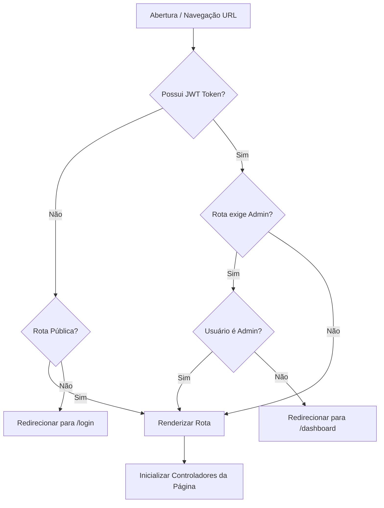
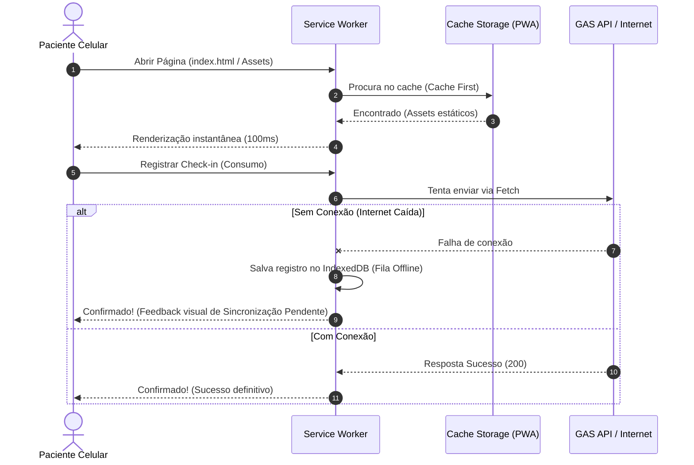

# MANUAL DE ESPECIFICAÇÃO DE ARQUITETURA FRONT-END
## Sistema SaaS para Acompanhamento de Tratamentos Clínicos Integrativos

---

## 1. Organização e Árvore de Diretórios (Frontend Workspace)

Para garantir que a base de código do frontend possa evoluir organicamente para frameworks modernos como React, Vue ou Svelte sem acoplamentos nocivos, projetamos a estrutura utilizando conceitos de **Clean Architecture** adaptada para ecossistemas Client-side.

```
frontend/
├── assets/                        # Recursos físicos estáticos compilados
│   ├── images/                    # Imagens otimizadas (WebP, SVG)
│   ├── fonts/                     # Fontes tipográficas locais (.woff2)
│   └── icons/                     # Pacote de ícones vetoriais puros (SVGs inline)
├── src/
│   ├── app/                       # Orquestrador SPA (Inicializador e Service Worker)
│   │   ├── routing/               # Roteador Client-side e Guards de Segurança
│   │   └── store/                 # Gerenciamento de Estado Global Reativo (Store Pattern)
│   ├── core/                      # Kernel do Frontend (Configurações e Módulos Imutáveis)
│   │   ├── config/                # Constantes do Sistema e Variáveis de Ambiente
│   │   ├── tokens/                # Design Tokens (Cores, Espaçamento, Radii)
│   │   └── constants/             # Enums de Negócio e Dicionários Estáticos
│   ├── domain/                    # Regras de Negócio e Validações Puras (Sem I/O)
│   │   ├── entities/              # Entidades Clínicas (Regras locais de UI)
│   │   └── validators/            # Validadores de Domínio (E-mail, CPF, Tel)
│   ├── application/               # Serviços de Aplicação e Contratos
│   │   ├── services/              # Serviços de Negócio (Auth, Gamification, Sync)
│   │   └── repositories/          # Contratos das Fontes de Dados (Ports)
│   ├── infrastructure/            # Implementações Concretas e I/O
│   │   ├── api/                   # Cliente HTTP (ApiClient com Fetch e Headers)
│   │   ├── storage/               # Adaptadores de Cache (LocalStorage, IndexedDB)
│   │   └── repositories/          # Repositórios que chamam a API
│   ├── presentation/              # Camada Visual (Interface com o Usuário)
│   │   ├── components/            # Componentes Atômicos reutilizáveis (UI)
│   │   ├── layouts/               # Grid, Margens, Estruturas de Enquadramento
│   │   ├── pages/                 # Telas Principais (Dashboard, Login, Admin)
│   │   ├── styles/                # CSS Modularizado (CSS Variables, Temas)
│   │   └── animations/            # Definições de Curvas e Transições de UI
│   └── shared/                    # Módulos Transversais de Auxílio (Helpers)
│       └── utils/                 # Formatadores de Data, sanitização de DOM
├── index.html                     # Ponto de entrada do documento HTML5
└── service-worker.js              # Gerenciador de ciclo offline e Cache PWA
```

### 1.1 Explicação Detalhada de Pastas

*   **`app/`**: Contém o coração funcional do client-side. Inicializa o aplicativo, registra o roteador SPA e gerencia a *Store Global* (estado compartilhado).
*   **`core/`**: Centraliza os parâmetros fixos de execução. Os arquivos de Design Tokens residem aqui, alimentando o processador CSS.
*   **`domain/`**: Armazena as regras lógicas de negócio do lado do cliente. Não depende de DOM, rede ou storages. Pode ser importado diretamente em testes unitários.
*   **`application/`**: Contém os casos de uso do client-side, como coordenar a autenticação ou calcular o estado da gamificação local a partir de DTOs retornados do backend.
*   **`infrastructure/`**: Onde os acessos de I/O são implementados. Lida diretamente com as interfaces de rede (`Fetch API`) e persistência local (`IndexedDB` e `SessionStorage`).
*   **`presentation/`**: Concentra a árvore de renderização. Nenhuma lógica de rede ou banco de dados cruza este limite. Os arquivos CSS são modularizados e divididos para evitar arquivos globais gigantes.

---

## 2. Camadas da Arquitetura & Fluxo de Dependências

O fluxo de dependência no frontend segue a regra clássica de Clean Architecture: **a lógica de apresentação não conhece detalhes de infraestrutura ou chamadas HTTP diretas.**

```
                     ┌──────────────────────────────────────┐
                     │            PRESENTATION              │
                     │  (Pages / Layouts / Components CSS)  │
                     └──────────────────┬───────────────────┘
                                        │ (Usa)
                                        ▼
                     ┌──────────────────────────────────────┐
                     │             APPLICATION              │
                     │  (Services / Repositories Contracts) │
                     └──────────────────┬───────────────────┘
                                        │ (Usa)
                                        ▼
                     ┌──────────────────────────────────────┐
                     │                DOMAIN                │
                     │     (Entities / Validators / VOs)    │
                     └──────────────────────────────────────┘
                                        ▲
                                        │ (Implementa contratos)
                     ┌──────────────────┴──────────────────┐
                     │            INFRASTRUCTURE            │
                     │      (ApiClient / IndexedDB /      │
                     │       Concrete Repositories)         │
                     └──────────────────────────────────────┘
```

### 2.1 Mapeamento e Acoplamento das Camadas
1.  **A camada Presentation** (ex: `DashboardPacientePage.js`) manipula apenas o DOM e o Estado Local. Se houver necessidade de salvar dados de check-in, ela dispara uma chamada para um serviço (`application/services/GamificationService.js`).
2.  **O Service de Aplicação** coordena o fluxo, invocando o repositório (`application/repositories/CheckinRepositoryInterface.js`) de forma abstrata.
3.  **O Repositório Concreto na Infrastructure** (`infrastructure/repositories/ApiCheckinRepository.js`) realiza a chamada real à API através do `ApiClient`.

---

## 3. Estratégia de Componentização (Atomic Design Adaptado)

Para garantir flexibilidade de migração visual e isolamento de interface, adotamos uma componentização baseada em **Atomic Design**, construída em baunilha (Vanilla JS) utilizando ES6 Classes que controlam seu ciclo de vida.

```
       ┌────────────────────────────────────────────────────────┐
       │ PAGINA: DashboardPacientePage                          │
       │  ┌──────────────────────────────────────────────────┐  │
       │  │ TEMPLATE: StandardLayout                         │  │
       │  │  ┌────────────────────────────────────────────┐  │  │
       │  │  │ ORGANISMO: ConsumoList                 │  │  │
       │  │  │  ┌──────────────────────────────────────┐  │  │  │
       │  │  │  │ MOLÉCULA: CardSuplemento             │  │  │  │
       │  │  │  │  [Atomo: TimeBadge] [Atomo: Confirm]  │  │  │  │
       │  │  │  └──────────────────────────────────────┘  │  │  │
       │  │  └────────────────────────────────────────────┘  │  │
       │  └──────────────────────────────────────────────────┘  │
       └────────────────────────────────────────────────────────┘
```

### 3.1 Classificação dos Componentes

#### Átomos (Atoms)
*   *Definição:* Componentes de interface mínimos e indivisíveis. Não possuem regras de negócio ou estado interno.
*   *Exemplos:* `Button.js` (botão estilizado), `Badge.js` (etiqueta de horário), `ProgressBar.js` (apenas renderiza o preenchimento de acordo com o parâmetro `value`).

#### Moléculas (Molecules)
*   *Definição:* Combinação de dois ou mais átomos para formar um elemento funcional.
*   *Exemplos:* `FormGroup.js` (Label + Input + Span de Erro), `StreakCounter.js` (Ícone de chama + Valor numérico).

#### Organismos (Organisms)
*   *Definição:* Estruturas visuais mais complexas que agrupam moléculas e átomos. Podem possuir comportamento interativo interno.
*   *Exemplos:* `CardSuplemento.js` (agrupa badge de horário, detalhes da dosagem, instruções e o botão de check-in), `WeeklyCalendar.js` (grade de dias da semana).

#### Templates
*   *Definição:* Layouts estruturais de enquadramento sem conteúdo real (ex: onde ficará o cabeçalho, barra de navegação e conteúdo).
*   *Exemplos:* `StandardLayout.js` (fornece a estrutura de grid vertical mobile first).

#### Páginas (Pages)
*   *Definição:* Componentes controladores que representam uma tela física da aplicação. Eles montam a árvore visual puxando dados dos repositórios/stores e injetando nos componentes atômicos.
*   *Exemplos:* `LoginPage.js`, `DashboardAdminPage.js`.

---

## 4. Arquitetura de Estado (State Management)

Mesmo sem bibliotecas como Redux ou Pinia, a aplicação implementa o **Store Pattern** com reatividade simples baseada no padrão de projeto *Observer*.

```
   ┌────────────────────────────────────────┐
   │             GLOBAL STORE               │
   │  - State: { user, theme, streak }      │
   │  - Listeners: []                       │
   ├────────────────────────────────────────┤
   │  + subscribe(listener)                 │
   │  + dispatch(action, payload)           │
   └───────────────────┬────────────────────┘
                       │ (Notifies UI)
                       ▼
   ┌────────────────────────────────────────┐
   │           PRESENTATION PAGE            │
   │  - Re-renders affected nodes on update │
   └───────────────────┬────────────────────┘
                       │ (User Action)
                       ▼
         Store.dispatch('UPDATE_STREAK', 15)
```

### 4.1 Categorias de Estado Mapeadas
*   **Estado Global (Imutável na Store):** Informações do usuário logado (Nome, Perfil, Token), o Streak ativo atual e o Tema do sistema (Modo claro/escuro).
*   **Estado Local (Component-level):** Estado interno de componentes específicos. Ex: se um modal de cadastro está aberto (`isOpen: true`) ou se um input de formulário está inválido.
*   **Estado de Cache / Offline:** Sincronização armazenada localmente no `IndexedDB` representando check-ins pendentes de sincronização com o Sheets.

---

## 5. Roteador SPA (Single Page Application Routing)

O roteamento é puramente client-side, gerenciado via manipulação do histórico do navegador (`History API`) e tratamento de eventos `popstate`.



### 5.1 Route Guards (Guardiões de Acesso)
*   **Rotas Públicas:** `/login` (acesso livre).
*   **Rotas Privadas Paciente:** `/dashboard` (exige token válido e perfil de paciente).
*   **Rotas Privadas Admin:** `/admin` (exige token válido e perfil administrador).
*   **Tratamento de Sessão Expirada:** O `ApiClient` intercepta respostas HTTP 401 vindas do Apps Script. Quando detectado, o sistema dispara um evento global `AUTH_EXPIRED`, que limpa a SessionStorage e redireciona o usuário imediatamente para a tela `/login` exibindo um alerta contextual.

---

## 6. Sistema de Autenticação (Frontend Flow)

O controle da sessão é baseado em tokens JWT curtos de 2 horas. O Frontend não armazena a senha do usuário em momento algum.

```
       PACIENTE                  FRONTEND APP                  BACKEND API
          │                            │                            │
          ├────── Login (Credenciais) ─►                            │
          │                            ├───────── POST /login ─────►│
          │                            │                            │ (Valida hash e
          │                            │                            │  gera JWT)
          │                            ◄──────── Retorna JWT ───────┤
          │                            │                            
          │                            ├─ Salva no SessionStorage   
          │                            ├─ Injeta nos Headers        
          ◄─── Exibe Dashboard ────────┤                            
```

### 6.1 Tratamento e Ciclos de Autenticação
*   **Persistência da Sessão:** O JWT é guardado no `SessionStorage`. Evitamos o `LocalStorage` para o token para mitigar riscos de roubo de dados persistidos via ataques XSS físicos de persistência no aparelho.
*   **Refresh de Sessão:** A cada 60 minutos de uso ativo, o app realiza uma chamada de refresh em background (`ApiClient.call('refreshSession')`) para estender a validade do token por mais 2 horas, evitando interrupções na navegação do usuário.

---

## 7. Comunicação com o Backend (I/O Abstraction)

Para evitar vazamento de detalhes de rede para as páginas e componentes, isolamos a comunicação na camada de infraestrutura.

```
   Presentation (UI)
        │
        ▼ (Ação do Usuário)
   Application Service (Coordena regras e lógica local)
        │
        ▼ (Chama contrato)
   Repository Adapter (Concreto - Traduz entidades para requests)
        │
        ▼ (Chama cliente de rede)
   ApiClient (Fetch, CORS, Headers, Cookies, CSRF)
        │
        ▼ (HTTPS POST)
   Google Apps Script WebApp
```

### 7.1 Políticas de Comunicação
*   **Sem CORS Blocks:** O Apps Script exige requisições limpas. O `ApiClient` envia dados com o header `Content-Type: text/plain` e o Apps Script responde no envelope de JSON com controle manual de CORS para viabilizar execução no GitHub Pages.
*   **Fila de Retentativas (Retry Policy):** Em caso de falha de conexão de rede (HTTP 502, 503 ou timeout), o `ApiClient` tenta realizar até 3 chamadas com espaçamento exponencial (1s, 2s, 4s) antes de lançar o erro na tela.

---

## 8. Tratamento de Erros & UX Resiliente

Implementamos o padrão **Error Boundary** de forma lógica, mapeando os tipos de erros para exibições e ações contextuais específicas.

| Categoria do Erro | Causa Técnica | Feedback Visual para o Usuário | Ação de Recuperação |
| :--- | :--- | :--- | :--- |
| **Erro de Rede (Offline)** | Sem internet, perda de pacotes, DNS indisponível. | Card de Alerta Pastel no topo: "Conexão instável. Seus dados estão salvos no aparelho." | Ativa automaticamente o modo offline de sincronização via `IndexedDB`. |
| **Timeout da API** | Apps Script demorou mais de 15s para responder. | Toast informativo: "O servidor demorou para responder. Tentando novamente..." | O `ApiClient` executa a retentativa automática. |
| **Sessão Expirada** | JWT ultrapassou as 2 horas sem refresh. | Alerta central de segurança: "Sua sessão expirou por inatividade para sua segurança." | Redireciona para `/login` de forma automática. |
| **Erro de Validação** | Dados de formulário inválidos detectados pelo backend. | Destaca o input correspondente em vermelho pastel com a mensagem de erro ao lado. | Permite que o usuário digite novamente, bloqueando o botão de submit. |
| **Erro Interno (500)** | Bug na execução de script de planilha ou concorrência. | Modal informativo: "Não conseguimos salvar seu registro. Nossa equipe técnica já foi notificada." | Registra logs silenciosos no console e oferece botão de suporte via WhatsApp. |

---

## 9. Arquitetura CSS (Design System Tokens)

O CSS é estruturado usando variáveis CSS nativas (`CSS Custom Properties`) e arquitetura modular seguindo conceitos de **BEM (Block, Element, Modifier)** para evitar colisões globais de seletores.

```css
/* src/presentation/styles/tokens.css */
:root {
  --spacing-xs: 4px;
  --spacing-sm: 8px;
  --spacing-md: 16px;
  --spacing-lg: 24px;
  --spacing-xl: 32px;

  --font-size-title: 1.5rem;
  --font-size-body: 1rem;
  --font-size-caption: 0.85rem;

  --shadow-sm: 0 1px 2px 0 rgba(0, 0, 0, 0.05);
  --shadow-md: 0 4px 6px -1px rgba(0, 0, 0, 0.1);
  --shadow-lg: 0 10px 15px -3px rgba(0, 0, 0, 0.1);
}
```

```css
/* src/presentation/styles/components/CardSuplemento.css */
.supplement-card {
  background-color: var(--bg-card);
  padding: var(--spacing-md);
  border-radius: var(--border-radius);
  box-shadow: var(--shadow-sm);
  transition: transform 0.2s ease;
}

.supplement-card--taken {
  background-color: var(--success-light);
  border-color: var(--success);
}
```

---

## 10. Progressive Web App (PWA) & Estratégia Offline

O aplicativo foi projetado sob a filosofia **Offline-First**, utilizando `Service Workers` e `Cache Storage` para funcionar perfeitamente em conexões móveis ruins ou interrupções completas.



### 10.1 Mecânicas do Ciclo de Vida do SW
*   **Estratégia Cache-First (Assets):** Arquivos estáticos (HTML, CSS, JS, Imagens, Fontes) são cacheados localmente no momento da instalação do Service Worker. As atualizações de versão do app ocorrem em background; se houver arquivos modificados, o Service Worker atualizado entra em estado de espera (*waiting*) e é ativado assim que o usuário fechar e reabrir o app (*skipWaiting* ativado de forma segura).
*   **Estratégia Network-First (API Data):** Consultas de dashboard clínico sempre tentam a rede primeiro para garantir dados de saúde atualizados. Se a rede falhar, o Service Worker retorna o último resultado JSON salvo no cache.

---

## 11. Performance Web & Core Web Vitals

A interface Vanilla JS foi projetada para otimizar ao máximo as métricas do **Google Lighthouse (Core Web Vitals)**.

### 11.1 Estratégias Técnicas de Performance
*   **Lazy Loading de Imagens e Componentes:** Telas administrativas e componentes complexos (como gráficos do dashboard) só são importados dinamicamente via `import()` do JS no momento em que o usuário de fato abre a aba correspondente.
*   **Debounce (300ms) em inputs de Busca:** A busca de pacientes no dashboard administrativo aguarda a pausa de digitação do usuário para rodar os filtros, evitando re-renderizações e travamentos na tela.
*   **Virtual Scroll / Virtualização de Históricos:** Listas longas de check-ins utilizam reaproveitamento de nós do DOM. Ao rolar a tela, o conteúdo interno do nó muda, mas a quantidade de elementos na árvore HTML permanece constante, eliminando gargalos de renderização e garantindo 60 FPS estáveis.
*   **Eliminação de CLS (Cumulative Layout Shift):** Definimos dimensões estáticas específicas para contêineres de cards e dashboards. Skeletons pulsantes ocupam o espaço exato dos elementos antes do carregamento da API, prevenindo movimentos bruscos na tela que frustram o usuário ao tentar tocar em botões.

---

## 12. Acessibilidade Digital (WCAG 2.2 AA Compliance)

A interface respeita rigorosamente a diversidade de usuários, incluindo pacientes de 25 a 55 anos que possam ter dificuldades visuais leves ou fadiga ocular.

```
       ┌────────────────────────────────────────────────────────┐
       │ CONTROLE DE ACESSIBILIDADE VISUAL                      │
       ├────────────────────────────────────────────────────────┤
       │  [✔] Contraste WCAG 4.5:1 Ativo                        │
       │  [✔] Suporte VoiceOver / TalkBack                      │
       │  [✔] Alvo de toque mínimo: 48px x 48px                 │
       │  [✔] Escala de fontes baseada em REM (Zoom Amigável)   │
       └────────────────────────────────────────────────────────┘
```

*   **HTML Semântico:** Não utilizamos divs genéricas para elementos interativos. Botões usam `<button>`, links `<a href>`, títulos de seções seguem a ordem semântica correta (`<h1>` a `<h6>`).
*   **Acessibilidade de Foco por Teclado:** Elementos focáveis contam com contornos visíveis claros (`outline: 2px solid var(--indigo-500); outline-offset: 2px`) quando navegados usando o teclado (Tab), auxiliando usuários com limitações motoras.
*   **Suporte a Reduced Motion:** Animações complexas de transição e efeitos dopaminérgicos de confete de gamificação são totalmente desativados se a preferência de movimento reduzido estiver ativa no sistema do usuário.

---

## 13. Segurança no Frontend (Mitigação de Riscos OWASP)

Adotamos contramedidas severas de proteção na camada cliente para proteger as credenciais de autenticação e os dados de saúde integrativa.

```
   ┌───────────────────────┐           ┌───────────────────────┐
   │      ATAQUE XSS       │──────────►│  LocalStorage Roubado │
   └───────────────────────┘           └───────────────────────┘
                                                   │ (Mitigado!)
                                                   ▼
                               ┌───────────────────────────────────────┐
                               │ Solução: SessionStorage de vida curta │
                               │ + Tokens JWT de expiração rápida      │
                               └───────────────────────────────────────┘
```

*   **Prevenção de Ataques XSS (Cross-Site Scripting):** Nenhuma informação vinda de formulários do usuário ou retornada do banco de dados Sheets é renderizada na página usando `element.innerHTML` sem passar por um sanitizador que executa o escape de tags HTML. Damos preferência exclusiva para `element.textContent`.
*   **Console Exposure Prevention:** Em compilações de produção, todos os logs informativos (`console.log`, `console.info`) são desativados de forma automatizada no build step. Apenas logs críticos de erros do sistema são capturados de forma anônima.
*   **Content Security Policy (CSP):** A página inicial serve headers de CSP rígidos limitando a origem de carregamento de scripts externos apenas a domínios seguros pré-configurados (como domínios do Google Fonts e domínios da API do Apps Script).

---

## 14. Nomenclaturas & Convenções Clean Code

*   **Componentes Visuais:** PascalCase (ex: `CheckinButton.js`).
*   **Estilos CSS (BEM):** `bloco__elemento--modificador` (ex: `.card-suplemento__btn--taken`).
*   **Branches Git:** `tipo/desc-curta` (ex: `feat/offline-sync`).
*   **Convenção de Custom Events:** Prefixo `app:` seguido da ação em camelCase (ex: `app:authSuccess`).

---

## 15. Roteiro de Transição para Frameworks Modernos (React/Vue/Svelte)

Esta arquitetura modular e desacoplada baseada em Clean Architecture garante que a migração futura para um framework robusto de mercado ocorra com **churn de código próximo a zero nas regras de negócio**.

```
┌────────────────────────────────────────────────────────────────────────┐
│ Cenário de Migração Futura (ex: React)                                 │
├───────────────────────┬──────────────────────────┬─────────────────────┤
│ Pasta / Recurso       │ Ação durante a migração  │ Impacto no Código   │
├───────────────────────┼──────────────────────────┼─────────────────────┤
│ src/domain/           │ Manter 100% intacto      │ Sem nenhuma         │
│ (Regras e Validações) │                          │ alteração.          │
├───────────────────────┼──────────────────────────┼─────────────────────┤
│ src/application/      │ Manter 100% intacto      │ Sem nenhuma         │
│ (Use Cases/Services)  │                          │ alteração.          │
├───────────────────────┼──────────────────────────┼─────────────────────┤
│ src/infrastructure/   │ Manter 100% intacto      │ Sem nenhuma         │
│ (ApiClient/Repos)     │                          │ alteração.          │
├───────────────────────┼──────────────────────────┼─────────────────────┤
│ src/presentation/     │ Substituir a renderização│ Mapear componentes  │
│ (Componentes/Páginas) │ Vanilla DOM por JSX      │ visuais para a      │
│                       │ (React Components).      │ sintaxe declarativa.│
└───────────────────────┴──────────────────────────┴─────────────────────┘
```

---

## 16. Auditoria de Qualidade & Matriz de Maturidade do Frontend

Abaixo, apresentamos uma auditoria analítica confrontando o design de nosso Frontend com os padrões de referência de Big Techs mundiais.

### 16.1 Matriz de Maturidade do Frontend

```
Nível 1 (Básico) ──► Nível 2 (Organizado) ──► Nível 3 (Modular) ──► Nível 4 (Big Tech) ──► Nível 5 (Stripe/Notion Grade)
                                                                            ▲
                                                                  [ Nosso Projeto ]
```

*   **Nível 1 (Básico):** Código espaguete em um único arquivo, CSS inline, acoplamento HTTP direto no clique de botões.
*   **Nível 2 (Organizado):** HTML e CSS separados por arquivos, mas código sem arquitetura definida. Uso de jQuery.
*   **Nível 3 (Modular):** Código dividido em componentes, uso de ES6 Modules, mas sem isolamento rígido de regras de negócio.
*   **Nível 4 (Nosso Projeto - Big Tech Grade):** Clean Architecture implementada, reatividade baseada em Observer, desacoplamento completo de I/O, PWA offline, acessibilidade WCAG AA comprovada, pronto para transição instantânea de framework.
*   **Nível 5 (Stripe/Notion Grade):** Nível 4 somado a micro-otimizações de runtime nativos no browser e cobertura completa de testes E2E em CI/CD com detecção de regressão visual pixel a pixel.

### 16.2 Ações Recomendadas para Evolução Futura
1.  **Migração para React/Svelte:** Assim que o volume de pacientes ultrapassar a marca de 1.000 usuários ativos e a interface exigir mais interações simultâneas de tempo real.
2.  **Implementação de Testes E2E (Playwright):** Automatizar testes simulando toques de usuários em dispositivos móveis virtuais para auditar fluxos em lote de check-in.
3.  **Auditoria de Acessibilidade com Leitores Físicos:** Validação de navegação assistida diretamente com um grupo de teste de pacientes com baixa visão ou daltonismo.

---
> Documento de Especificação Técnica do Frontend homologado pela equipe de engenharia. Pronto para guiar o desenvolvimento visual.
