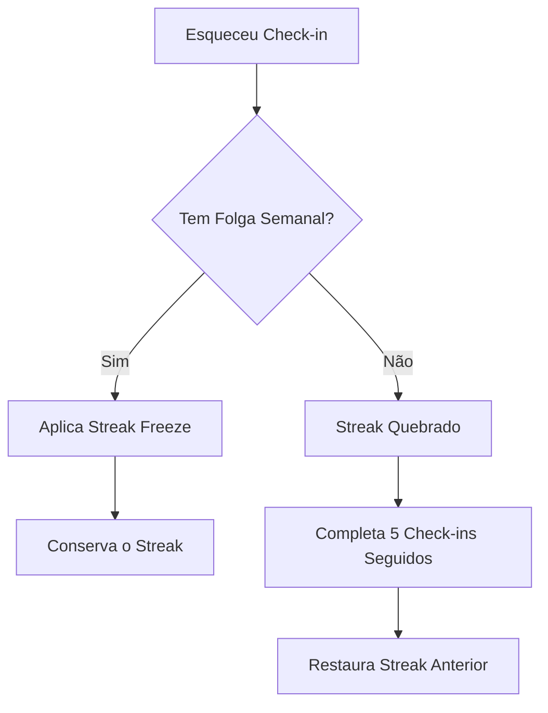
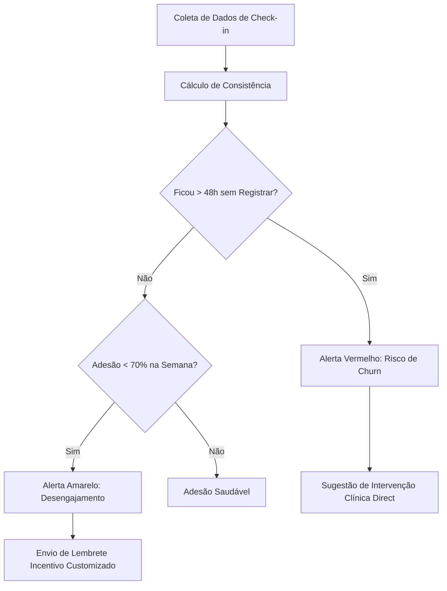

# GAMIFICATION & BEHAVIORAL DESIGN HANDBOOK
## Estratégia de Adesão, Engajamento e Psicologia Comportamental para Tratamento de 90 Dias

---

## 1. Introdução e Framework Científico Comportamental

Este manual estabelece a arquitetura de engajamento e adesão do aplicativo de Acompanhamento Clínico Integrativo (Melasma e Desinflamação). Em vez de projetar um "jogo" ou empregar dinâmicas de cassino, esta estratégia baseia-se na **ciência comportamental** e na **neurociência cognitiva** para estruturar a formação de hábitos de autocuidado ao longo da jornada terapêutica de 90 dias.

```
                  ┌──────────────────────────────────────────┐
                  │          TRIGGER (Gatilho)               │
                  │   Interno: Identidade / Desejo           │
                  │   Externo: Lembrete Inteligente          │
                  └────────────────────┬─────────────────────┘
                                       │
                                       ▼
                  ┌──────────────────────────────────────────┐
                  │           ACTION (Ação)                  │
                  │   Tomar Suplemento + Check-in Simples    │
                  │   Fogg: Baixo esforço cognitivo/físico   │
                  └────────────────────┬─────────────────────┘
                                       │
                                       ▼
                  ┌──────────────────────────────────────────┐
                  │       VARIABLE REWARD (Recompensa)       │
                  │   Dopamine Loop Saudável (Animação,      │
                  │   Mensagem Elegante, Insight de Saúde)   │
                  └────────────────────┬─────────────────────┘
                                       │
                                       ▼
                  ┌──────────────────────────────────────────┐
                  │         INVESTMENT (Investimento)        │
                  │   XP acumulado, Nível e Streak           │
                  │   Evita aversão à perda da consistência  │
                  └──────────────────────────────────────────┘
```

### 1.1 Teoria da Autodeterminação (SDT)
A motivação sustentável de longo prazo baseia-se em três pilares fundamentais, aplicados aqui de maneira estritamente ética:
*   **Autonomia:** O paciente controla sua jornada. A edição retroativa é solicitável, e não há punições rígidas ou humilhações públicas. Ele escolhe o momento ideal para receber lembretes.
*   **Competência:** Promovida pelo *Endowed Progress Effect* (efeito de progresso doado) e pelo *Progress Principle*. O paciente visualiza seu avanço em frações realizáveis, recebendo badges que celebram marcos reais de saúde.
*   **Relacionamento (Vínculo Terapêutico):** Em vez de competir com outros pacientes (o que geraria ansiedade estética), a conexão é feita diretamente com o clínico, que acompanha a evolução por meio do Painel Admin e pode intervir ativamente com suporte personalizado.

### 1.2 O Modelo do Gancho (Hook Model - Nir Eyal)
Adaptado para criar hábitos saudáveis de forma ética:
1.  **Gatilho (Trigger):** Notificações personalizadas contextualizadas com a rotina diária (Gatilho Externo) que gradualmente se transformam no desejo de sentir-se bem e saudável (Gatilho Interno).
2.  **Ação (Action):** O check-in no aplicativo é simplificado ao extremo (apenas um toque), minimizando a barreira descrita pelo Modelo de Comportamento de Fogg.
3.  **Recompensa Variável (Variable Reward):** O feedback visual e sonoro varia sutilmente a cada check-in, oferecendo frases de autocuidado e pequenos fatos científicos educativos, mantendo a curiosidade sem criar adicção destrutiva.
4.  **Investimento (Investment):** O acúmulo de XP, o crescimento do Streak (consistência) e a coleção de Badges representam o esforço contínuo do paciente, aumentando o valor percebido e a aversão a interromper o tratamento (*Loss Aversion*).

### 1.3 Modelo de Comportamento de Fogg ($B = MAP$)
O comportamento ($B$) ocorre quando a Motivação ($M$), a Habilidade ($A$ de *Ability*) e o Gatilho ($P$ de *Prompt*) coincidem no mesmo instante.
*   **Aumento de Habilidade (Redução de Esforço):** O fluxo de registrar a ingestão deve exigir menos de 3 segundos no smartphone do paciente.
*   **Gatilhos Otimizados:** O prompt só é enviado dentro de janelas de tolerância clinicamente relevantes, evitando a fadiga de notificações.

---

## 2. Perfil Comportamental das Usuárias (Público-Alvo)

O perfil prioritário do aplicativo é composto por **mulheres adultas entre 30 e 55 anos** em tratamentos dermatológicos e sistêmicos complexos (Melasma e protocolos anti-inflamatórios).

### Diretrizes de Tom de Voz e Design Comportamental:
*   **Premium e Sofisticado:** Sem ilustrações infantis, mascotes caricatos ou paletas de cores excessivamente saturadas. O design utiliza tons sóbrios (terracota e verdes oliva), tipografia limpa (Outfit) e acabamentos refinados (vidro fosco/glassmorphism).
*   **Foco no Autocuidado e Autoestima:** A linguagem celebra a disciplina, a constância e o cuidado diário, em vez de focar na "perfeição visual rápida".
*   **Competência e Disciplina Terapêutica:** A motivação baseia-se em acompanhar a regeneração celular e a desinflamação sistêmica passo a passo.

---

## 3. A Jornada Comportamental dos 90 Dias

Para sustentar o engajamento ao longo dos 90 dias necessários para o ciclo de renovação da pele e modulação celular, mapeamos a jornada emocional do paciente:

```mermaid
chronology
    title Jornada Emocional dos 90 Dias
    Dia 1 - Boas-vindas : Entusiasmo e expectativa alta. Foco em alinhar a facilidade de uso e onboarding.
    Primeira Semana : Adaptação do hábito. Risco de esquecimento alto. Foco em lembretes amigáveis.
    Marcos 14 a 30 dias : Primeiras melhorias sutis na pele. Efeito Goal Gradient começa a agir.
    Dia 45 - Metade da Jornada : Platô de entusiasmo. Risco médio de abandono. Conteúdos educativos desbloqueados.
    Dia 60 a 75 : Resultados consolidados. Hábito de check-in integrado à rotina.
    Dia 90 - Conclusão : Celebração da consistência, entrega de certificado clínico digital e transição para manutenção.
```

### 3.1 Fase de Onboarding (Dia 1 ao 7)
*   **Objetivo Emocional:** Acolhimento, redução de ansiedade sobre o tratamento e clareza das etapas.
*   **Mecânica Aplicada:** *Endowed Progress Effect*. O paciente inicia com a barra de progresso já preenchida em 5% (referente ao preenchimento de perfil e recebimento do protocolo inicial), gerando impulso imediato de continuação.

### 3.2 Fase de Adaptação (Dia 8 ao 30)
*   **Objetivo Emocional:** Construção de consistência. Superar a tentação de abandonar caso não veja melhorias drásticas imediatas nos primeiros dias.
*   **Mecânica Aplicada:** *Streak Semanal* e *Gamificação da Constância*. Desbloqueio da primeira série de curiosidades sobre "Como a pele se comporta nos primeiros 20 dias".

### 3.3 Fase do Platô (Dia 31 ao 60)
*   **Objetivo Emocional:** Resiliência e sustentabilidade. O entusiasmo inicial diminui; o hábito precisa de suporte cognitivo.
*   **Mecânica Aplicada:** Badges de "Metade da Jornada" e pequenos relatórios visuais de progresso entregues de forma personalizada.

### 3.4 Fase de Consolidação e Conclusão (Dia 61 ao 90)
*   **Objetivo Emocional:** Triunfo, orgulho e empoderamento pessoal.
*   **Mecânica Aplicada:** Emissão de certificado de conclusão terapêutica, estatísticas personalizadas da consistência e liberação do protocolo de manutenção de longo prazo.

---

## 4. Sistema de Progressão: XP e Equações de Balanceamento

O XP (Pontos de Experiência) e os níveis medem o progresso objetivo do paciente e servem como combustível para o avanço visual.

### 4.1 Regras de Distribuição de XP

```
                    ┌──────────────────────────────┐
                    │      Check-in no Horário     │
                    │           +10 XP             │
                    └──────────────┬───────────────┘
                                   │
                                   ├─────────────────────────────┐
                                   │                             │
                                   ▼                             ▼
                    ┌──────────────────────────────┐   ┌───────────────────┐
                    │      Streak de 7 Dias        │   │ Check-in Atrasado │
                    │           +15 XP             │   │       +5 XP       │
                    └──────────────────────────────┘   └───────────────────┘
```

*   **Check-in no Horário (Janela de Tolerância de 60 min):** $+10$ XP.
*   **Check-in Atrasado (Dentro do mesmo dia clínico):** $+5$ XP.
*   **Check-in Retroativo (Autorizado por clínico):** $+2$ XP (não pontua para Streak para proteger a veracidade dos dados).
*   **Bônus de Consistência (Streak de 7 dias consecutivos):** $+15$ XP.

### 4.2 Equação de Progressão de Nível
Para garantir uma curva de aprendizado e engajamento suave, a quantidade de XP necessária para avançar do nível $L$ para o nível $L+1$ segue a fórmula:

$$\text{XP Requerido}(L) = L \times 100$$

*   **Nível 1 para Nível 2:** $100$ XP (Aproximadamente 10 check-ins pontuais).
*   **Nível 2 para Nível 3:** $200$ XP (Acumulado de 300 XP).
*   **Nível 10 para Nível 11:** $1000$ XP.

O teto máximo de nível projetado para os 90 dias é o **Nível 20**, com um acumulado de XP calibrado de tal forma que um paciente com 95% de adesão atinja o Nível 20 exatamente no final da jornada do tratamento.

---

## 5. Níveis e Evolução Visual (1 a 20)

Os níveis são divididos em 4 grandes fases terapêuticas, cada uma correspondente ao estado fisiológico esperado da pele e do organismo:

| Fase | Nível | Nome do Nível | Requisito de XP | Benefício Visual e Recompensa |
| :---: | :---: | :--- | :---: | :--- |
| **I. Despertar** | 1 | Iniciante Consciente | 0 XP | Tema padrão ativo. Primeiro card de suplementação liberado. |
| | 2 | Primeiro Passo | 100 XP | Desbloqueio da paleta de cores complementar da clínica. |
| | 3 | Despertar Celular | 300 XP | Liberação do artigo: "O ciclo circadiano e sua pele". |
| | 4 | Consistência Inicial | 600 XP | Badge de Onboarding Concluído. |
| | 5 | Renovação em Curso | 1000 XP | Desbloqueio do tema visual "Vidro Terracota" / "Verde Oliva". |
| **II. Cultivo** | 6 | Guardião da Rotina | 1500 XP | Mini-infográfico: "Suplementação e Absorção Celular". |
| | 7 | Foco Diário | 2100 XP | Efeito de partículas premium na confirmação do check-in. |
| | 8 | Equilíbrio Sistêmico | 2800 XP | Mensagem de parabéns personalizada do clínico via Dashboard. |
| | 9 | Escudo Protetor | 3600 XP | Guia exclusivo sobre "Alimentos que combatem o melasma". |
| | 10 | Metade do Caminho | 4500 XP | Desbloqueio do Badge Especial "30 Dias de Ouro". |
| **III. Florescer** | 11 | Fisiologia Ativa | 5500 XP | Liberação do tema visual Dark Mode Premium. |
| | 12 | Disciplina Firme | 6600 XP | Acesso rápido a dicas avançadas de foto-proteção. |
| | 13 | Pele Nutrida | 7800 XP | Efeitos táteis (haptic feedback) de maior intensidade. |
| | 14 | Resiliência Clínica | 9100 XP | Notificações com citações científicas inspiradoras. |
| | 15 | Purificação | 10500 XP | Desbloqueio do Badge Especial "60 Dias de Fogo". |
| **IV. Maestria** | 16 | Equilíbrio Pleno | 12000 XP | Tema visual com animações fluidas de fundo orgânico. |
| | 17 | Brilho Próprio | 13600 XP | Liberação do artigo de transição pós-tratamento. |
| | 18 | Hábito Consolidado | 15300 XP | Pré-visualização do Certificado Clínico. |
| | 19 | Renascimento | 17100 XP | Efeito de glow dourado ao redor do card de check-in. |
| | 20 | Maestria Integrativa | 19000 XP | Emissão do Certificado e Liberação do Protocolo de Manutenção. |

---

## 6. O Sistema de Streaks e Proteção Comportamental

O *Streak* (sequência de dias) é uma poderosa ferramenta de engajamento baseada no princípio de *Loss Aversion* (aversão à perda). No entanto, punições severas geram desmotivação e abandono do aplicativo (*Efeito "Dane-se" / What-the-Hell Effect*).

### 6.1 Mecânica do Streak Guard (Proteção Comportamental)
*   **O Amortecedor de Streak (Streak Freeze):** O paciente possui uma "Folga Semanal" automática. Caso ele esqueça de realizar o check-in em um dia, a sequência de dias não é zerada na primeira ocorrência. O sistema exibe um card com mensagem acolhedora: *"Sua sequência foi protegida por nossa equipe. A saúde é uma maratona, não um sprint diário."*
*   **Recuperação Amigável:** Se a sequência for quebrada após o esgotamento da folga, o paciente pode reativá-la ao completar 5 dias consecutivos de check-in pontual. O "Streak anterior" é restaurado automaticamente (*Endowed Progress* restaurativo).



---

## 7. Catálogo de Badges (Conquistas Premium)

Os Badges são estruturados como medalhas e insígnias minimalistas com design em alto relevo metálico e paleta terracota/verde-oliva.

```
       ┌─────────────────┐       ┌─────────────────┐       ┌─────────────────┐
       │   PRIMEIRO TOQUE│       │  SEMANA PERFEITA│       │     30 DIAS GOLD│
       │  Bronze Minimal │       │  Prata Polida   │       │  Ouro Acetinado │
       │  1º Check-in    │       │  7 Dias Seguidos│       │  30 Dias Totais │
       └─────────────────┘       └─────────────────┘       └─────────────────┘
```

1.  **Primeiro Toque:**
    *   *Critério:* Realizar o primeiro check-in no aplicativo.
    *   *Mensagem:* *"Seu compromisso com você mesma começou hoje. Bem-vinda à sua jornada."*
2.  **Semana Perfeita:**
    *   *Critério:* 7 dias consecutivos de check-ins pontuais.
    *   *Mensagem:* *"Consistência é a base de tudo. Sete dias construindo um novo hábito."*
3.  **Hábito de Ferro:**
    *   *Critério:* Completar 14 dias de consistência (mesmo com uso de um Streak Freeze).
    *   *Mensagem:* *"A estrutura celular da sua pele se renova com disciplina. Continue firme."*
4.  **Consistência Prata:**
    *   *Critério:* 30 dias acumulados de check-ins registrados.
    *   *Mensagem:* *"Um mês inteiro dedicado à sua saúde integral. Os resultados começam de dentro para fora."*
5.  **Metade do Caminho:**
    *   *Critério:* 45 dias concluídos de protocolo.
    *   *Mensagem:* *"45 dias de dedicação. Você atravessou a metade do caminho com determinação."*
6.  **Foco Inabalável:**
    *   *Critério:* 60 dias totais de registro no aplicativo.
    *   *Mensagem:* *"Duas renovações celulares completas guiadas pela sua disciplina."*
7.  **Soberania Clínica:**
    *   *Critério:* Registrar check-in em 75 dias de tratamento.
    *   *Mensagem:* *"O hábito de se cuidar tornou-se parte de quem você é."*
8.  **Maestria Integrativa:**
    *   *Critério:* Conclusão dos 90 dias do protocolo de tratamento.
    *   *Mensagem:* *"Você completou o protocolo de 90 dias. Parabéns pelo autocuidado e perseverança."*

---

## 8. UX Writing e Mensageira de Feedback Positivo

Evitamos mensagens robóticas ou excessivamente alegres. O tom é **compassivo, clínico, empoderador e elegante**.

### 8.1 Banco de Mensagens Inteligentes (Exemplos)

#### Categoria: Pequenas Vitórias (Pós Check-in)
*   *"Dose registrada. Seu organismo agradece pela consistência."*
*   *"Mais um passo dado em direção ao seu equilíbrio sistêmico."*
*   *"Cuidar de si é um ato de respeito diário. Até a próxima dose."*

#### Categoria: Resiliência (Retorno de Ausência)
*   *"Que bom ver você de volta. O autocuidado não exige perfeição, exige persistência."*
*   *"Cada dia é uma nova oportunidade de recomeçar seu protocolo. Vamos juntas."*

#### Categoria: Disciplina e Saúde
*   *"O tratamento integrativo atua em nível celular. Sua constância de hoje é o resultado de amanhã."*

---

## 9. Notificações Inteligentes e Triggers Não-Intrusivos

Para evitar a "fadiga de alerta" que leva à desinstalação de apps de saúde, as notificações seguem regras de prioridade e temporalidade estritas.

### 9.1 Matriz de Lembretes Diários
*   **Lembrete Primário (15 min antes da dose):** *"Olá [Nome]. Daqui a 15 minutos é o momento de cuidar da sua pele. Deixe sua dose separada."*
*   **Lembrete Secundário (60 min após o horário, se pendente):** *"Perdemos o check-in das [Hora]? Não se preocupe, você ainda pode registrar a sua ingestão agora."*
*   **Lembrete de Final de Dia (21:00, se faltar check-in):** *"Antes de descansar, confirme o seu protocolo do dia. Mantenha sua rotina alinhada."*

---

## 10. Dashboard do Administrador: Métricas e Churn Prevention

Para o clínico, o Painel de Controle serve como uma ferramenta de diagnóstico comportamental em tempo real, gerando alertas preditivos de abandono.



### 10.1 Indicadores no Painel do Clínico
*   **Índice de Adesão Geral (IAG):** Média percentual de check-ins corretos em relação ao total prescrito no período de 90 dias.
*   **Médias de Streak:** Identifica pacientes que mantém constância constante de 7, 14 ou mais dias.
*   **Alerta de Risco de Abandono (Churn Risk):** Disparado quando um paciente fica sem registrar check-ins por **mais de 48 horas seguidas** ou quando a taxa de adesão semanal cai para menos de 65%.
*   **Card de Intervenção Sugerida:** Se o risco de abandono for alto, o painel disponibiliza um botão rápido para enviar mensagem via WhatsApp: *"Oi [Nome], notei que você deu uma pausa no registro das doses. Está tudo bem com a adaptação dos suplementos? Me conta como você está se sentindo."*

---

## 11. Decisões Arquiteturais de Gamificação (ADRs)

### ADR 021: Rejeição de Rankings Públicos Competitivos
*   **Decisão:** Não implementar tabelas de classificação (*leaderboards*) que comparem o progresso dos pacientes.
*   **Justificativa:** Em tratamentos estéticos e dermatológicos (Melasma/Desinflamação), a comparação social induz a ansiedade, sentimentos de inadequação e competição nociva, violando a ética do autocuidado integrado.

### ADR 022: Amortecimento de Streak Automático (Streak Freeze)
*   **Decisão:** Oferecer uma folga semanal automática sem necessidade de "compra de item virtual".
*   **Justificativa:** Pacientes esquecem check-ins por razões reais da rotina. Zerar o streak imediatamente ativa o *Efeito Dane-se*, onde o paciente desiste de todo o tratamento porque perdeu o "contador perfeito".

---

## 12. Auditoria e Matriz de Maturidade de Gamificação

Comparamos nosso sistema de Behavioral Design com os principais players do mercado de bem-estar:

```
Nível 1 (Ad-hoc) ──► Nível 2 (Superficial) ──► Nível 3 (Operante) ──► Nível 4 (Comportamental Premium) ──► Nível 5 (Padrão Duolingo)
                                                                                  ▲
                                                                          [ Nosso Sistema ]
```

*   **Nível 1 (Ad-hoc):** Apenas pontuação crua e rankings simples sem justificação psicológica.
*   **Nível 2 (Superficial - Cassino):** Uso excessivo de luzes, caixas de recompensa aleatórias e confetes infantis para gerar dopamina barata.
*   **Nível 3 (Operante - Fitbit básico):** Monitora estatísticas, dá badges apenas por conquistas cumulativas simples, sem amortecedores de perdas.
*   **Nível 4 (Comportamental Premium - Nosso Sistema / Headspace):** Foco em motivação intrínseca, amparo ético de perda, mensagens elegantes baseadas no tom de autocuidado maduro, design minimalista e integração direta com o acompanhamento médico real.
*   **Nível 5 (Otimizado/Gamified Core - Duolingo / Habitica):** Toda a experiência estruturada como um RPG complexo ou sistema de ligas integradas de alta intensidade. Desaconselhável para aplicações clínicas de saúde.

---
> Gamification & Behavioral Design Handbook revisado e homologado para desenvolvimento de produto de alta retenção.
