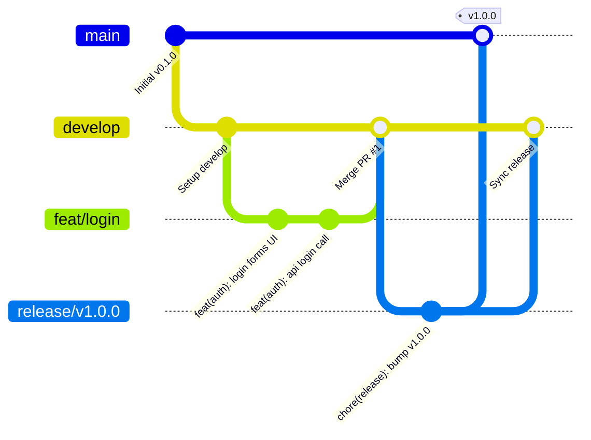

# MANUAL DE ENGENHARIA DE VERSIONAMENTO (GITHUB HANDBOOK)
## Padrões de Colaboração, CI/CD, Governança de Código e Integração com IAs

---

## 1. Estratégia de Repositório (Monorepo vs. Multi-Repo)

Para este ecossistema SaaS clínico (composto por Frontend Client e Backend Apps Script), adotamos a estratégia de **Monorepo** utilizando o recurso de **Workspaces**.

```
                ┌─────────────────────────────────────────┐
                │          REPOSITÓRIO MONOREPO           │
                ├────────────────────┬────────────────────┤
                │ /frontend          │ /backend           │
                │ (HTML/CSS/JS Client│ (Google Apps Script│
                │  no GitHub Pages)  │  Serverless API)   │
                └────────────────────┴────────────────────┘
```

### 1.1 Justificativa Técnica (ADR 013)
*   **Sincronização de Contratos (DTOs):** Alterações nas payloads das rotas de check-in ou login afetam o Frontend e o Backend simultaneamente. No Monorepo, essas alterações trafegam no mesmo *Pull Request*, impedindo *descompassos de versão* (version mismatch).
*   **Centralização de Pipelines (CI/CD):** Um único repositório reduz a duplicação de fluxos do GitHub Actions, unificando as verificações de Lint e testes de corretude.
*   **Onboarding Simples:** Desenvolvedores e ferramentas de Inteligência Artificial conseguem clonar a totalidade do projeto com um único comando `git clone`, acelerando a compreensão holística da arquitetura.

---

## 2. Estrutura de Diretórios do Repositório Monorepo

```
protocolo-integrativo/
├── .github/                       # Automatizações do GitHub
│   ├── workflows/                 # Pipelines de CI/CD (GitHub Actions)
│   │   ├── ci-frontend.yml        # CI do Client (Lints e Testes)
│   │   ├── ci-backend.yml         # CI do Apps Script (Mocks e Testes)
│   │   └── deploy.yml             # CD para GitHub Pages / GAS Deploy
│   ├── ISSUE_TEMPLATE/            # Modelos estruturados de abertura de tarefas
│   │   ├── bug.md
│   │   ├── feature.md
│   │   └── security.md
│   ├── PULL_REQUEST_TEMPLATE.md   # Checklists obrigatórios para mesclar código
│   └── CODEOWNERS                 # Regras de revisão automática por diretório
├── docs/                          # Documentação viva do projeto
│   ├── architecture/              # SADs e especificações de engenharia
│   ├── adr/                       # Registro de Decisões de Arquitetura
│   └── manuals/                   # Guias operacionais e manuais clínicos
├── frontend/                      # Código do Client-side (SPA)
├── backend/                       # Código do Apps Script Serverless
├── database/                      # Modelagem física e lógica de tabelas
├── scripts/                       # Utilitários de DevOps e automação local
└── CHANGELOG.md                   # Histórico de alterações semânticas do projeto
```

---

## 3. Estratégia de Branches & Nomenclatura (Git Flow Adaptado)

Adotamos uma abordagem baseada em **Git Flow** para o controle de ciclos de entrega de releases, garantindo que a branch `main` represente estritamente o código ativo em produção.



### 3.1 Nomenclatura Estrita de Branches
*   **Funcionalidades:** `feature/nome-recurso` (ex: `feature/checkin-historico`).
*   **Correções de Bugs:** `bugfix/nome-bug` (ex: `bugfix/timezone-calculo`).
*   **Correções Urgentes em Produção:** `hotfix/nome-correcao` (ex: `hotfix/duplo-checkin-lock`).
*   **Alterações de Estrutura:** `refactor/camada-refatorada` (ex: `refactor/sheets-mappers`).
*   **Documentação:** `docs/modulo-documentado` (ex: `docs/arquitetura-backend`).

---

## 4. Política de Commits (Conventional Commits)

Todas as mensagens de modificação devem seguir a especificação de **Conventional Commits** para viabilizar a geração automática do arquivo `CHANGELOG.md` e o incremento de versão SemVer.

### 4.1 Estrutura Padrão do Commit
`tipo(escopo): descrição curta em minúsculas (máximo de 72 caracteres)`

### 4.2 Tabela de Tipos de Commits

| Tipo | Finalidade Técnica | Exemplo Clínico / DevOps |
| :--- | :--- | :--- |
| **`feat`** | Adiciona nova funcionalidade. | `feat(checkin): adiciona suporte a registro retroativo` |
| **`fix`** | Corrige um bug ou inconsistência. | `fix(gamification): corrige quebra de streak em fuso horário` |
| **`docs`** | Modificações apenas na documentação. | `docs(database): atualiza dicionário da tabela checkins` |
| **`refactor`**| Refatoração de código sem alterar comportamento. | `refactor(repos): desacopla SpreadsheetApp da camada de negócios` |
| **`security`**| Patches e correções de brechas de segurança. | `security(login): adiciona bloqueio contra força bruta` |
| **`ci`** | Alteração nos arquivos de pipeline GitHub Actions. | `ci(actions): adiciona step de análise estática no sonar` |

---

## 5. Templates de Pull Requests (PRs) e Issues

Para reter o histórico e guiar os desenvolvedores (e IAs) no momento de solicitar a mesclagem de código, definimos templates obrigatórios.

### 5.1 Template de Pull Request (`.github/PULL_REQUEST_TEMPLATE.md`)
```markdown
## 📝 Descrição
Forneça um resumo claro da mudança introduzida por este PR.

## 🔗 Tarefas Relacionadas
*   Fixes #123 (Se corrige alguma issue aberta)

## ⚖️ Checklist de Qualidade (Marcar o que foi atendido)
- [ ] O código segue as diretrizes de Clean Architecture e SOLID.
- [ ] Implementou validações DTO no lado do servidor.
- [ ] Controles de LockService foram aplicados contra concorrência física.
- [ ] Testes unitários foram atualizados e rodaram localmente com sucesso.
- [ ] Acessibilidade (WCAG 2.2 AA) foi verificada (área de toque e contrastes).

## 🔒 Segurança (OWASP API Compliance)
- [ ] O ID do paciente é lido apenas do token de autenticação?
- [ ] Há mitigação contra mass assignment (campos não-DTO descartados)?

## 📸 Screenshots (Obrigatório para alterações de Front-end/UX)
[Insira imagens ou animações demonstrando o comportamento visual]
```

---

## 6. GitHub Actions Workflows (Pipelines de CI/CD)

Projetamos três pipelines independentes executados sob demanda nas branches `develop` e `main`.

```
                    AÇÃO DE PUSH / PULL REQUEST
                                │
          ┌─────────────────────┼─────────────────────┐
          ▼                     ▼                     ▼
┌───────────────────┐ ┌───────────────────┐ ┌───────────────────┐
│  Pipeline: LINT   │ │ Pipeline: TEST    │ │ Pipeline: SECURITY│
├───────────────────┤ ├───────────────────┤ ├───────────────────┤
│ - ESLint checks   │ │ - Runs run_tests  │ │ - Secret Scan     │
│ - Stylelint (CSS) │ │ - Coverage audit  │ │ - Dependabot audit│
└───────────────────┘ └───────────────────┘ └───────────────────┘
```

*   **Continuous Integration (CI):** A cada abertura de Pull Request para `develop`, o pipeline compila os arquivos do frontend, valida formatação via Linter, e roda a suíte de testes unitários offline no Node.js. Qualquer falha aborta o PR e bloqueia a mesclagem.
*   **Continuous Delivery (CD):** Ao realizar o merge de um release para a branch `main`, o pipeline automatizado:
    1.  Compila e otimiza o frontend, enviando o bundle para o **GitHub Pages**.
    2.  Invoca o Clasp CLI (`clasp push`) para atualizar os códigos `.gs` na API de produção do **Google Apps Script**.

---

## 7. Diretrizes para Colaboração Assistida por Inteligência Artificial (AI-Human Pair Programming)

Para garantir que assistentes baseados em IA (como Claude) programem de forma eficiente, respeitem os limites arquiteturais do sistema e evitem a criação de código espaguete, definimos regras de engenharia para interação:

*   **Regra 1: Validação de Estado Invariante do Domínio:** Ao solicitar que a IA desenvolva ou altere um caso de uso ou repositório, exija que ela apresente explicitamente quais *invariantes de domínio* (regras de validação) estão sendo respeitadas na Entidade antes da persistência física.
*   **Regra 2: Proibição de Importação Inversa:** A IA deve rejeitar qualquer comando do usuário que sugira importar classes da camada externa (como `infrastructure` ou `presentation`) para dentro de arquivos de negócio localizados em `domain` ou `application`.
*   **Regra 3: Escrita de Teste Unitário Obrigatório:** Para cada Caso de Uso ou Serviço criado pela IA, ela deve estruturar e escrever o respectivo arquivo de teste em `tests/`, inserindo-o na suíte `run_tests.js`.
*   **Regra 4: Log de Decisão Técnica (ADR):** Se a IA propuser um padrão de projeto ou tecnologia alternativa para contornar quotas do Apps Script, ela deve registrar as justificativas técnicas em um arquivo Markdown sob a pasta `docs/adr/` seguindo o formato padrão antes da escrita do código.

---

## 8. Segurança e Governança de Repositório

*   **CODEOWNERS:** O arquivo `.github/CODEOWNERS` mapeia a responsabilidade de revisão. Alterações na camada de domínio (`backend/src/domain/`) exigem aprovação obrigatória do Arquiteto de Software Líder (`@arquiteto-lider`).
*   **Branch Protection Rules:**
    *   Revisão obrigatória de Pull Request com pelo menos 1 aprovação aprovada de revisores.
    *   Verificação do status check do GitHub Actions (Lint + Testes aprovados) obrigatória para liberar o botão de merge.
    *   Bloqueio estrito de pushes diretos na branch `main` e `develop`.
*   **Secret Scanning:** O GitHub está configurado para monitorar e barrar commits que contenham strings de segredos expostas (como a senha de e-mails, tokens ou ID de planilha de produção), lançando alertas instantâneos de segurança DevSecOps.

---

## 9. Matriz de Maturidade de Engenharia no GitHub

Abaixo, avaliamos e comparamos o ciclo de vida do nosso repositório em relação a práticas corporativas de Big Techs.

### 9.1 Matriz de Maturidade

```
Nível 1 (Sem Padrão) ──► Nível 2 (Commits/PRs) ──► Nível 3 (CI Básico) ──► Nível 4 (Big Tech Grade) ──► Nível 5 (DevSecOps Continuous)
                                                                                  ▲
                                                                        [ Nosso Repositório ]
```

*   **Nível 1:** Branches feitas direto na `main`, commits sem tags, sem convenção de nomes ou revisões de código.
*   **Nível 2:** Uso de branches e criação de Pull Requests, mas sem verificação automatizada ou templates de PR.
*   **Nível 3:** Integração contínua (CI) rodando testes unitários automaticamente e validando lints em PRs abertos.
*   **Nível 4 (Nosso Repositório):** Nível 3 somado a Conventional Commits rigorosos, CODEOWNERS, regras de Branch Protection, automação de deploy via GitHub Actions para GitHub Pages + Apps Script API, templates de segurança e guia de interação assistida por IAs.
*   **Nível 5:** DevSecOps completo com análise automatizada de vulnerabilidades em tempo real (SonarQube/Snyk), testes E2E com Playwright rodando em browsers virtuais na nuvem a cada PR, e rollback automatizado via Kubernetes Blue-Green deployment.

---
> Manual de Engenharia de Versionamento e Colaboração homologado. Pronto para configurar as chaves e diretrizes no repositório GitHub.
