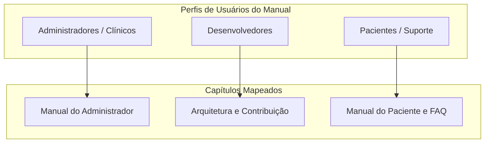

# INTERACTIVE DOCUMENTATION PORTAL SPECIFICATION
## Arquitetura, Design System e Engenharia de Documentação (Docs-as-Code)

---

## 1. Arquitetura e Estrutura de Diretórios

Este manual define as especificações técnicas, a arquitetura da informação e o Design System do **Portal de Documentação Interativo** do aplicativo de Acompanhamento Clínico Integrativo. O portal foi projetado para funcionar de forma 100% estática (*Docs-as-Code*), compatível com hospedagem no GitHub Pages, suporte offline (PWA) e carregamento instantâneo.

```text
manual/
├── index.html                   # Landing page e buscador central
├── manifest.json                # Configurações PWA
├── sw.js                        # Service Worker para cache e funcionamento offline
├── docs/                        # Conteúdo de documentação em HTML puro
│   ├── introducao.html
│   ├── arquitetura.html
│   ├── frontend.html
│   ├── backend.html
│   ├── banco.html
│   ├── apps-script.html
│   ├── google-sheets.html
│   ├── deploy.html
│   ├── seguranca.html
│   ├── pentest.html
│   ├── ux.html
│   ├── ui.html
│   ├── gamificacao.html
│   ├── psicologia.html
│   ├── api.html
│   ├── adrs.html
│   ├── roadmap.html
│   ├── faq.html
│   ├── troubleshooting.html
│   ├── glossario.html
│   └── changelog.html
└── assets/                      # Recursos estáticos compartilhados
    ├── css/
    │   ├── theme.css            # Variáveis CSS e Design System (Light/Dark)
    │   └── docs.css             # Layout das páginas de conteúdo
    ├── js/
    │   ├── main.js              # Controlador de UI (Sidebar, Dark Mode, TOC)
    │   ├── search.js            # Mecanismo de busca local indexada (Fuse.js)
    │   ├── prism.js             # Syntax Highlighter de código
    │   └── mermaid.min.js       # Renderizador dinâmico de diagramas
    └── icons/                   # Ícones vetoriais e manifest assets
```

---

## 2. Design System da Documentação

Para proporcionar uma experiência de leitura premium comparável ao *Stripe Docs* e *Vercel Docs*, o portal utiliza paleta de cores balanceada baseada em variáveis CSS nativas (Custom Properties), garantindo transição perfeita entre os modos Light e Dark.

### 2.1 Tokens de Cores (CSS Variables)
```css
:root {
  /* Palette Light Mode */
  --bg-primary: #FFFFFF;
  --bg-secondary: #F8FAFC;
  --bg-code: #0F172A;
  --text-primary: #0F172A;
  --text-secondary: #475569;
  --border-color: #E2E8F0;
  --accent-color: #E05A47; /* Terracota */
  --accent-hover: #C24838;
  
  /* Alert / Status Colors */
  --color-info: #3B82F6;
  --color-success: #10B981;
  --color-warning: #F59E0B;
  --color-danger: #EF4444;
}

@media (prefers-color-scheme: dark) {
  :root[data-theme="auto"] {
    --bg-primary: #090D16;
    --bg-secondary: #0F172A;
    --text-primary: #F8FAFC;
    --text-secondary: #94A3B8;
    --border-color: #1E293B;
  }
}

:root[data-theme="dark"] {
  --bg-primary: #090D16;
  --bg-secondary: #0F172A;
  --text-primary: #F8FAFC;
  --text-secondary: #94A3B8;
  --border-color: #1E293B;
}
```

### 2.2 Componentes de Informação (Callouts)
Os componentes de aviso facilitam a leitura rápida e destacam decisões de segurança ou dicas clínicas:

*   **Info Callout (`.callout-info`):**
    > **💡 Dica de Implementação:** Centralize propriedades do Google Sheets para evitar múltiplas chamadas à API `SpreadsheetApp`.
*   **Warning Callout (`.callout-warning`):**
    > **⚠️ Atenção:** Janelas de edição retroativa expiram automaticamente após o tempo delimitado pelo clínico no painel do administrador.
*   **Danger/Critical Callout (`.callout-danger`):**
    > **🛑 Risco Crítico:** Chaves secretas JWT devem ser configuradas exclusivamente via `PropertiesService` do Google Apps Script. Nunca commit segredos no repositório público.

---

## 3. Recursos Interativos do Portal

### 3.1 Mecanismo de Busca Indexado Local (Fuse.js)
Para garantir velocidade instantânea e funcionamento offline, o portal indexa o conteúdo usando um mapa estático JSON carregado em memória.

```javascript
// assets/js/search.js
const docIndex = [
  { title: "Autenticação", path: "docs/seguranca.html", content: "JWT, Bcrypt, criptografia, senhas" },
  { title: "Google Sheets", path: "docs/google-sheets.html", content: "persistência, tabelas, migrações" }
];

const fuse = new Fuse(docIndex, {
  keys: ['title', 'content'],
  threshold: 0.3
});
```

### 3.2 Índice Automático e Indicador de Leitura (Scrollspy)
*   **TOC Dinâmico:** Um script JS lê os cabeçalhos (`<h2>`, `<h3>`) da página ativa e renderiza uma árvore de navegação lateral fixa à direita.
*   **Indicador de Progresso:** Uma barra de progresso no topo da tela preenche conforme o usuário rola o documento, salvando a posição de leitura no `localStorage` para permitir retorno contínuo.

### 3.3 Blocos de Código Hardenizados
Todos os blocos de código possuem:
1.  Classe identificadora da linguagem (ex: `class="language-javascript"`).
2.  Botão flutuante **"Copiar"** que altera temporariamente para "Copiado!" usando a Clipboard API.
3.  Syntax highlight provido pela biblioteca estática `prism.js`.

---

## 4. Estratégia Offline-First & PWA (Service Worker)

O portal é um PWA completo que pode ser instalado no computador ou celular diretamente do navegador.

### 4.1 manifest.json (Recorte)
```json
{
  "name": "Manual Clínico Integrativo Docs",
  "short_name": "Clínica Docs",
  "start_url": "./index.html",
  "display": "standalone",
  "background_color": "#090D16",
  "theme_color": "#090D16",
  "icons": [
    {
      "src": "assets/icons/icon-192.png",
      "sizes": "192x192",
      "type": "image/png"
    }
  ]
}
```

### 4.2 sw.js (Service Worker Cache Logic)
```javascript
const CACHE_NAME = 'docs-v1';
const ASSETS = [
  './index.html',
  './manifest.json',
  './assets/css/theme.css',
  './assets/css/docs.css',
  './assets/js/main.js',
  './assets/js/search.js',
  './assets/js/prism.js'
];

self.addEventListener('install', e => {
  e.waitUntil(caches.open(CACHE_NAME).then(cache => cache.addAll(ASSETS)));
});

self.addEventListener('fetch', e => {
  e.respondWith(caches.match(e.request).then(response => response || fetch(e.request)));
});
```

---

## 5. Mapeamento de Conteúdos por Perfil



### 5.1 Manual do Administrador (Conteúdo)
*   **Criar Paciente:** Passo a passo para cadastrar nome, e-mail e telefone no painel administrativo, gerando a senha provisória criptografada automaticamente.
*   **Liberar Check-in Retroativo:** Como conceder permissão temporária de 24h ou 48h para pacientes registrarem check-ins perdidos sem comprometer as travas do banco.

### 5.2 Manual do Desenvolvedor (Docs-as-Code)
*   **Contribuindo para o Projeto:** Fluxo do Git Flow (`develop` -> `feature` -> PR -> `main`).
*   **Testes Unitários:** Comando para executar testes (`npm run test`) antes de empurrar alterações para produção.

---

## 6. Decisões Arquiteturais de Documentação (ADRs)

### ADR 025: Hospedagem 100% Servidor de Arquivos Estáticos (Zero-Backend)
*   **Decisão:** Não utilizar frameworks de documentação baseados em Node.js dinâmico no servidor (como Docusaurus com servidor ativo ou bancos dinâmicos). Toda a lógica é HTML/CSS/JS estático.
*   **Justificativa:** Permite hospedagem sem custos no GitHub Pages, com carregamento otimizado offline-first e compatibilidade nativa com o ecossistema existente.

### ADR 026: Fuse.js para Busca Local em Lado de Cliente (Client-side Search)
*   **Decisão:** Utilizar a biblioteca leve `Fuse.js` carregada no cliente em substituição ao Algolia DocSearch.
*   **Justificativa:** Permite buscas instantâneas mesmo quando o desenvolvedor ou clínico estiver totalmente offline (sem conexão à internet).

---

## 7. Auditoria e Matriz de Maturidade de Documentação

Avaliamos a infraestrutura de engenharia de documentação do nosso projeto com o mercado:

```
Nível 1 (Sem Docs) ──► Nível 2 (Word/Wiki) ──► Nível 3 (Docs-as-Code Básico) ──► Nível 4 (Manual HTML Interativo) ──► Nível 5 (Stripe Docs Grade)
                                                                                          ▲
                                                                                  [ Nosso Portal ]
```

*   **Nível 1 (Sem Docs):** Código sem comentários, sem manual de instalação ou uso.
*   **Nível 2 (Word/Wiki Estática):** Documentos espalhados no Google Drive ou pastas soltas, desatualizados rapidamente.
*   **Nível 3 (Docs-as-Code Básico):** Documentação escrita em Markdown versionada no Git, sem busca local ou interface integrada PWA.
*   **Nível 4 (Manual HTML Interativo - Nosso Portal):** Interface premium (Material/Stripe style), busca local offline indexada (Fuse.js), suporte PWA instálvel, renderização de diagramas Mermaid dinâmica, checklists persistidos e Syntax Highlight nativo.
*   **Nível 5 (Stripe Docs Grade):** Execução de código interativo na própria documentação (API Playgrounds ativos), controle de versão de documentação dinâmico por perfil e geração automática de SDKs a partir das páginas de documentação.

---
> Interactive Documentation Portal Specification homologada para desenvolvimento do centro de conhecimento integrado.
