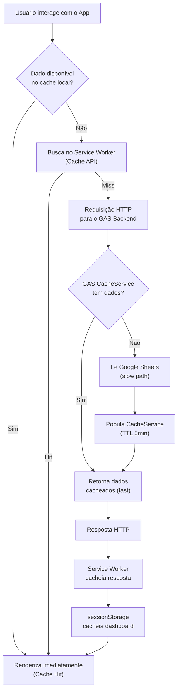
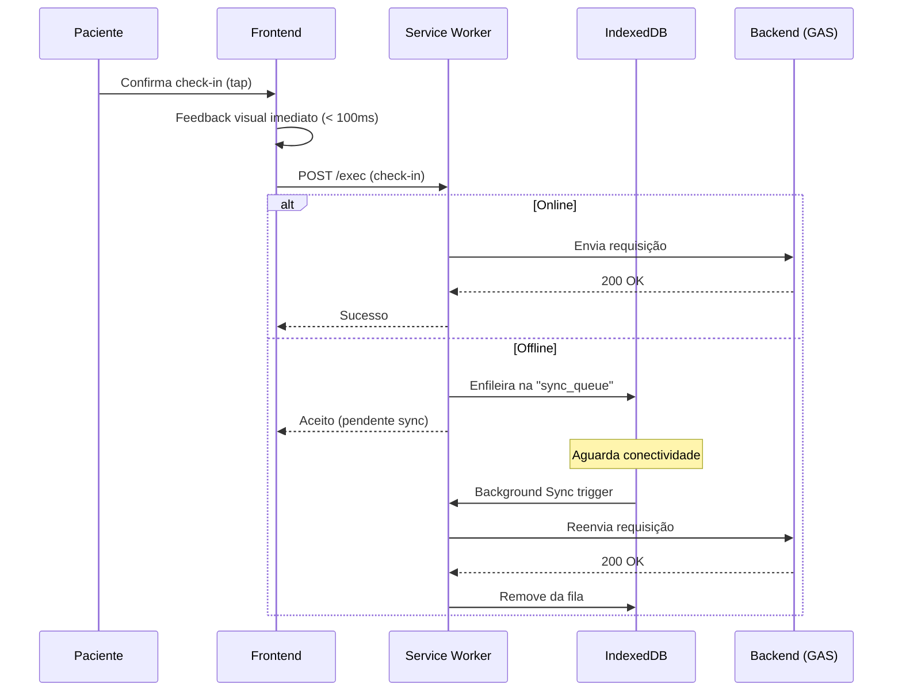

# ⚡ Performance Engineering Handbook (Módulo 19)

Estratégia completa de performance para o sistema de Acompanhamento Clínico Integrativo, projetada com base nos padrões de engenharia de **Google Web.dev**, **Vercel**, **Stripe**, **Netflix** e **Amazon**.

---

## 1. Metas de Performance (Core Web Vitals & KPIs)

### 1.1 Core Web Vitals — Targets

| Métrica | Target MVP | Target SaaS | Medição |
|:---|:---:|:---:|:---|
| **LCP** (Largest Contentful Paint) | < 1.5s | < 1.0s | Tempo até o maior elemento visual da viewport ser pintado |
| **INP** (Interaction to Next Paint) | < 150ms | < 100ms | Latência entre interação e próximo frame pintado |
| **CLS** (Cumulative Layout Shift) | < 0.05 | < 0.02 | Estabilidade visual (quanto a página "pula") |
| **FCP** (First Contentful Paint) | < 0.8s | < 0.5s | Primeiro pixel de conteúdo pintado |
| **TTI** (Time to Interactive) | < 2.0s | < 1.2s | Tempo até a aplicação responder a interações |
| **TBT** (Total Blocking Time) | < 150ms | < 50ms | Tempo total em que a thread principal ficou bloqueada |

### 1.2 KPIs de Operação

| Operação | Target (P50) | Target (P95) | Cenário |
|:---|:---:|:---:|:---|
| Login completo | < 2.5s | < 4.0s | GAS cold-start incluído |
| Dashboard render | < 1.5s | < 3.0s | Com cache warm |
| Check-in (tap → feedback) | < 200ms | < 500ms | Feedback local imediato |
| Sincronização incremental | < 1.0s | < 2.5s | Delta de dados |

---

## 2. Estratégia de Frontend Performance

### 2.1 Critical Rendering Path

O aplicativo já segue o modelo ideal: **HTML mínimo → CSS inline-critical → JS defer module**.

```
index.html (2KB)
  ├── <link preconnect fonts.googleapis.com>    ← DNS resolve antecipado
  ├── <link preconnect fonts.gstatic.com>       ← Handshake TLS antecipado
  ├── <link stylesheet index.css>               ← CSS render-blocking (5KB, aceitável)
  ├── Skeleton loader inline no HTML            ← FCP instantâneo antes do JS
  └── <script type="module" src="app.js">       ← Defer implícito (não bloqueia parser)
```

> [!TIP]
> **ADR-025: CSS Inline Critical.** Como o CSS total é de apenas ~5KB (bem abaixo do threshold de 14KB do primeiro RTT do TCP), NÃO fazemos code-splitting de CSS. O arquivo inteiro é entregue no primeiro round-trip, garantindo LCP rápido sem complexidade de extração de CSS crítico. Se o CSS crescer além de 14KB no futuro, devemos extrair o CSS acima-do-fold para inline e lazy-load o restante.

### 2.2 JavaScript — Carregamento e Execução

| Técnica | Estado Atual | Recomendação |
|:---|:---:|:---|
| ES Modules (`type="module"`) | ✅ Ativo | Mantém defer implícito. Não bloqueia a thread. |
| Lazy Import de Pages | ❌ Ausente | Usar `import()` dinâmico para carregar `DashboardAdminPage.js` e `DashboardPacientePage.js` somente quando autenticado. |
| Minificação | ❌ Ausente | Antes do deploy no GitHub Pages, rodar `esbuild --minify` ou `terser`. |
| Tree Shaking | ✅ Implícito | Já utiliza ES Modules nativos; o browser descarta exports não utilizados. |
| Event Delegation | ❌ Parcial | Nos cards de suplementos, bind individual por card. Migrar para delegation no container pai. |

**Implementação recomendada de Lazy Import no `app.js`:**

```javascript
// ANTES (eager — carrega tudo no boot):
import { DashboardPacientePage } from './pages/DashboardPacientePage.js';

// DEPOIS (lazy — carrega sob demanda):
const { DashboardPacientePage } = await import('./pages/DashboardPacientePage.js');
```

Isso reduz o tamanho do bundle inicial em ~15KB (DashboardAdmin + DashboardPaciente), melhorando TTI em conexões 3G.

### 2.3 Renderização Eficiente do DOM

| Problema Identificado | Arquivo | Impacto | Solução |
|:---|:---|:---|:---|
| `innerHTML` no dashboard inteiro após cada check-in | `DashboardPacientePage.js` L131, L164 | Causa reflow completo, perde scroll position e destrói listeners | Usar DOM patching granular: atualizar apenas o card específico e os labels de progresso |
| Recriação de AudioContext por clique | `CardSuplemento.js` L79 | Aloca e descarta contextos de áudio | Criar um singleton AudioContext compartilhado |
| `undoBtn.replaceWith(undoBtn.cloneNode(true))` | `DashboardPacientePage.js` L235 | Técnica funcional, mas ineficiente. O `cloneNode` dispara GC desnecessário | Usar `AbortController` para remover listeners seletivamente |

### 2.4 Debounce, Throttle e Memoização

- **Debounce:** Aplicar no campo de pesquisa do manual (`handleSearch`) com 250ms de delay.
- **Throttle:** Aplicar no scroll event do container `.app-container` se observadores de progresso forem adicionados.
- **Memoização:** Cachear o resultado do `gerarDashboard` no `sessionStorage` com TTL de 5 minutos para evitar chamadas repetidas ao renavegar entre telas.

### 2.5 Fontes Web

| Técnica | Estado | Impacto |
|:---|:---:|:---|
| `preconnect` para Google Fonts | ✅ Ativo | Economia de ~200ms em DNS+TLS |
| `font-display: swap` | ✅ Via URL param `&display=swap` | Evita FOIT (Flash of Invisible Text) |
| Subset (caracteres necessários) | ❌ Ausente | Adicionar `&subset=latin` à URL do Google Fonts para reduzir download de ~45KB para ~12KB |
| Fallback system font stack | ✅ Ativo | `-apple-system, BlinkMacSystemFont, Segoe UI, Roboto` declarados |

**Ação:** Adicionar `&subset=latin` na URL do Google Fonts no `index.html`.

### 2.6 Imagens

O aplicativo atualmente não utiliza imagens raster, o que é excelente para performance. Os ícones são emojis nativos Unicode (✨, 🔥, 💡), que têm custo zero de download.

> [!NOTE]
> **ADR-026: Emojis sobre Ícones SVG.** A decisão de usar emojis nativos em vez de uma biblioteca de ícones (ex: Lucide, Heroicons) elimina ~30-80KB de JavaScript/SVG e é adequada para o escopo clínico onde a identidade visual não exige ícones custom. Se ícones personalizados forem necessários no futuro, preferir SVG inline sobre icon fonts.

---

## 3. Estratégia de Backend Performance (Google Apps Script)

### 3.1 Gargalos Identificados no GAS

| Gargalo | Severidade | Detalhes |
|:---|:---:|:---|
| `readAllRows()` lê a planilha inteira (O(N)) | 🔴 Crítico | Cada chamada de API lê TODAS as linhas de uma aba. Com 500 pacientes e 90 dias × 6 suplementos = ~270.000 linhas de check-in, isso colapsará. |
| `LockService` serializa TODAS as leituras | 🟡 Alto | Mesmo leituras puras (sem escrita) adquirem o lock global, criando um gargalo de concorrência serial. |
| Cold Start do GAS | 🟡 Alto | A primeira execução após inatividade leva 2-5s extras (inicialização da VM do Rhino/V8). |
| `SpreadsheetApp.flush()` síncrono | 🟢 Baixo | Necessário para garantir atomicidade, mas adiciona ~200ms por write. |

### 3.2 Otimizações Recomendadas

#### A. Leitura em Lote com Cache (CacheService)

```javascript
// GoogleSheetsRepository.js — Leitura com Cache de 5 minutos
async readAllRows() {
  if (typeof CacheService !== 'undefined') {
    const cacheKey = `sheet_${this.tabName}`;
    const cached = CacheService.getScriptCache().get(cacheKey);
    if (cached) {
      return JSON.parse(cached);
    }
  }

  // ... leitura real da planilha ...
  const values = sheet.getRange(2, 1, lastRow - 1, lastCol).getValues();

  // Cachear por 5 minutos (300 segundos)
  if (typeof CacheService !== 'undefined') {
    try {
      CacheService.getScriptCache().put(cacheKey, JSON.stringify(values), 300);
    } catch (e) {
      // CacheService tem limite de 100KB por chave — fall through silenciosamente
    }
  }

  return values;
}
```

> [!WARNING]
> **Limite do CacheService:** 100KB por chave, 25MB total. Para abas com muitos dados (ex: Check_Ins), particionaremos o cache por `pacienteId` em vez de cachear a aba inteira.

#### B. Separação de Locks (Leitura vs. Escrita)

```javascript
// ANTES: Lock em TODAS as operações (leitura E escrita)
async readAllRows() {
  const lock = LockService.getScriptLock();
  lock.waitLock(10000);
  // ...
}

// DEPOIS: Lock SOMENTE em escritas (leituras são idempotentes)
async readAllRows() {
  // SEM lock — leituras não precisam de exclusão mútua
  const ss = SpreadsheetApp.openById(config.DATABASE_SPREADSHEET_ID);
  // ...
}
```

Isso permite **múltiplas leituras simultâneas**, desbloqueando a concorrência para consultas de dashboard.

#### C. Batch Writes

Quando múltiplos check-ins forem registrados simultaneamente (ex: paciente marcando 3 suplementos de manhã), devemos agrupar as escritas em uma única chamada `setValues()` em vez de 3 chamadas `appendRow()` separadas.

#### D. Warm-up Anti-Cold-Start

Configurar um **cron trigger** no Google Apps Script que executa a cada 5 minutos uma função `doWarmup()` mínima, mantendo a VM ativa:

```javascript
function doWarmup() {
  // Mantém a VM quente — previne cold start de 2-5s
  return 'ok';
}
```

---

## 4. Estratégia de Cache Multi-Camada



### Camadas de Cache

| Camada | Tecnologia | Uso | TTL | Tamanho |
|:---|:---|:---|:---:|:---:|
| **L1 — Memória JS** | Variável/sessionStorage | Dashboard ativo, dados do usuário logado | Sessão | ~50KB |
| **L2 — Service Worker** | Cache API | Assets estáticos (HTML, CSS, JS, fontes) | Versão do app | ~500KB |
| **L3 — IndexedDB** | IndexedDB | Fila de check-ins offline, histórico local | Persistente | ~5MB |
| **L4 — GAS CacheService** | Memcached do Google | Resultados de leitura de planilhas | 5 min | 100KB/key |
| **L5 — Google Sheets** | Persistência final | Source of truth | ∞ | Ilimitado |

---

## 5. Estratégia PWA & Offline-First

### 5.1 Service Worker Avançado

O Service Worker atual (`sw.js`) implementa apenas **Cache First** estático. Devemos evoluí-lo para suportar estratégias diferenciadas:

| Recurso | Estratégia | Justificativa |
|:---|:---|:---|
| HTML, CSS, JS, Fontes | **Cache First** | Assets versionados. Só muda em deploy. |
| API `/exec` (GET dashboard) | **Stale While Revalidate** | Mostra dados cacheados imediato, atualiza em background. |
| API `/exec` (POST check-in) | **Network First + Queue Fallback** | Tenta enviar online. Se offline, enfileira no IndexedDB. |

### 5.2 Fila de Sincronização Offline



### 5.3 Background Sync API

```javascript
// No Service Worker: registra background sync quando offline
self.addEventListener('sync', event => {
  if (event.tag === 'sync-checkins') {
    event.waitUntil(replayOfflineQueue());
  }
});
```

---

## 6. Estratégia de Rede

### 6.1 Técnicas de Pré-Conexão

O `index.html` já possui `preconnect` para Google Fonts. Devemos adicionar para o endpoint do GAS:

```html
<!-- Pré-conexão ao backend GAS (economia de ~300ms em DNS+TLS) -->
<link rel="preconnect" href="https://script.google.com" crossorigin>
```

### 6.2 Compressão

O GitHub Pages serve automaticamente com **Brotli** (prioridade) ou **Gzip**. Não é necessária configuração adicional.

### 6.3 Request Coalescing

Se a paciente estiver na tela e dois componentes (Progress Bar e Calendar) ambos chamarem `gerarDashboard`, devemos **deduplicar** a requisição:

```javascript
// ApiClient.js — Request Deduplication
static #pendingRequests = new Map();

static async call(action, payload = {}) {
  const cacheKey = `${action}:${JSON.stringify(payload)}`;
  
  if (ApiClient.#pendingRequests.has(cacheKey)) {
    return ApiClient.#pendingRequests.get(cacheKey);
  }

  const promise = ApiClient._doFetch(action, payload);
  ApiClient.#pendingRequests.set(cacheKey, promise);
  
  try {
    return await promise;
  } finally {
    ApiClient.#pendingRequests.delete(cacheKey);
  }
}
```

---

## 7. Performance UX (Percepção de Velocidade)

### 7.1 Skeleton Screens

O aplicativo já implementa skeleton loaders no `index.html` (loader com spinner) e no dashboard (`.skeleton-card`). Esses elementos garantem que o FCP ocorra antes de qualquer JS executar.

### 7.2 Optimistic UI (Feedback Imediato)

O check-in deve seguir o padrão **Optimistic Update**:

1. Ao tocar "Confirmar", o card muda de visual IMEDIATAMENTE (< 100ms) com animação.
2. A requisição HTTP é disparada em background.
3. Se a requisição falhar, o card reverte com toast de erro.

Isso elimina a percepção de latência do GAS (1-3s) da experiência da paciente.

### 7.3 Progressive Rendering

Para o dashboard com muitos suplementos, renderizar os primeiros 2 cards imediatamente e os restantes com `requestIdleCallback`:

```javascript
// Renderiza os 2 primeiros cards imediatamente (above the fold)
const visibleCards = cards.slice(0, 2);
visibleCards.forEach(card => dosesContainer.appendChild(card));

// Renderiza o restante quando a thread estiver ociosa
const remainingCards = cards.slice(2);
if (remainingCards.length > 0) {
  requestIdleCallback(() => {
    remainingCards.forEach(card => dosesContainer.appendChild(card));
  });
}
```

---

## 8. Consumo de Memória e Bateria

### 8.1 Memory Leak Prevention

| Risco | Arquivo | Solução |
|:---|:---|:---|
| Listeners não removidos ao trocar de página | `app.js` (SPA reroute faz `innerHTML = ''`) | Implementar `destroy()` em cada Page que chama `removeEventListener` antes de desmontar |
| AudioContext nunca fechado | `CardSuplemento.js` | Singleton + `ctx.close()` após playback |
| `setTimeout` orphans no Toast | `DashboardPacientePage.js` | Armazenar IDs e limpar com `clearTimeout` no `destroy()` |

### 8.2 Battery Efficiency

- **Zero polling:** O app não faz polling. Dados são buscados apenas por ação do usuário (check-in, refresh).
- **Animações com `prefers-reduced-motion`:** Já implementado em `index.css` (L207-L213).
- **AudioContext lazy:** Só criado no momento do tap, não no boot.

---

## 9. Monitoramento de Performance

### 9.1 PerformanceObserver (Client-Side)

```javascript
// Coleta automática de Web Vitals no frontend
if ('PerformanceObserver' in window) {
  // LCP
  new PerformanceObserver((list) => {
    const entries = list.getEntries();
    const lastEntry = entries[entries.length - 1];
    console.log(`[Perf] LCP: ${lastEntry.startTime.toFixed(0)}ms`);
  }).observe({ type: 'largest-contentful-paint', buffered: true });

  // Long Tasks (> 50ms)
  new PerformanceObserver((list) => {
    for (const entry of list.getEntries()) {
      console.warn(`[Perf] Long Task: ${entry.duration.toFixed(0)}ms`);
    }
  }).observe({ type: 'longtask', buffered: true });
}
```

### 9.2 Plano de Testes de Performance

| Ferramenta | Objetivo | Frequência | Critério Pass/Fail |
|:---|:---|:---|:---|
| **Lighthouse CI** | Auditoria automatizada de Web Vitals | A cada PR / deploy | Score Performance ≥ 90 |
| **WebPageTest** | Testes em 3G Slow simulado | Mensal | LCP < 2.5s em 3G |
| **PageSpeed Insights** | Auditoria de campo (dados reais do Chrome UX Report) | Mensal | Todas as métricas "Good" |

---

## 10. Roadmap de Performance Evolutivo

### Fase 1: MVP (Atual)
- [x] Skeleton loader no boot
- [x] ES Modules com defer implícito
- [x] Preconnect para Google Fonts
- [x] CSS < 14KB (cabe no primeiro RTT)
- [x] `prefers-reduced-motion` respeitado
- [ ] Lazy import de páginas protegidas
- [ ] Subset de fontes (`&subset=latin`)
- [ ] Preconnect para `script.google.com`

### Fase 2: Otimização Inicial
- [ ] Optimistic UI no check-in (feedback < 100ms)
- [ ] Remover lock de leituras no `GoogleSheetsRepository`
- [ ] CacheService no GAS para leituras frequentes
- [ ] Request deduplication no ApiClient
- [ ] Event delegation nos cards de suplemento
- [ ] Singleton AudioContext

### Fase 3: Performance Avançada
- [ ] IndexedDB sync queue para offline check-ins
- [ ] Background Sync API no Service Worker
- [ ] Stale-While-Revalidate para dados do dashboard
- [ ] DOM patching granular (sem `innerHTML` full-rebuild)
- [ ] PerformanceObserver + logging de Web Vitals
- [ ] Minificação com esbuild no build pipeline

### Fase 4: Escala Regional (SaaS)
- [ ] CDN Edge caching (Cloudflare/Vercel)
- [ ] HTTP/2 Server Push para CSS crítico
- [ ] Redis cache distribuído no backend Node.js
- [ ] Batch writes no PostgreSQL

### Fase 5: Escala Nacional (SaaS Maduro)
- [ ] Streaming SSR para dashboards pesados
- [ ] Virtualização de listas (>100 suplementos)
- [ ] Web Workers para cálculos pesados de gamificação
- [ ] Grafana + Prometheus para dashboards de métricas em tempo real

---

## 11. Matriz de Maturidade de Performance

| Área | Nível Atual | Target Fase 2 | Target SaaS | Referência |
|:---|:---:|:---:|:---:|:---|
| **Core Web Vitals** | Nível 3 | Nível 4 | Nível 5 | Google Web.dev |
| **Estratégia de Cache** | Nível 2 | Nível 4 | Nível 5 | Netflix Edge Caching |
| **Offline/PWA** | Nível 2 | Nível 3 | Nível 4 | Vercel Offline-First |
| **Backend Efficiency** | Nível 2 | Nível 3 | Nível 5 | Stripe API Engineering |
| **Renderização Frontend** | Nível 3 | Nível 4 | Nível 5 | React/Preact Reconciler |
| **Monitoramento** | Nível 1 | Nível 3 | Nível 5 | Google CrUX / Grafana |
| **Network Optimization** | Nível 3 | Nível 4 | Nível 5 | Amazon CloudFront |
| **Consumo de Memória** | Nível 2 | Nível 4 | Nível 4 | Chrome DevTools Profiler |
| **UX de Velocidade** | Nível 3 | Nível 4 | Nível 5 | Apple HIG / Material 3 |

> **Legenda:** Nível 1 = Básico | Nível 2 = Consciente | Nível 3 = Otimizado | Nível 4 = Avançado | Nível 5 = Classe Mundial

---

## 12. ADRs de Performance

### ADR-025: CSS Inline vs External
CSS total < 14KB → arquivo externo com `<link>` é suficiente. O CSS inteiro é entregue no primeiro TCP round-trip. Inlining adicionaria complexidade de build sem ganho mensurável.

### ADR-026: Emojis Unicode vs Icon Library
Emojis nativos eliminam ~30-80KB de dependências. Aceito em contexto clínico. Reavaliação se identidade visual customizada for exigida.

### ADR-027: Sem Framework Reativo (React/Vue)
O overhead de um framework virtual DOM (~40-100KB gzipped) não se justifica para uma SPA de 3 páginas com ~15 componentes. Vanilla JS com ES Modules mantém o bundle total < 30KB.

### ADR-028: Lock apenas em escritas
Leituras no Google Sheets são idempotentes e thread-safe. Remover o `LockService.waitLock()` de `readAllRows()` desbloqueia concorrência de até 30 leituras simultâneas (limite do GAS).

### ADR-029: Optimistic UI para Check-ins
A latência do Google Apps Script (1-3s) é inaceitável para feedback de interação. O padrão Optimistic Update garante que a paciente perceba resposta em < 100ms, com rollback automático em caso de falha.
