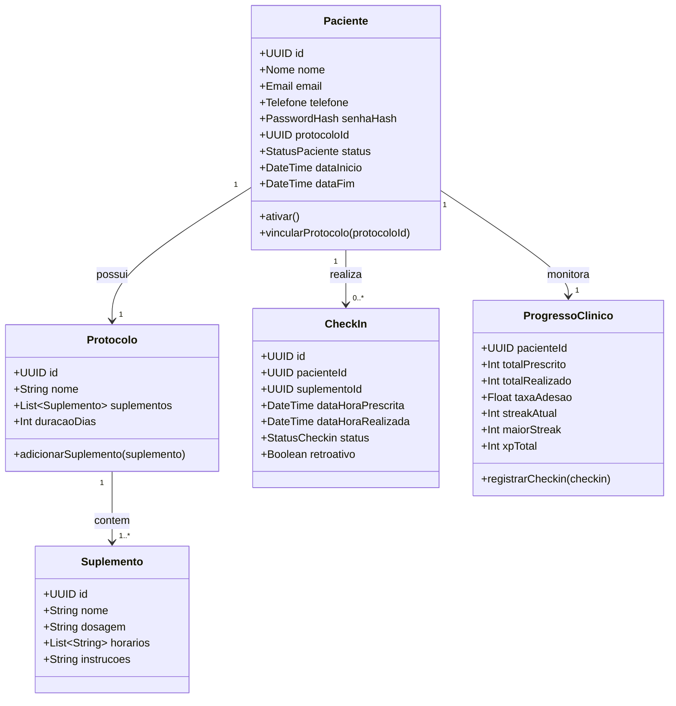
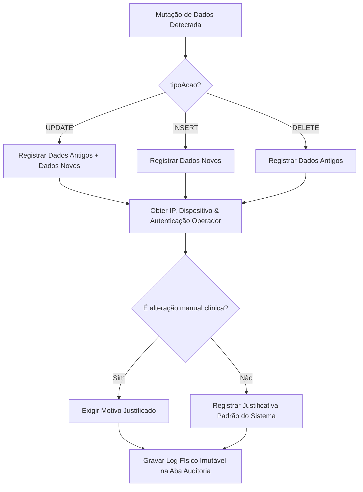
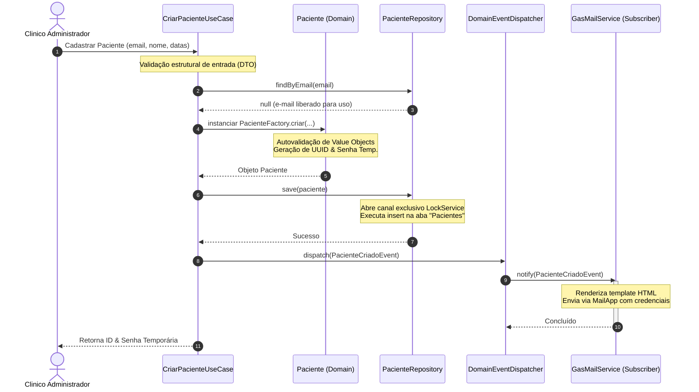

# DOCUMENTO DE ARQUITETURA DE SOFTWARE (SAD)
## Sistema SaaS para Acompanhamento de Tratamentos Clínicos Integrativos

---

## 1. Termo de Abertura & Visão Geral do Produto

### 1.1 Objetivo do Produto
Este documento detalha a especificação arquitetural de um sistema **SaaS (Software as a Service) multi-inquilino (multi-tenant)** para acompanhamento de tratamentos clínicos integrativos. O sistema foi projetado para operar inicialmente sob limitações severas de infraestrutura (utilizando Google Sheets como banco de dados e Google Apps Script como backend serverless), mas com uma arquitetura desacoplada (Clean & Hexagonal Architecture) que viabiliza a migração transparente para bancos relacionais (PostgreSQL, Supabase) ou NoSQL (Firestore, MongoDB) e plataformas em nuvem (GCP, AWS) sem alterar as regras de negócio core.

### 1.2 Personas do Sistema
*   **Administrador (Clínico/Gestor):** Responsável por gerenciar pacientes, criar e monitorar protocolos de tratamento (prescrever suplementações, definir horários e dosagens), auditar acessos e analisar a evolução clínica através de dashboards.
*   **Paciente:** Usuário final que consome o protocolo, realiza o check-in das suplementações consumidas, recebe alertas de horários e acompanha seu progresso histórico e pontuação (gamificação).

### 1.3 Visão Geral do Fluxo Principal
```mermaid
sequenceDiagram
    autonumber
    actor Admin as Administrador
    actor Paciente as Paciente
    participant UI as Presentation (Frontend)
    participant UC as Application (Use Cases)
    participant DOM as Domain (Entities/Events)
    participant REP as Infrastructure (Repository)
    database GS as Google Sheets (DB)

    Admin->>UI: Cadastrar Paciente & Protocolo
    UI->>UC: Execute: CriarPacienteUseCase
    UC->>DOM: Instanciar Paciente + Protocolo (Regras)
    UC->>REP: PacienteRepository.save(paciente)
    REP->>GS: Gravar Linhas (LockService)
    REP-->>UC: Confirmação de Persistência
    UC-->>UI: Sucesso & Credenciais Geradas
    UI-->>Admin: Exibir Credenciais do Paciente

    Paciente->>UI: Efetuar Login (Credenciais)
    UI->>UC: Execute: LoginUseCase
    UC->>REP: PacienteRepository.findByEmail(email)
    REP->>GS: Consultar Planilha
    REP-->>UC: Dados do Paciente
    UC->>DOM: Validar Senha Hash & Status
    UC-->>UI: Token JWT / Sessão Ativa
    UI-->>Paciente: Exibir Dashboard & Protocolo

    Paciente->>UI: Realizar Check-in (Suplemento Consumido)
    UI->>UC: Execute: RegistrarCheckinUseCase
    UC->>DOM: Registrar Progresso & Calcular Streak/XP
    UC->>REP: CheckinRepository.save(checkin)
    REP->>GS: Gravar Check-in & Logs de Auditoria
    UC-->>UI: Progresso Updated + Feedback Visual UX
    UI-->>Paciente: Exibir Efeito Gamificado (Streak + XP)
```

---

## 2. Princípios de Arquitetura e Decisões de Projeto (ADR)

### 2.1 Clean & Hexagonal Architecture
Adotamos uma separação rígida entre regras de negócio (core) e detalhes de implementação (infraestrutura). O fluxo de dependência é sempre de fora para dentro. O Domínio não conhece bancos de dados, protocolos de rede (HTTP), ou frameworks de interface.

```
       ┌────────────────────────────────────────────────────────┐
       │                  INFRASTRUCTURE LAYER                  │
       │  [Google Sheets Repository] [Google Apps Script API]   │
       │  [Fetch API]                [Local Storage]            │
       └───────────────────────────┬────────────────────────────┘
                                   │ (Implements / Adapts)
                                   ▼
       ┌────────────────────────────────────────────────────────┐
       │                   APPLICATION LAYER                    │
       │  [Use Cases (Interactors)]  [Port Interfaces]          │
       │  [Data Transfer Objects]    [Application Services]     │
       └───────────────────────────┬────────────────────────────┘
                                   │ (Uses)
                                   ▼
       ┌────────────────────────────────────────────────────────┐
       │                      DOMAIN LAYER                      │
       │  [Entities]      [Value Objects]    [Domain Services]  │
       │  [Domain Events] [Exceptions]       [Aggregates]       │
       └────────────────────────────────────────────────────────┘
```

#### Justificativa Técnica (ADR 001):
A escolha de iniciar com o Google Sheets como banco de dados visa custo zero de infraestrutura e agilidade no MVP. No entanto, sem a segregação por camadas, haveria acoplamento direto das funções de manipulação de planilhas (`SpreadsheetApp`) no código de negócio. Aplicando Clean Architecture, isolamos o `SpreadsheetApp` dentro de adaptadores de infraestrutura (`GoogleSheetsRepository`). Quando migrarmos para PostgreSQL/Supabase, alteramos apenas o adaptador da camada de infraestrutura, mantendo os Casos de Uso e Entidades intactos e intocados.

### 2.2 Aplicação Rígida dos Princípios SOLID
*   **Single Responsibility Principle (SRP):** Cada classe e componente possui uma única razão para mudar. Classes de controle de fluxo de tela não realizam requisições HTTP; Repositórios não aplicam penalidades de atraso ou regras de check-in; Entidades apenas validam seu estado interno invariante.
*   **Open/Closed Principle (OCP):** Comportamentos são estendidos através de interfaces e polimorfismo. Por exemplo, a notificação de horários suporta diferentes canais (Email, WhatsApp, Push) através de uma abstração `NotificationService`, permitindo novas implementações sem alterar o motor de agendamento de tratamentos.
*   **Liskov Substitution Principle (LSP):** Subclasses ou implementações de interfaces podem ser substituídas por suas abstrações sem alterar a corretude do sistema. O `GoogleSheetsPacienteRepository` pode ser substituído por `PostgreSQLPacienteRepository` a qualquer momento sob o contrato `PacienteRepositoryInterface`.
*   **Interface Segregation Principle (ISP):** Clientes não são obrigados a depender de métodos que não utilizam. Dividimos grandes interfaces de persistência em contratos coesos específicos (ex: `ReadOnlyRepository` vs `WriteRepository` se necessário, ou separação rígida por Agregados).
*   **Dependency Inversion Principle (DIP):** Módulos de alto nível não dependem de módulos de baixo nível; ambos dependem de abstrações. A camada de aplicação depende de interfaces de repositórios (Ports) definidas na camada de aplicação/domínio, e não de classes concretas de banco de dados.

### 2.3 Padrões de Projeto Adotados
*   **Repository Pattern:** Abstrai o acesso aos dados da planilha, expondo coleções de entidades do domínio.
*   **Service Layer:** Coordena transações de negócios e orquestra a execução dos Casos de Uso.
*   **Dependency Injection (DI):** Injeta instâncias de infraestrutura e serviços (como repositórios e criptografia) nos Casos de Uso via construtores, facilitando a substituição e a escrita de testes unitários isolados (mocks).
*   **Factory Pattern:** Utilizado para instanciar Entidades complexas que requerem validação e construção de múltiplos Value Objects (ex: `PacienteFactory` garantindo a integridade dos dados iniciais).
*   **Strategy Pattern:** Empregado nas regras de pontuação de check-in da Gamificação (ex: cálculo de bônus por consistência de horários de acordo com o nível do paciente ou tipo de suplemento).
*   **Observer Pattern:** Utilizado para desacoplar ações secundárias de eventos principais (ex: disparar uma notificação por e-mail e registrar logs quando o evento `PacienteCriado` for emitido).
*   **Command Pattern:** Abstrai as ações executadas pelo paciente no painel (ex: execução de check-ins recorrentes e reversões autorizadas).
*   **Facade Pattern:** Cria uma interface unificada simplificada para subsistemas complexos do frontend (ex: encapsular requisições HTTP, controle de estado local e cache em uma fachada de API única).
*   **Adapter Pattern:** Traduz as respostas brutas obtidas do Apps Script/Google Sheets (matrizes bidimensionais) para DTOs ou objetos de domínio legíveis.
*   **DTO (Data Transfer Object) Pattern:** Define contratos estritos de entrada e saída para transferir dados entre a camada de apresentação e a camada de aplicação, prevenindo o vazamento de entidades de domínio para a interface.

---

## 3. Organização de Pastas e Árvore do Projeto

A estrutura de diretórios separa rigidamente o Frontend (hospedado no GitHub Pages) e o Backend (executado no Google Apps Script). Ambos seguem a mesma filosofia Clean Architecture.

```
/
├── .github/                       # Configurações do GitHub (Workflows CI/CD, templates)
├── docs/                          # Documentações adicionais do sistema, diagramas, ADRs
├── backend/                       # Código a ser implantado no Google Apps Script (GAS)
│   ├── src/
│   │   ├── domain/                # Camada de Domínio (Sem dependências externas)
│   │   │   ├── entities/          # Entidades (Paciente, Protocolo, etc.)
│   │   │   ├── valueObjects/      # Objetos de Valor (Email, Telefone, PasswordHash)
│   │   │   ├── services/          # Serviços de Domínio
│   │   │   └── events/            # Definições de Eventos de Domínio
│   │   ├── application/           # Camada de Aplicação (Casos de Uso e Portas)
│   │   │   ├── useCases/          # Casos de Uso (Interatores)
│   │   │   ├── repositories/      # Interfaces dos Repositórios (Ports)
│   │   │   ├── services/          # Interfaces de Serviços (Ex: Criptografia, Email)
│   │   │   └── dto/               # Data Transfer Objects (Entrada/Saída)
│   │   ├── infrastructure/        # Camada de Infraestrutura (Implementações concretas)
│   │   │   ├── repositories/      # Repositórios usando Google Sheets (SpreadsheetApp)
│   │   │   ├── services/          # Implementações (BcryptGasService, GasMailService)
│   │   │   ├── config/            # Configurações do Apps Script (ID de planilhas)
│   │   │   └── controllers/       # Pontos de entrada HTTP do GAS (doGet/doPost adapters)
│   │   └── shared/                # Utilidades compartilhadas no backend (Validators, Logs)
│   └── tests/                     # Testes de unidade e integração do backend
│
└── frontend/                      # Aplicação Client-side (HTML5/CSS3/Vanilla JS)
    ├── assets/                    # Recursos estáticos (Imagens, Ícones, Web Fonts)
    ├── src/
    │   ├── presentation/          # Apresentação Visual e Renderização
    │   │   ├── components/        # Componentes UI reutilizáveis (Card, Modal, Alert)
    │   │   └── pages/             # Páginas da aplicação (Dashboard, Login, Admin)
    │   ├── application/           # Gerenciamento de Estado e Orquestração do Client
    │   │   ├── controllers/       # Controladores que respondem a eventos do DOM
    │   │   └── services/          # Serviços locais (AuthService, GamificationState)
    │   ├── infrastructure/        # Integração com a API Externa e Storage Local
    │   │   ├── api/               # Cliente HTTP (Fetch API configurada para o GAS WebApp)
    │   │   └── storage/           # Acesso ao LocalStorage / SessionStorage
    │   └── shared/                # Utilitários globais do client
    │       ├── config/            # Configurações de ambiente (URLs de produção/desenv)
    │       └── utils/             # Helpers de data, formatação de moeda, máscaras
    └── index.html                 # Ponto de entrada SPA (Single Page Application)
```

### 3.1 Explicação Detalhada das Pastas

*   **`domain/`**: Coração do sistema. Contém a lógica de negócio pura. Se o banco mudar, se o design visual mudar, se trocarmos JavaScript por outra linguagem no futuro, a estrutura teórica deste diretório se mantém.
    *   `entities/`: Objetos de negócio identificáveis por ID único. Contêm regras de validação intrínsecas e alteração de estado (ex: mudar status do paciente, calcular data fim).
    *   `valueObjects/`: Objetos imutáveis definidos por seus atributos, sem ID (ex: E-mail, Telefone, Hash de Senha). Eles se autovalidam no momento da instanciação.
    *   `services/`: Contém regras que envolvem múltiplas entidades e não se encaixam naturalmente em uma única entidade.
*   **`application/`**: Implementa os fluxos de negócios específicos (Casos de Uso). Define a orquestração: recebe dados, busca no repositório, invoca lógica de domínio, persiste e emite eventos.
    *   `useCases/`: Classes que representam cenários reais do sistema (ex: `CriarPaciente`, `RegistrarCheckin`).
    *   `repositories/`: Contratos de interface que a infraestrutura deve implementar para fornecer acesso ao banco de dados.
    *   `dto/`: Estruturas de dados planas usadas para trafegar parâmetros limpos sem expor as Entidades de Domínio para fora.
*   **`infrastructure/`**: Onde os detalhes técnicos vivem. Lida com chamadas ao Google Sheets, envio de e-mails via servidores, criptografia de senhas nativa do ambiente e mapeamento de requisições.
*   **`presentation/`**: Lida diretamente com o Usuário. No frontend, contém os arquivos HTML/CSS estruturados de maneira moderna e componentes JavaScript isolados, responsáveis por ouvir eventos do DOM (clique, submit) e atualizar o estado visual.
*   **`shared/`**: Helpers, validadores transversais (Regex, esquemas de validação) e motores de logs que são necessários por mais de uma camada.

---

## 4. Modelagem de Domínio DDD (Domain-Driven Design)

Mapeamento completo dos domínios do sistema, suas responsabilidades, limites (Bounded Contexts) e interdependências.



### 4.1 Paciente (Agregado Raiz - Bounded Context: Gestão Clínica)
*   **Responsabilidade:** Representar o indivíduo em tratamento. Controlar dados demográficos, status cadastral, período de tratamento ativo e vinculação ao protocolo clínico.
*   **Entidades Relacionadas:** `Paciente` (Aggregate Root).
*   **Value Objects:** `UUID` (Id), `Nome`, `Email`, `Telefone`, `PasswordHash`, `StatusPaciente` (Enum: Ativo, Inativo, Suspenso).
*   **Serviços de Domínio:** `GeradorCredenciais` (gera senhas temporárias fortes e hashes seguros).
*   **Casos de Uso Associados:** `CadastrarPaciente`, `AtualizarDadosContato`, `AlterarSenha`, `ArquivarPaciente`.
*   **Eventos de Domínio:** `PacienteCriado`, `PacienteDesativado`, `SenhaAlterada`.
*   **Regras de Negócio:**
    *   O e-mail e telefone devem ser validados estruturalmente.
    *   A data de fim do tratamento não pode ser anterior à data de início.
    *   Um paciente só pode realizar check-ins se o seu status for `Ativo`.

### 4.2 Protocolo & Suplemento (Bounded Context: Prescrição Médica)
*   **Responsabilidade:** Definir o plano terapêutico prescrito pelo Administrador. Ele descreve quais substâncias (suplementos) devem ser consumidas, em quais dosagens e horários.
*   **Entidades Relacionadas:** `Protocolo` (Aggregate Root), `Suplemento` (Entidade interna ao Agregado).
*   **Value Objects:** `UUID` (Id), `NomeSuplemento`, `Dosagem` (ex: "500mg", "2 cápsulas"), `HorarioPrescricao` (HH:MM).
*   **Serviços de Domínio:** `ValidadorProtocolo` (impede prescrição de suplementos duplicados no mesmo horário).
*   **Casos de Uso Associados:** `CriarProtocolo`, `AssociarProtocoloAoPaciente`, `AdicionarSuplementoAoProtocolo`.
*   **Eventos de Domínio:** `ProtocoloCriado`, `ProtocoloAtualizado`.
*   **Regras de Negócio:**
    *   Um protocolo deve durar no mínimo 1 dia e no máximo 365 dias.
    *   Os horários de consumo dos suplementos devem seguir o padrão ISO de 24 horas (HH:MM).

### 4.3 Calendário & Check-in (Bounded Context: Execução do Tratamento)
*   **Responsabilidade:** Gerenciar a agenda diária de consumo do paciente e registrar a execução de cada ingestão (Check-in).
*   **Entidades Relacionadas:** `CheckIn` (Aggregate Root).
*   **Value Objects:** `UUID` (Id), `StatusCheckin` (Enum: Concluido, Pendente, Atrasado, NaoConsumido), `DateTime` (DataHoraPrescrita, DataHoraRealizada).
*   **Serviços de Domínio:** `CalculadorJanelaCheckin` (determina se o paciente está realizando o consumo dentro da janela de tolerância para não ser considerado atrasado).
*   **Casos de Uso Associados:** `RegistrarCheckin`, `ReverterCheckin` (com liberação administrativa), `ListarCheckinsDiarios`.
*   **Eventos de Domínio:** `CheckinRealizado`, `CheckinAtrasado`, `CheckinCancelado`.
*   **Regras de Negócio:**
    *   O check-in retroativo (fora do dia corrente) é bloqueado por padrão, exceto se houver uma permissão de edição retroativa temporária concedida pelo administrador.
    *   A janela padrão de tolerância para check-in no horário correto é de ±60 minutos da hora prescrita.

### 4.4 Histórico & Progresso Clínico (Bounded Context: Monitoramento e Auditoria)
*   **Responsabilidade:** Consolidar os dados de consumo para gerar a evolução do paciente ao longo do tempo.
*   **Entidades Relacionadas:** `ProgressoClinico` (Entidade de acompanhamento).
*   **Value Objects:** `TaxaAdesao` (Porcentagem de check-ins bem-sucedidos em relação aos prescritos), `Streak` (dias seguidos cumprindo o protocolo).
*   **Serviços de Domínio:** `EstatisticaTratamento` (calcula a taxa de adesão total e por categoria de suplemento).
*   **Casos de Uso Associados:** `ConsultarHistoricoClinico`, `GerarDashboardAdmin`.
*   **Eventos de Domínio:** `AdesaoAbaixoDoLimite` (disparado se a taxa cair abaixo de 70%, gerando alerta para o Admin).

### 4.5 Gamificação (Bounded Context: Engajamento do Paciente)
*   **Responsabilidade:** Incentivar a aderência ao tratamento por meio de dinâmicas cognitivas de recompensa (Streaks, XP e Conquistas).
*   **Entidades Relacionadas:** `GamificacaoPaciente` (Aggregate Root).
*   **Value Objects:** `StreakAtual` (dias consecutivos), `XP` (Experiência acumulada), `Nivel` (calculado com base em XP), `Conquistas` (Crachás de consistência).
*   **Serviços de Domínio:** `RegraCalculoPontuacao` (Calcula bônus de XP baseados em consistência - ex: check-in no horário correto concede 10 XP; manter o streak por 7 dias concede bônus multiplicador de 1.5x).
*   **Casos de Uso Associados:** `ConsultarNivelGamificacao`, `ProcessarRecompensasDiarias`.
*   **Eventos de Domínio:** `SubiuDeNivel`, `ConquistaDesbloqueada`.
*   **Regras de Negócio:**
    *   Quebrar o streak (ficar um dia sem fazer nenhum check-in completo dos suplementos obrigatórios) reseta o `StreakAtual` para 0, mas o `XP` acumulado nunca é perdido.

### 4.6 Sessão & Permissão (Bounded Context: Segurança e Identidade)
*   **Responsabilidade:** Garantir a autenticação de usuários, manutenção do estado seguro de login e controle de acesso baseado em papéis (RBAC - Role Based Access Control).
*   **Entidades Relacionadas:** `Sessao` (Aggregate Root), `Usuario` (Paciente ou Admin).
*   **Value Objects:** `TokenSessao` (Token criptográfico único), `Role` (Enum: ADMIN, PACIENTE), `TentativasLogin` (contador).
*   **Serviços de Domínio:** `ValidadorToken` (verifica expiração e assinatura).
*   **Casos de Uso Associados:** `AutenticarUsuario`, `RenovarToken`, `BloquearContaPorTentativas`.
*   **Eventos de Domínio:** `LoginEfetuado`, `Logout`, `ContaBloqueada`.
*   **Regras de Negócio:**
    *   A sessão expira após 2 horas de inatividade no Frontend.
    *   Após 5 tentativas consecutivas de login malsucedidas com a mesma credencial (e-mail), a conta é temporariamente suspensa por 15 minutos (mitigação de brute force).

### 4.7 Log & Auditoria (Bounded Context: Conformidade e Segurança)
*   **Responsabilidade:** Registrar de forma imutável todas as mutações de dados no sistema.
*   **Entidades Relacionadas:** `LogAuditoria` (Aggregate Root).
*   **Value Objects:** `IP`, `UserAgent` (Dispositivo), `TipoAcao` (Criar, Alterar, Deletar), `MudancaDados` (JSON com estado antigo e novo).
*   **Casos de Uso Associados:** `GravarLog`, `ConsultarLogsAuditoria`.
*   **Regras de Negócio:**
    *   Um registro de auditoria, uma vez gravado, nunca pode ser editado ou removido pelo sistema.

---

## 5. Modelagem de Entidades & Relacionamentos (Der)

Mesmo utilizando o Google Sheets, a modelagem lógica segue o padrão de banco de dados relacional normalizado para viabilizar migração futura instantânea. Cada entidade abaixo representa uma tabela (tab) na planilha Google Sheets.

```
       ┌────────────────┐
       │   PACIENTES    │
       ├────────────────┤
       │ PK id          │◄────────┐
       │ FK protocoloId ├────┐    │
       │    nome        │    │    │
       │    email       │    │    │
       │    telefone    │    │    │
       │    senhaHash   │    │    │
       │    status      │    │    │
       │    dataInicio  │    │    │
       │    dataFim     │    │    │
       └────────────────┘    │    │
                             │    │
       ┌────────────────┐    │    │
       │  PROTOCOLOS    │    │    │
       ├────────────────┤    │    │
       │ PK id          │◄───┘    │
       │    nome        │         │
       │    duracaoDias │         │
       └────────────────┘         │
               ▲                  │
               │ 1:N              │
       ┌───────┴────────┐         │ 1:N
       │  SUPLEMENTOS   │         │
       ├────────────────┤         │
       │ PK id          │         │
       │ FK protocoloId │         │
       │    nome        │         │
       │    dosagem     │         │
       │    horarios    │         │
       │    instrucoes  │         │
       └────────────────┘         │
                                  │
       ┌────────────────┐         │
       │   CHECK_INS    │         │
       ├────────────────┤         │
       │ PK id          │         │
       │ FK pacienteId  ├─────────┘
       │    suplementoId│
       │    dtPrescrita │
       │    dtRealizada │
       │    status      │
       │    retroativo  │
       └────────────────┘
```

### 5.1 Tabela: `Pacientes`
*   **id:** `VARCHAR(36)` - UUID v4 (Chave Primária).
*   **protocoloId:** `VARCHAR(36)` - Nullable UUID v4 (Chave Estrangeira apontando para `Protocolos.id`).
*   **nome:** `VARCHAR(100)` - Nome completo do paciente.
*   **email:** `VARCHAR(150)` - E-mail de login (Único / Índice principal).
*   **telefone:** `VARCHAR(20)` - Telefone celular no formato DDI + DDD + Número.
*   **senhaHash:** `VARCHAR(60)` - Hash Bcrypt de 60 caracteres.
*   **status:** `VARCHAR(15)` - Estado atual (`ATIVO`, `INATIVO`, `SUSPENSO`).
*   **dataInicio:** `TIMESTAMP` - Início do tratamento.
*   **dataFim:** `TIMESTAMP` - Fim planejado do tratamento.

### 5.2 Tabela: `Protocolos`
*   **id:** `VARCHAR(36)` - UUID v4 (Chave Primária).
*   **nome:** `VARCHAR(100)` - Nome identificador da prescrição (ex: "Protocolo de Detox e Sono").
*   **duracaoDias:** `INT` - Quantidade de dias previstos para o tratamento.

### 5.3 Tabela: `Suplementos`
*   **id:** `VARCHAR(36)` - UUID v4 (Chave Primária).
*   **protocoloId:** `VARCHAR(36)` - Chave Estrangeira apontando para `Protocolos.id`.
*   **nome:** `VARCHAR(100)` - Nome da substância (ex: "Melatonina", "Magnésio Inositol").
*   **dosagem:** `VARCHAR(50)` - Dosagem prescrita (ex: "500mg", "1 cápsula").
*   **horarios:** `TEXT` - Lista de horários em formato JSON stringificado (ex: `["08:00", "22:00"]`).
*   **instrucoes:** `TEXT` - Recomendações (ex: "Tomar em jejum com água morna").

### 5.4 Tabela: `Check_Ins`
*   **id:** `VARCHAR(36)` - UUID v4 (Chave Primária).
*   **pacienteId:** `VARCHAR(36)` - Chave Estrangeira apontando para `Pacientes.id`.
*   **suplementoId:** `VARCHAR(36)` - Chave Estrangeira apontando para `Suplementos.id`.
*   **dataHoraPrescrita:** `TIMESTAMP` - Horário em que o paciente deveria tomar o suplemento.
*   **dataHoraRealizada:** `TIMESTAMP` - Horário em que o paciente confirmou a ingestão.
*   **status:** `VARCHAR(15)` - Estado da ingestão (`CONCLUIDO`, `ATRASADO`, `PENDENTE`).
*   **retroativo:** `BOOLEAN` - Flag identificador se o check-in foi realizado fora da janela por concessão de permissão administrativa.

### 5.5 Tabela: `Gamificacao`
*   **id:** `VARCHAR(36)` - UUID v4 (Chave Primária).
*   **pacienteId:** `VARCHAR(36)` - Chave Estrangeira (Única) apontando para `Pacientes.id`.
*   **xpTotal:** `INT` - Quantidade de experiência total acumulada.
*   **streakAtual:** `INT` - Quantidade de dias seguidos com 100% de adesão.
*   **maiorStreak:** `INT` - Recorde histórico do paciente.
*   **conquistas:** `TEXT` - Lista de conquistas desbloqueadas (JSON array de strings).

### 5.6 Tabela: `Auditoria`
*   **id:** `VARCHAR(36)` - UUID v4 (Chave Primária).
*   **timestamp:** `TIMESTAMP` - Data e hora exata da alteração.
*   **operadorId:** `VARCHAR(36)` - Usuário que efetuou a alteração (Admin ou Paciente).
*   **tabela:** `VARCHAR(30)` - Tabela alvo (ex: "Pacientes", "Protocolos").
*   **registroId:** `VARCHAR(36)` - ID do registro que sofreu a mutação.
*   **tipoAcao:** `VARCHAR(10)` - Ação realizada (`INSERT`, `UPDATE`, `DELETE`).
*   **dadosAntigos:** `TEXT` - Estado anterior do registro em JSON (Null para INSERT).
*   **dadosNovos:** `TEXT` - Novo estado do registro em JSON (Null para DELETE).
*   **ip:** `VARCHAR(45)` - Endereço IP do dispositivo do operador.
*   **dispositivo:** `VARCHAR(255)` - User Agent do dispositivo utilizado.
*   **motivo:** `TEXT` - Justificativa clínica ou administrativa para a alteração (obrigatório para alterações manuais de dados clínicos históricos).

---

## 6. Camada de Persistência & Estratégia de Transição do Banco de Dados

### 6.1 Isolamento Rígido: The Repository Pattern
Nenhuma camada do sistema, exceto a camada de **Infraestrutura**, pode importar dependências relacionadas ao banco de dados ou utilizar chamadas a planilhas (`SpreadsheetApp`). 

Os Casos de Uso interagem exclusivamente através de interfaces abstratas (Ports), como no exemplo conceitual abaixo:

```typescript
// Definido em backend/src/application/repositories/PacienteRepositoryInterface.ts
export interface PacienteRepositoryInterface {
  findById(id: string): Promise<Paciente | null>;
  findByEmail(email: string): Promise<Paciente | null>;
  save(paciente: Paciente): Promise<void>;
  update(paciente: Paciente): Promise<void>;
}
```

A classe concreta implementa essa interface:

```typescript
// Definido em backend/src/infrastructure/repositories/GoogleSheetsPacienteRepository.ts
export class GoogleSheetsPacienteRepository implements PacienteRepositoryInterface {
  private sheet: GoogleSessionSheet;
  
  constructor() {
    this.sheet = new GoogleSessionSheet("Pacientes");
  }

  async findById(id: string): Promise<Paciente | null> {
    const rawData = this.sheet.findRowByColumn("id", id);
    if (!rawData) return null;
    return PacienteMapper.toDomain(rawData);
  }
  
  // Demais implementações ocultando SpreadsheetApp...
}
```

### 6.2 O Mapeador (Data Mapper)
Para desacoplar as entidades de domínio do formato do banco de dados (que no Google Sheets é estruturado como uma linha contendo colunas indexadas numericamente), a camada de infraestrutura utiliza **Mappers**.

```
Row do Google Sheets: [ "usr_001", "Luiz Silva", "luiz@email.com", "(11) 99999-9999", "$2b$10$...hash...", "ATIVO" ]
                                           │
                                  PacienteMapper.toDomain()
                                           ▼
Objeto de Domínio: Paciente {
  id: UUID("usr_001"),
  nome: "Luiz Silva",
  email: Email("luiz@email.com"),
  telefone: Telefone("(11) 99999-9999"),
  senhaHash: PasswordHash("$2b$10$...hash..."),
  status: StatusPaciente.ATIVO
}
```

O Mapper garante que, caso as colunas da planilha mudem de lugar ou migremos para um banco onde os campos tenham nomes diferentes, apenas o código do `Mapper` seja ajustado.

### 6.3 Estratégia de Concorrência e Confiabilidade no Google Sheets
O Google Sheets não possui mecanismos nativos de transação ACID e bloqueio de registros por padrão, tornando-o suscetível a sobreposições de dados quando há escritas concorrentes.

Para sanar este problema no `GoogleSheetsRepository`, implementamos o **LockService** nativo do Google Apps Script:

```typescript
public async save(paciente: Paciente): Promise<void> {
  const lock = LockService.getScriptLock();
  try {
    // Tenta adquirir o bloqueio por até 10 segundos
    lock.waitLock(10000); 
    
    const rawRow = PacienteMapper.toRow(paciente);
    // Insere ou atualiza os dados na planilha de forma atômica
    this.sheet.appendRow(rawRow);
    
    // Libera a alteração forçando a escrita imediata em disco
    SpreadsheetApp.flush(); 
  } catch (e) {
    throw new DatabaseLockException("Não foi possível persistir os dados devido à fila de concorrência cheia.");
  } finally {
    lock.releaseLock();
  }
}
```

### 6.4 Roteiro de Transição Tecnológica para PostgreSQL / Supabase
Quando a clínica expandir e houver demanda de concorrência ou volumetria inviável para o Google Sheets, a migração ocorrerá em 4 passos sem alterar a camada de negócio:

```
Passo 1: Provisionar o Banco de Dados (ex: PostgreSQL no Supabase)
  │── Executar scripts DDL baseados no DER definido na Seção 5.
  │── Configurar índices de busca rápida nos campos de ID e E-mail.
  ▼
Passo 2: Desenvolver os novos Repositórios
  │── Criar a classe PostgreSQLPacienteRepository que implementa a mesma interface PacienteRepositoryInterface.
  │── Utilizar bibliotecas padrão de conexão (ex: pg-promise ou Sequelize) para manipulação de dados.
  ▼
Passo 3: Alterar o Injetor de Dependência
  │── No container de IoC / Inicializador do Backend, alterar:
  │   De: container.register("PacienteRepository", new GoogleSheetsPacienteRepository())
  │   Para: container.register("PacienteRepository", new PostgreSQLPacienteRepository(connectionString))
  ▼
Passo 4: Script de Migração (One-shot)
  │── Rodar script de carga que lê todas as linhas do Google Sheets, 
  │   passa pelo Mapper correspondente, e grava no PostgreSQL.
```

---

## 7. Responsabilidades das Camadas & Fluxo de Execução

As camadas do sistema cooperam de forma desacoplada. A tabela abaixo resume o papel de cada nível.

| Camada | Responsabilidade | O que contém | O que pode acessar |
| :--- | :--- | :--- | :--- |
| **Domain** | Regras de negócio puras, invariantes do sistema e validações de consistência lógica. | Entidades, Value Objects, Domain Services, Domain Events, Domain Exceptions. | Nada (Não possui importações de outras camadas). |
| **Application** | Orquestração do sistema, tradução dos casos de uso de negócio do produto. | Use Cases (Interactors), DTOs, Repository Interfaces, Service Interfaces. | **Domain** |
| **Infrastructure** | Implementação de acessos de IO (Banco de dados, APIs, Serviços de Rede, Frameworks). | GoogleSheetsRepository, BcryptService, MailAppAdapter, Configurações de Banco, Middleware. | **Application**, **Domain** |
| **Presentation** | Interface com o usuário, renderização e processamento inicial de entrada de dados. | SPA HTML/CSS, Controladores Frontend (JavaScript), Componentes UI, APIs nativas (Fetch/DOM). | **Application** (via HTTP endpoints / Controladores de Frontend). |
| **Shared** | Códigos transversais que não se enquadram em regras de negócio específicas. | Validadores genéricos, String Helpers, Formatadores de Data, Constantes globais. | Qualquer camada (apenas para utilitários puros). |

### 7.1 Fluxo Detalhado: Processo de Login do Paciente
Abaixo, descrevemos o fluxo completo de uma requisição de autenticação para ilustrar a travessia das camadas:

```
[Paciente] 
  │ 1. Clica no botão "Acessar"
  ▼
[UI / Presentation (Frontend JS Page: login.js)]
  │ 2. Captura inputs e executa validação básica de formato.
  │ 3. Dispara POST JSON para a URL de produção do Google Apps Script.
  ▼
[Controller (GAS doPost Handler)]
  │ 4. Recebe a requisição POST bruta, extrai corpo HTTP e traduz para LoginDTO.
  │ 5. Instancia LoginUseCase, injetando o PacienteRepository concreto.
  │ 6. Executa: LoginUseCase.execute(loginDTO)
  ▼
[Use Case (LoginUseCase)]
  │ 7. Invoca o repositório: PacienteRepository.findByEmail(loginDTO.email).
  ▼
[Repository (GoogleSheetsPacienteRepository)]
  │ 8. Acessa a aba "Pacientes" do Google Sheets de forma isolada e segura.
  │ 9. Retorna a linha correspondente aos dados de cadastro do paciente.
  │ 10. Passa a linha pelo PacienteMapper.toDomain(row) para criar a Entidade de Domínio Paciente.
  │ 11. Retorna o objeto Paciente para o Use Case.
  ▼
[Use Case (LoginUseCase)]
  │ 12. Invoca validação no Domínio: Paciente.validarStatusPermissaoLogin().
  │ 13. Invoca o serviço de Criptografia: CriptografiaService.compare(loginDTO.senha, Paciente.senhaHash).
  │ 14. Se a senha for inválida, dispara evento de auditoria e lança DomainException.
  │ 15. Se válida, invoca o TokenService para gerar um token de autenticação JWT/Criptográfico seguro.
  │ 16. Retorna DTO de Saída com o Token e Dados Básicos (LoginSuccessDTO).
  ▼
[Controller (GAS doPost Handler)]
  │ 17. Traduz o LoginSuccessDTO em JSON e monta a resposta HTTP 200 OK.
  ▼
[UI / Presentation (Frontend JS Page: login.js)]
  │ 18. Salva o token retornado no SessionStorage.
  │ 19. Redireciona a tela do usuário para o Dashboard.
  ▼
[Paciente]
    20. Visualiza a tela inicial de seu tratamento.
```

---

## 8. Catálogo Completo de Casos de Uso (Use Cases)

Todos os fluxos operacionais de negócio são encapsulados em Casos de Uso específicos. Cada classe implementa um padrão de método público único (ex: `execute()`).

### 8.1 Cadastrar Paciente (`CriarPacienteUseCase`)
*   **Objetivo:** Permitir ao Administrador cadastrar um novo paciente no sistema.
*   **Entrada DTO (`CriarPacienteInputDTO`):**
    *   `nome`: String (Obrigatório, min 3 caracteres)
    *   `email`: String (Obrigatório, e-mail válido)
    *   `telefone`: String (Obrigatório, padrão numérico com DDI/DDD)
    *   `dataInicio`: String (ISO-8601)
    *   `dataFim`: String (ISO-8601)
*   **Saída DTO (`CriarPacienteOutputDTO`):**
    *   `id`: UUID v4 do paciente cadastrado
    *   `senhaTemporaria`: String (senha gerada automaticamente em texto puro para entrega ao paciente)
*   **Validações:**
    *   Verificar se o e-mail informado já está em uso no sistema (unicidade).
    *   Confirmar se `dataFim` é posterior a `dataInicio`.
*   **Erros Possíveis:**
    *   `EmailDuplicadoException` (HTTP 409)
    *   `InvalidDateIntervalException` (HTTP 400)
*   **Fluxo de Execução:**
    1.  Valida os campos de entrada do DTO.
    2.  Verifica duplicidade de e-mail usando `PacienteRepository.findByEmail()`.
    3.  Gera uma senha forte temporária aleatória de 12 caracteres.
    4.  Criptografa a senha usando Bcrypt (gera o Hash).
    5.  Instancia a Entidade `Paciente` com status `ATIVO` por meio de `PacienteFactory`.
    6.  Grava no banco via `PacienteRepository.save()`.
    7.  Registra evento `PacienteCriado` (o qual envia um e-mail de boas-vindas com as credenciais via serviço de e-mail).
    8.  Retorna o ID e a senha temporária para exibição segura na tela do administrador.

### 8.2 Registrar Consumo de Suplemento (`RegistrarCheckinUseCase`)
*   **Objetivo:** Permitir ao paciente confirmar que realizou o consumo de um determinado suplemento.
*   **Entrada DTO (`RegistrarCheckinInputDTO`):**
    *   `pacienteId`: UUID v4
    *   `suplementoId`: UUID v4
    *   `dataHoraPrescrita`: String (ISO-8601)
*   **Saída DTO (`RegistrarCheckinOutputDTO`):**
    *   `checkinId`: UUID v4
    *   `streakAtualizado`: Int
    *   `xpGanho`: Int
    *   `xpTotal`: Int
*   **Validações:**
    *   O paciente correspondente deve existir e estar ativo.
    *   O check-in não pode estar duplicado para o mesmo suplemento e data/hora prescritos.
    *   O horário de registro deve estar dentro do mesmo dia da data prescrita (bloqueio de check-in retroativo automático).
*   **Erros Possíveis:**
    *   `PacienteInativoException` (HTTP 403)
    *   `CheckinDuplicadoException` (HTTP 409)
    *   `BloqueioRetroativoException` (HTTP 400 - Quando tenta fazer check-in de dias anteriores sem permissão).
*   **Fluxo de Execução:**
    1.  Busca o Paciente ativo no repositório.
    2.  Busca o Suplemento para verificar as regras e horários do protocolo.
    3.  Verifica se existe check-in prévio para a janela.
    4.  Determina se o check-in é retroativo. Se for, verifica se o administrador concedeu uma chave de liberação retroativa ativa em `PermissoesRetroativas`.
    5.  Instancia a entidade `CheckIn` definindo o status (`CONCLUIDO` se na janela de tolerância de ±60 minutos, `ATRASADO` se fora).
    6.  Persiste o `CheckIn` via `CheckinRepository.save()`.
    7.  Dispara o processador de gamificação (`GamificacaoService.processarCheckin()`) para atualizar o Streak e creditar o XP correspondente.
    8.  Emite o evento de domínio `CheckinRealizado`.
    9.  Retorna o feedback com dados de progresso e XP acumulados.

### 8.3 Conceder Permissão Retroativa (`LiberarEdicaoRetroativaUseCase`)
*   **Objetivo:** Permitir ao Administrador liberar temporariamente que um paciente preencha check-ins de dias anteriores que perdeu.
*   **Entrada DTO (`LiberarEdicaoRetroativaInputDTO`):**
    *   `pacienteId`: UUID v4
    *   `horasLiberadas`: Int (Tempo de expiração da liberação em horas - ex: 24 horas para preencher)
    *   `motivo`: String (Obrigatório para auditoria clínica)
*   **Saída DTO (`LiberarEdicaoRetroativaOutputDTO`):**
    *   `permissaoId`: UUID v4
    *   `expiraEm`: String (ISO-8601)
*   **Validações:**
    *   `horasLiberadas` deve ser maior que 0 e menor ou igual a 72 horas.
    *   O `motivo` deve possuir no mínimo 10 caracteres.
*   **Erros Possíveis:**
    *   `MotivoInvalidoException` (HTTP 400)
    *   `PacienteNaoEncontradoException` (HTTP 404)
*   **Fluxo de Execução:**
    1.  Verifica existência do Paciente.
    2.  Registra a permissão na tabela `PermissoesRetroativas` contendo a data e hora atual e a data e hora limite (`DataAtual + horasLiberadas`).
    3.  Grava um log de auditoria clínica detalhando quem autorizou, para qual paciente, qual o motivo e por quanto tempo a janela de edição retroativa estará aberta.
    4.  Retorna confirmação de liberação com data de expiração da concessão.

### 8.4 Gerar Relatório de Evolução Clínica (`GerarDashboardUseCase`)
*   **Objetivo:** Consolidar métricas de adesão e progresso clínico de um paciente para análise do Administrador.
*   **Entrada DTO (`GerarDashboardInputDTO`):**
    *   `pacienteId`: UUID v4
    *   `dataInicio`: String (ISO-8601)
    *   `dataFim`: String (ISO-8601)
*   **Saída DTO (`GerarDashboardOutputDTO`):**
    *   `pacienteNome`: String
    *   `taxaAdesaoGeral`: Float (0 a 100%)
    *   `totalPrescrito`: Int
    *   `totalConsumido`: Int
    *   `totalAtrasado`: Int
    *   `totalPerdido`: Int
    *   `historicoAgrupadoPorSuplemento`: List (lista com taxas de cumprimento individuais por suplemento)
*   **Validações:**
    *   Período de consulta não pode ser superior a 90 dias por requisição (limitação física de processamento do Sheets).
*   **Fluxo de Execução:**
    1.  Consulta o paciente e os dados do seu protocolo.
    2.  Lê o histórico de check-ins realizados no intervalo via `CheckinRepository.findByInterval()`.
    3.  Consolida matematicamente as métricas:
        *   Taxa de Adesão Geral = `(Concluídos + Atrasados) / Total Prescrito * 100`.
    4.  Agrupa os dados por substâncias do protocolo para detectar rejeição ou esquecimento de horários específicos.
    5.  Retorna o DTO consolidado pronto para plotagem de gráficos na tela.

---

## 9. Sistema de Eventos (Event-Driven Architecture)

O desacoplamento de fluxos colaterais é garantido por meio do gerenciamento de eventos. No Google Apps Script, isso é executado de forma síncrona/em-memória por meio de um `DomainEventDispatcher` simples, mas projetado para ser facilmente migrado para brokers como AWS EventBridge ou Google Pub/Sub.

```
                    ┌───────────────────────────┐
                    │  DomainEventDispatcher    │
                    └─────────────┬─────────────┘
                                  │ (Dispatches)
         ┌────────────────────────┼────────────────────────┐
         ▼                        ▼                        ▼
┌─────────────────┐      ┌─────────────────┐      ┌─────────────────┐
│ PacienteCriado  │      │CheckinRealizado │      │TratamentoFinaliz│
└────────┬────────┘      └────────┬────────┘      └────────┬────────┘
         │                        │                        │
         ├────────────────────────┼────────────────────────┤
         ▼                        ▼                        ▼
┌─────────────────┐      ┌─────────────────┐      ┌─────────────────┐
│ GasMailService  │      │GamificacaoServic│      │AuditoriaService │
│ (Envia e-mail)  │      │(Calcula XP/Strk)│      │(Registra log)   │
└─────────────────┘      └─────────────────┘      └─────────────────┘
```

| Evento | Disparado por | Consumido por | Impacto no Sistema |
| :--- | :--- | :--- | :--- |
| **`PacienteCriado`** | `CriarPacienteUseCase` | `GasMailService` | Envia e-mail de boas-vindas com dados de acesso e link do aplicativo. |
| **`CheckinRealizado`** | `RegistrarCheckinUseCase` | `GamificacaoService`, `AuditoriaService` | Recalcula XP, atualiza Streaks e insere linha no log de auditoria do paciente. |
| **`SuplementoConcluido`** | `RegistrarCheckinUseCase` | `StreakService` | Se todos os suplementos do dia foram concluídos, valida a consolidação do streak diário. |
| **`SemanaFinalizada`** | `CronizadorDiario` (Job) | `GamificacaoService` | Concede bônus de XP se a semana fechou com taxa de adesão superior a 90%. |
| **`NotificacaoEnviada`** | `ServicoAlertaPaciente` | `AuditoriaService` | Registra a entrega da notificação de horário na planilha para controle de contestações. |
| **`TratamentoFinalizado`** | `FinalizarTratamentoUC` | `PacienteRepository` | Atualiza o status do paciente para `INATIVO` e remove tarefas agendadas futuras. |
| **`AdministradorCriado`** | `CriarAdminUseCase` | `AuditoriaService` | Registra a criação de nova conta com privilégios de gestão. |
| **`LoginEfetuado`** | `LoginUseCase` | `AuditoriaService`, `SessaoRepository` | Registra dados de acesso (IP, dispositivo) e invalida tokens antigos. |
| **`Logout`** | `LogoutUseCase` | `SessaoRepository` | Invalida o token de sessão ativo imediatamente no banco e no cache. |
| **`ContaBloqueada`** | `LoginUseCase` (Validador) | `GasMailService`, `AuditoriaService` | Notifica o paciente do bloqueio preventivo de segurança por suspeita de ataque. |

---

## 10. Sistema de Configuração Centralizado

Para mitigar a ocorrência de strings fixas de código (*hardcode*), toda configuração do sistema é gerenciada pela classe `SystemConfiguration` alimentada por variáveis de ambiente (ou propriedades nativas do Apps Script, gerenciadas via `PropertiesService`).

### 10.1 Chaves de Configuração Mapeadas

```typescript
export const SystemConfiguration = {
  // Conexão e Banco
  DATABASE_SPREADSHEET_ID: "1-Fm6p3GZt9L1zXj...", // ID do Google Sheets
  
  // Regras Clínicas de Tolerância
  CHECKIN_WINDOW_TOLERANCE_MINUTES: 60, // Janela de ±60 minutos
  MAX_DAYS_TREATMENT: 365, // Tempo máximo permitido de protocolo
  ALERT_TOLERANCE_MINUTES: 15, // Enviar alerta 15 minutos antes da dose
  
  // Regras de Segurança
  MAX_LOGIN_ATTEMPTS: 5, // Número máximo de erros de senha antes do bloqueio
  LOGIN_LOCKOUT_MINUTES: 15, // Tempo de bloqueio temporário
  SESSION_TIMEOUT_MINUTES: 120, // Expiração de inatividade do token
  
  // Gamificação (Streaks e Nível)
  XP_PER_ON_TIME_CHECKIN: 10, // Check-in no horário correto
  XP_PER_LATE_CHECKIN: 5, // Check-in atrasado
  XP_STREAK_BONUS_MULTIPLIER: 1.5, // Multiplicador de streak por 7 dias seguidos
  XP_LEVEL_BASE: 100, // XP necessário para o primeiro nível (aumenta progressivamente)
  
  // Design System (Injetado dinamicamente para o App)
  THEME: {
    PRIMARY_COLOR: "#0F172A", // Slate 900
    SECONDARY_COLOR: "#10B981", // Emerald 500
    ACCENT_COLOR: "#6366F1", // Indigo 500
    BACKGROUND_DARK: "#020617", // Slate 950
    TEXT_MUTED: "#64748B", // Slate 500
    FONT_FAMILY: "'Outfit', sans-serif"
  }
};
```

---

## 11. Auditoria e Rastreabilidade de Dados

O sistema exige conformidade com padrões de governança e segurança da informação aplicados a dados de saúde (LGPD/HIPAA). Nenhum dado clínico ou de identificação de paciente pode sofrer alteração física sem registro de auditoria completo.



### 11.1 Estrutura de Mudança de Dados (Detalhamento do JSON de Auditoria)
Quando um Administrador alterar, por exemplo, o telefone de um paciente, o campo `dadosAntigos` e `dadosNovos` registrarão as mutações em JSON na planilha de Auditoria:

```json
// Campo dadosAntigos
{
  "telefone": "(11) 98888-8888",
  "status": "ATIVO"
}

// Campo dadosNovos
{
  "telefone": "(11) 99999-9999",
  "status": "ATIVO"
}
```

Essa estrutura permite retroceder alterações acidentais e provar compliance para fins regulatórios médicos.

---

## 12. Escalabilidade, Performance & UX Strategy

### 12.1 Estratégia de Escalabilidade de Usuários
Embora o sistema comece utilizando Google Sheets, o planejamento prevê o crescimento sustentável de volumetria:

```
┌────────────────────────────────────────────────────────────────────────┐
│ Escalabilidade: Roteiro Tecnológico por Fase                           │
├─────────────────┬─────────────────┬──────────────────┬─────────────────┤
│ Clientes (Pac.) │ Camada Banco    │ Camada Backend   │ Impacto / Custo │
├─────────────────┼─────────────────┼──────────────────┼─────────────────┤
│ Até 100         │ Google Sheets   │ Apps Script Web  │ Zero Custo      │
│                 │                 │ (Serverless API) │                 │
├─────────────────┼─────────────────┼──────────────────┼─────────────────┤
│ Até 1.000       │ Google Sheets + │ Apps Script +    │ Praticamente    │
│                 │ CacheService    │ CDN Caching      │ gratuito        │
├─────────────────┼─────────────────┼──────────────────┼─────────────────┤
│ Até 10.000      │ Supabase /      │ Node.js Server / │ Baixo custo     │
│                 │ PostgreSQL      │ GCP Cloud Run    │ (SaaS Inicial)  │
├─────────────────┼─────────────────┼──────────────────┼─────────────────┤
│ 100.000+        │ PostgreSQL      │ Kubernetes (GKE) │ Escalar Nodes / │
│                 │ (Cloud SQL)     │ Microservices    │ Infraestrutura  │
└─────────────────┴─────────────────┴──────────────────┴─────────────────┘
```

### 12.2 Técnicas de Otimização de Performance
*   **Lazy Loading / Módulos Assíncronos:** No frontend, as telas do paciente e do administrador são divididas em scripts dinâmicos de renderização. O código da interface administrativa só é carregado se o usuário for autenticado como `ADMIN`.
*   **Cache Estratégico (GAS CacheService):** Leituras recorrentes de catálogos de suplementos e de configurações de protocolos não precisam bater no Google Sheets a cada requisição. Elas ficam armazenadas no `CacheService` do Google Apps Script com expiração de 60 minutos, derrubando o tempo de resposta da API de ~1.5s para menos de 100ms.
*   **Minificação e Compressão:** O frontend realiza um build step (via script de CI/CD simples no GitHub Actions antes de enviar para o GitHub Pages) para minificar arquivos JavaScript e estilização CSS.
*   **Virtualização de Listas de Check-in:** A tela de histórico do paciente exibe listas longas usando técnicas de reciclagem de nós do DOM. Apenas os elementos visíveis na viewport do celular são de fato renderizados na árvore HTML, garantindo rolagem de tela macia de 60 FPS mesmo com milhares de registros de histórico.
*   **Debounce & Throttle:** Cliques repetidos no botão de check-in são filtrados por um throttle de 2 segundos para evitar duplicidade de requisições no backend. Digitações de busca no painel administrativo utilizam debounce de 300ms para evitar chamadas excessivas de API.
*   **Redução de Idas ao Servidor (PWA Caching):** Check-ins ocorridos offline ou em conexões instáveis de internet móvel são enfileirados no `IndexedDB` do navegador do paciente e sincronizados em lote (*batch processing*) assim que a conectividade for restabelecida.

### 12.3 Princípios de UX (Apple Standards)
*   **Estética Limpa & Premium:** Paleta de cores baseada em tons naturais e relaxantes (Slate e Emerald), tipografia refinada (Outfit), cantos arredondados generosos (`border-radius: 12px` a `16px`) e elementos de estilo *glassmorphism* (efeito de vidro jateado com desfoque de fundo) para sensação moderna de bem-estar.
*   **Redução de Carga Cognitiva:** A tela de check-in do paciente exibe apenas a tarefa atual com botões grandes de toque fácil de dedão (zona ergonômica fácil). Elementos informativos secundários são ocultados sob menus expansivos limpos.
*   **Micro-Animações e Efeitos Hápticos:** Confirmações de check-in disparam pequenas animações CSS fluidas de preenchimento e confetes discretos para ativar gatilhos de recompensa dopaminérgica (gamificação), melhorando a taxa de engajamento do tratamento.

---

## 13. Convenções de Nomenclatura e Clean Code

### 13.1 Arquivos e Diretórios
*   **Pastas:** `kebab-case` (ex: `src/presentation/components`).
*   **Arquivos de Classe/Componentes:** `PascalCase` (ex: `PacienteRepository.js`, `CheckinCard.js`).
*   **Arquivos Utilitários/Interfaces:** `camelCase` ou `kebab-case` (ex: `dateFormatter.js`, `use-toast.js`).

### 13.2 Código (JavaScript ES2024 / TypeScript-ready)
*   **Classes & Entidades:** `PascalCase` (ex: `class Paciente`).
*   **Interfaces:** `PascalCase` prefixado/sufixado por Interface ou apenas estrutural (ex: `PacienteRepositoryInterface`).
*   **Funções & Métodos:** `camelCase` (ex: `registrarConsumo()`).
*   **Variáveis e Parâmetros:** `camelCase` (ex: `pacienteId`).
*   **Constantes e Enums:** `UPPER_SNAKE_CASE` (ex: `STATUS_ATIVO`).

### 13.3 Padrões de Git & Versionamento
*   **Branches:** `tipo/nome-da-feature`
    *   `feat/cadastro-paciente`
    *   `fix/concorrencia-lock`
    *   `docs/atualiza-sad`
*   **Commits (Conventional Commits):**
    *   `feat: adiciona caso de uso para check-in retroativo`
    *   `fix(sheets): corrige estouro de timeout do LockService`
    *   `style: melhora transição do gradiente de progresso`
*   **Tags e Releases (Semantic Versioning):**
    *   `vMAJOR.MINOR.PATCH` (ex: `v1.0.0` para o MVP, `v1.1.0` ao adicionar gamificação).

---

## 14. Auditoria de Qualidade e Análise de Riscos

Esta seção analisa preventivamente os pontos de falha arquiteturais identificados pela nossa equipe multidisciplinar antes do início do desenvolvimento.

### 14.1 Matriz de Riscos Clínicos, Tecnológicos e de Segurança

| Risco | Probabilidade | Impacto | Mitigação Arquitetural |
| :--- | :--- | :--- | :--- |
| **Timeout de Script do GAS** | Alta (após o crescimento de dados) | Crítico | O tempo máximo de execução do Apps Script é de 6 minutos por requisição. O sistema utiliza paginação estrita e indexação lógica (CacheService) para garantir que nenhuma consulta demore mais que 500ms. |
| **Concorrência e Perda de Escrita (Google Sheets)** | Alta | Crítico | Implementado o padrão de concorrência com bloqueio exclusivo (`LockService.getScriptLock()`) na camada de infraestrutura. |
| **Vazamento de Dados Médicos (LGPD)** | Média | Altíssimo | Dados de saúde não trafegam em texto puro. Todos os canais utilizam criptografia HTTPS (TLS 1.3). As chaves de ID dos pacientes no Sheets são UUIDs e as senhas são hasheadas com Bcrypt. |
| **Contestação de Check-in (Fraude)** | Baixa | Médio | Sistema de Auditoria imutável de mutação de dados e log de envio de alertas em todas as tomadas de decisão. |

### 14.2 Custos de Manutenção e Evolução
*   **Infraestrutura Inicial (Até 10.000 check-ins/mês):** Custo de Hospedagem: **$0.00** (GitHub Pages gratuito, Google Workspace / Drive gratuito).
*   **Complexidade Ciclomática:** Limitada a no máximo 5 desvios condicionais por método de Caso de Uso através da separação das validações de dados em rotinas assessoras isoladas no Domínio.
*   **Índice de Acoplamento:** Mínimo. A separação em Clean Architecture garante acoplamento aferente zero na camada de Domínio, assegurando que o motor de regras de saúde integrativa seja totalmente testável sem simular conexões de rede ou planilhas físicas.

---

## 15. Diagrama de Sequência de Casos de Uso (DDD)

Detalhamento visual de como os principais Casos de Uso interagem por meio do despacho de Eventos de Domínio e controle do ciclo de vida das transações:



---
> Documento de Referência Arquitetural desenvolvido colaborativamente. Pronto para revisão e aprovação.
