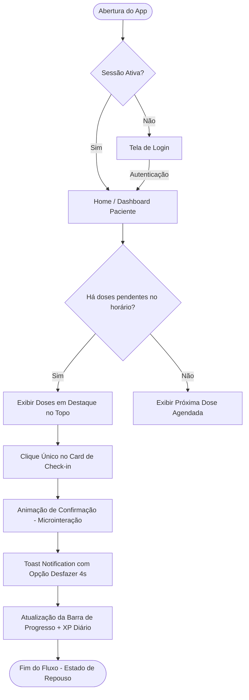
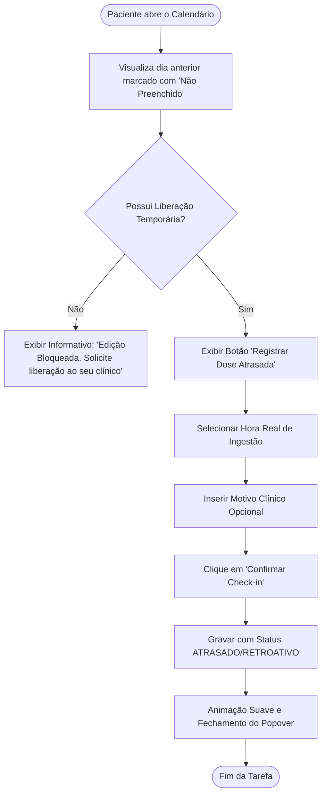

# MANUAL DE ESPECIFICAÇÃO DE EXPERIÊNCIA DO USUÁRIO (UX)
## Sistema SaaS para Acompanhamento de Tratamentos Clínicos Integrativos

---

## 1. Personas & Jobs-To-Be-Done (JTBD)

Para guiar toda a experiência de interação do produto, a equipe multidisciplinar definiu uma persona principal com base no perfil demográfico e psicográfico majoritário dos pacientes da clínica integrativa, além de mapear as reais motivações de uso através da metodologia *Jobs-To-Be-Done*.

### 1.1 Persona Principal: Dra. Mariana Costa (Paciente)
*   **Perfil Demográfico:** Mulher, 38 anos, dermatologista ou advogada autônoma, casada, 1 filho.
*   **Cenário de Saúde:** Tratando melasma crônico e inflamação subclínica crônica (fadiga, distensão abdominal).
*   **Comportamento Tecnológico:** Utiliza iPhone 15 Pro, adepta de aplicativos minimalistas e produtivos (Notion, Todoist, Headspace). Possui baixo limiar para aplicativos lentos, poluídos ou com excesso de notificações.
*   **Rotina Diária:** Extremamente corrida. Acorda cedo, divide-se entre atendimentos, reuniões, academia e família.
*   **Necessidades & Dores:**
    *   *Esquecimento:* Frequentemente esquece de tomar os suplementos prescritos nos horários intermediários (meio da tarde/trabalho).
    *   *Ansiedade de Controle:* Sente culpa ou frustração quando perde um dia de tratamento, o que por vezes a faz abandonar o protocolo no meio (efeito "tudo ou nada").
    *   *Autoestima:* Quer ver resultados estéticos e de disposição física rapidamente, mas sabe que tratamentos integrativos levam tempo.

```
                  ┌────────────────────────────────────────────────────────┐
                  │                 MARIANA COSTA (38 anos)                │
                  ├────────────────────────────────────────────────────────┤
                  │ "Minha rotina é insana. Se o aplicativo me cobrar com  │
                  │ culpa ou for difícil de mexer, eu simplesmente deleto." │
                  └────────────────────────────────┬───────────────────────┘
                                                   │
         ┌─────────────────────────────────────────┼─────────────────────────────────────────┐
         ▼                                         ▼                                         ▼
┌───────────────────┐                     ┌───────────────────┐                     ┌───────────────────┐
│     MOTIVAÇÃO     │                     │     GARGALO UX     │                     │  PONTO DE ENCANTO  │
│ Resgatar a        │                     │ Aplicativo poluir │                     │ Sentir progresso  │
│ autoestima e      │                     │ a tela ou exigir  │                     │ visual e ter      │
│ desinflamar.      │                     │ cliques demais.   │                     │ retorno positivo. │
└───────────────────┘                     └───────────────────┘                     └───────────────────┘
```

### 1.2 Jobs-To-Be-Done (JTBD)
*   **Job Principal (Funcional):** "Quando eu estiver na minha rotina de trabalho agitada, quero uma forma rápida e sem atrito de registrar que tomei minha suplementação, para que eu possa manter a consistência do tratamento sem perder o foco nas minhas tarefas profissionais."
*   **Job Secundário (Emocional/Pessoal):** "Quando eu olhar para o meu dia, quero sentir que estou cuidando ativamente de mim e progredindo na minha saúde, eliminando a culpa de esquecer minhas obrigações clínicas."
*   **Job Social:** "Quando eu retornar à consulta médica, quero poder provar minha consistência de consumo para o médico com orgulho e transparência, validando meu esforço e o investimento no tratamento."

---

## 2. Jornada Emocional & Mapeamento de 90 Dias

A jornada do paciente dura exatamente 90 dias (ciclo comum em tratamentos integrativos). Mapeamos a flutuação de ânimo do usuário para desenhar gatilhos de suporte adequados nos momentos críticos de vulnerabilidade.

```
Humor/
Engajamento
  ▲
5 │   (1) Início           (3) O Platô              (5) Reta Final
4 │     ┌───┐                 ▲                       ┌───┐
3 │    ┌┘   └┐                │ (Apoio Cognitivo)    ┌┘   └┐
2 │   ┌┘     └┐              ┌┴──────┐              ┌┘     └┐ (6) Conclusão
1 │  ┌┘       └┐            ┌┘       └┐            ┌┘       └─►
0 └──┼─────────┼────────────┼─────────┼────────────┼───────────► Tempo (Dias)
   Dia 1     Dia 7        Dia 30    Dia 45       Dia 80      Dia 90
            (2) O Declínio           (4) Hábito Consolidado
```

### 2.1 Mapeamento das Fases da Jornada

#### Fase 1: O Primeiro Acesso (Dia 1 a 3)
*   **Estado Emocional:** Empolgação alta combinada com ansiedade moderada. Expectativa de mudança de vida, mas receio de não conseguir cumprir o protocolo.
*   **Ações do Usuário:** Efetuar o primeiro login, explorar o protocolo e ver a lista de suplementos.
*   **Oportunidade UX:** *Onboarding de Acolhimento.* Reduzir a ansiedade simplificando a interface. Apresentar mensagens de boas-vindas curtas e focadas no autocuidado, sem jargões médicos opressores.

#### Fase 2: O Declínio da Novidade (Dia 7 a 14)
*   **Estado Emocional:** Fadiga da rotina. O aplicativo deixa de ser "novidade" e passa a disputar atenção com a rotina diária. Ocorrem os primeiros esquecimentos.
*   **Ações do Usuário:** Realizar check-ins tardios, esquecer doses.
*   **Oportunidade UX:** *Gatilhos de Empatia.* Notificações personalizadas inteligentes e não punitivas. O app não exibe mensagens de erro graves; em vez disso, sugere formas suaves de reajuste ("Mariana, que tal deixar seu frasco de Magnésio ao lado da sua garrafa de água para facilitar?").

#### Fase 3: O Platô Invisível (Dia 30 a 45)
*   **Estado Emocional:** Desânimo latente. Os resultados visuais do tratamento (melasma/desinflamação) ainda são sutis ou oscilantes, e o esforço diário parece não ter recompensa visível. Alto risco de abandono.
*   **Ações do Usuário:** Redução na frequência de check-ins diários.
*   **Oportunidade UX:** *Visualização de Progresso Indireto.* Destacar métricas acumuladas (ex: "Você já consumiu 120 cápsulas de nutrientes essenciais para sua pele!"). A gamificação silenciosa destaca a consistência acumulada e não a perfeição diária (Endowed Progress Effect).

#### Fase 4: O Hábito Consolidado (Dia 45 a 79)
*   **Estado Emocional:** Estabilidade e autonomia. O ato de registrar torna-se mecânico e rápido.
*   **Ações do Usuário:** Check-ins rápidos na janela de tolerância correta.
*   **Oportunidade UX:** *Foco na Eficiência.* Garantir a velocidade extrema da tarefa. Reduzir ao máximo telas intermediárias ou pop-ups. O fluxo deve demorar menos de 3 segundos (Lei de Hick).

#### Fase 5: Conclusão & Evolução (Dia 80 a 90)
*   **Estado Emocional:** Orgulho e ansiedade pré-consulta. Expectativa de avaliação clínica e consolidação dos resultados.
*   **Ações do Usuário:** Consulta de gráficos históricos e exportação de dados de adesão.
*   **Oportunidade UX:** *Peak-End Rule.* Celebrar o encerramento do ciclo com uma retrospectiva rica e visualmente deslumbrante (estilo Spotify Wrapped), gerando desejo de renovação do protocolo no próximo ciclo clínico.

---

## 3. Fluxos de Navegação e Tarefas (User Flows & Task Flows)

### 3.1 User Flow Geral (Do Login ao Check-in)
Este diagrama demonstra o caminho que o paciente percorre ao abrir o aplicativo para registrar a ingestão de um suplemento:



### 3.2 Task Flow: Registro de Check-in Retroativo Autorizado
Se o paciente perdeu a janela de registro e teve uma chave de liberação concedida pelo Administrador, o fluxo comporta o preenchimento retroativo:



---

## 4. Ergonomia Cognitiva & Gestalt

Para garantir que o aplicativo atenda a mulheres de 25 a 55 anos que possuem rotinas sobrecarregadas, aplicamos regras estritas de redução de esforço mental.

### 4.1 Redução de Esforço Mental e Leis de Design

#### Lei de Hick (Tempo de Decisão)
*   *Aplicação no App:* A tela inicial do paciente não possui menus suspensos complexos. Se existem 3 suplementos a serem tomados no período da manhã, o app exibe apenas esses 3 cartões proeminentes. O botão de ação primária é único ("Marcar todos" ou toque individual no card). Não há tomada de decisão sobre configuração ou navegação secundária no fluxo de check-in.

#### Lei de Miller (Capacidade de Memória de Trabalho)
*   *Aplicação no App:* Nunca exibimos mais do que 5 elementos de dados principais simultaneamente em uma visualização. A tela Home é estruturada em blocos funcionais claros:
    1. Status do dia (Progresso de hoje).
    2. Bloco de ação (Suplementos da vez).
    3. Gamificação discreta (Streak + XP).
    4. Menu de Navegação inferior simplificado (Home, Calendário, Perfil).

#### Princípio da Proximidade (Gestalt)
*   *Aplicação no App:* O horário do suplemento, o nome da substância e a dosagem são agrupados visualmente dentro do mesmo cartão físico, com espaçamento interno curto (`padding: 16px`) e margem externa maior (`margin-bottom: 12px`), permitindo ao cérebro ler o conjunto como uma única instrução de dosagem instantaneamente.

#### Princípio da Similaridade (Gestalt)
*   *Aplicação no App:* Todos os elementos interativos primários (botões de check-in) usam a mesma cor característica do sistema (Emerald Green). Elementos informativos não clicáveis usam cinza e tons pastéis. Isso cria um mapa visual imediato: se tem cor viva, serve para interagir.

#### Princípio da Continuidade (Gestalt)
*   *Aplicação no App:* O progresso semanal de check-ins é exibido em uma linha horizontal fluida de círculos que se interligam por uma barra de cor. Se o paciente completa um dia, a linha estende a cor Emerald para o círculo seguinte, estimulando visualmente o cérebro a desejar completar o circuito gráfico da semana.

---

## 5. Psicologia Comportamental & Formação de Hábitos Saudáveis

O design do sistema apoia-se em conceitos científicos de psicologia comportamental com foco exclusivo em **apoio terapêutico ético**, rejeitando qualquer padrão obscuro de indução ao vício digital.

```
                           [ 1. GATILHO (Trigger) ]
                           Interno: Desejo de saúde
                           Externo: Notificação suave
                                     │
                                     ▼
     [ 4. INVESTIMENTO ]                          [ 2. AÇÃO (Action) ]
     Inserir motivo clínico;                     Toque rápido de 1 clique;
     Personalizar horários.                      Redução extrema de barreiras.
                                     ▲
                                     │
                          [ 3. RECOMPENSA VARIÁVEL ]
                          XP de progresso;
                          Micro-animação de bem-estar.
```

### 5.1 Aplicação das Teorias Comportamentais

*   **Hook Model (Nir Eyal):**
    *   *Gatilho:* O gatilho externo é uma notificação não invasiva com base na agenda diária. O gatilho interno é o desejo de cuidar da própria pele e saúde.
    *   *Ação:* O clique no card para efetuar o check-in ocorre sem barreiras (sem formulários ou perguntas de humor obrigatórias no momento da ingestão).
    *   *Recompensa Variável:* O ganho de XP e a animação do streak. Para manter a recompensa variável (não monótona), o app exibe mensagens de apoio clínico que mudam de acordo com o progresso do tratamento (ex: curiosidades sobre os benefícios do suplemento que está sendo ingerido na pele).
    *   *Investimento:* O paciente investe no app ao customizar suas preferências de horários e registrar dados adicionais opcionais (como fotos de evolução facial), aumentando o custo de saída do sistema.
*   **BJ Fogg Behavior Model ($B = MAP$):**
    *   *Motivation (Motivação):* Elevada no início e reabastecida pelos dados do progresso visível na Home.
    *   *Ability (Habilidade/Simplicidade):* Maximizada. Registrar o consumo requer apenas 1 clique físico na tela. Não há necessidade de digitação de textos ou navegação complexa de menus.
    *   *Prompt (Gatilho):* Notificações contextuais disparadas rigorosamente nos horários das dosagens.
*   **Tiny Habits (Pequenos Hábitos):**
    *   O app incentiva o comportamento âncora: "Depois que eu escovar os dentes pela manhã, vou abrir o app e tomar meu suplemento matinal". O design minimalista facilita a associação desse hábito simples com a rotina existente.
*   **Goal Gradient Effect (Efeito Gradiente de Meta):**
    *   O paciente acelera seu esforço à medida que se aproxima de concluir uma meta. Por isso, dividimos os 90 dias em "Ciclos Semanais" e "Etapas Mensais". Completar um ciclo de 7 dias parece muito mais alcançável e gera mais dedicação do que focar no objetivo distante do 90º dia.
*   **Zeigarnik Effect (Efeito Zeigarnik):**
    *   Tarefas incompletas geram tensão mental. Deixar um dia com check-in pendente em aberto (exibido como um círculo com contorno pontilhado no calendário) gera uma discreta necessidade de fechamento cognitivo no usuário, incentivando-o a realizar o check-in das doses restantes do dia.
*   **Peak-End Rule (Regra do Pico-Fim):**
    *   As pessoas avaliam as experiências com base em como se sentiram no pico (melhor/pior momento) e no final. Os "picos" são desenhados para os marcos de 30 dias (animação especial celebrando a marca) e o "fim" é a retrospectiva do tratamento aos 90 dias, fechando a jornada com chave de ouro e orgulho.
*   **Endowed Progress Effect (Efeito do Progresso Concedido):**
    *   Ao iniciar o tratamento, a barra de progresso da primeira semana já começa com uma dose preenchida fictícia simbolizando a "Consulta de Início com o Clínico", reduzindo a barreira de saída do ponto zero e fazendo o paciente sentir que já iniciou o progresso.
*   **Loss Aversion (Aversão à Perda) - Aplicação Ética:**
    *   Se o paciente quebrar o streak, **nunca** exibimos mensagens tristes, alertas de falha ou sons de perda. O streak apenas congela ou reseta discretamente, e o app exibe uma mensagem de apoio acolhedora ("Mariana, a vida é dinâmica. O importante é a sua consistência geral. Que tal recomeçarmos hoje com calma?").

---

## 6. Sistema de Recompensa Discreta (Gamificação Elegante)

Para evitar infantilizar o aplicativo (com visual de desenho animado ou mecânicas de jogos infantis que afastam o perfil de mulheres executivas), a gamificação é aplicada de forma **adulta e refinada**, utilizando conceitos de bem-estar e progresso pessoal.

```
       ────────────────────────────────────────────────────────
       MARIANA COSTA • Nível 4 (Clínico Integrativo)
       ────────────────────────────────────────────────────────
       Streak Atual: 🔥 14 Dias   Adesão Geral: 📈 94%
       
       Hoje:
       [✔] Melatonina (22:00) ─────────────── +10 XP
       
       Progresso Semanal:
       ( Seg )  ( Ter )  ( Qua )  ( Qui )  ( Sex )  ( Sab )  ( Dom )
         ●        ●        ●        ●        ○        ○        ○
       ────────────────────────────────────────────────────────
```

### 6.1 Mecânicas de Engajamento Refinado
*   **XP (Pontos de Experiência):** Representa "Pontos de Consistência". Cada check-in no horário correto concede 10 XP. Check-ins com atraso (fora da janela tolerável) concedem 5 XP. Acumular XP eleva o "Nível de Consistência" do paciente (ex: Nível 1: Iniciante Consistente; Nível 4: Ritmo Consolidado).
*   **Streak (Consistência Diária):** Exibido na tela através de um pequeno ícone de chama minimalista com um número (ex: 🔥 12 dias). O streak representa a quantidade de dias consecutivos nos quais o paciente realizou o consumo de todas as doses prescritas para o dia.
*   **Achievements (Conquistas Clínicas):** Medalhas virtuais de design refinado em tons dourados/pastéis que celebram marcos:
    *   *Consistência Prata:* 15 dias ininterruptos de tratamento.
    *   *Pontualidade de Ouro:* Uma semana inteira sem check-ins atrasados.
    *   *Superação:* Realizar check-in mesmo em finais de semana (historicamente o período de maior esquecimento).
*   **Percentuais de Progresso:** Um painel circular elegante que indica o percentual geral de adesão ao tratamento (ex: 92%). Manter o percentual acima de 85% é classificado visualmente como "Excelente", ajudando a focar na consistência média ao invés da busca impossível pela perfeição de 100%.

### 6.2 Microinterações de Confirmação (Feedback Dopaminérgico)
*   **A Ação do Toque:** Ao pressionar o botão de check-in, a cor do botão transiciona suavemente de um verde Emerald opaco para um preenchimento Emerald brilhante com um ícone de marcação `check` que surge de dentro para fora com uma escala suave (`scale(1.1)` reduzindo para `1.0`).
*   **Frequência Sonora:** Caso o som esteja ativado nas configurações do app, o toque de sucesso emite um tom sutil, agudo e relaxante, semelhante ao aviso de confirmação de pagamento do Apple Pay (duração de 150ms).
*   **Feedback Háptico (Vibração no Celular):** Dispara uma vibração curta e suave do motor háptico do aparelho (padrão `Light Impact` no iOS / `haptic feedback` do Android), gerando uma resposta física satisfatória ao toque de conclusão.

---

## 7. Arquitetura da Home e Layout de Componentes

O layout da interface do paciente prioriza a legibilidade de dados clínicos e a acessibilidade visual de forma limpa e organizada.

```
┌────────────────────────────────────────────────────────┐
│  (Foto)  Olá, Mariana!                     🔥 14 Dias  │
│  "Cada dia é um novo passo na sua jornada."           │
├────────────────────────────────────────────────────────┤
│  ADESÃO HOJE                                  ( 75% )  │
│  [===========================>         ]               │
├────────────────────────────────────────────────────────┤
│  SUAS DOSES DE HOJE                                    │
│                                                        │
│  ┌──────────────────────────────────────────────────┐  │
│  │ 08:00  •  Melasma Care (Clareador)               │  │
│  │ 1 Cápsula ── Comer com alimentos                 │  │
│  │                                  [ TOMADO ✔ ]    │  │
│  └──────────────────────────────────────────────────┘  │
│  ┌──────────────────────────────────────────────────┐  │
│  │ 22:00  •  Magnésio + Inositol                    │  │
│  │ 1 Sachê ── Diluir em água morna                   │  │
│  │                                  [ TOMAR DADO ]  │  │
│  └──────────────────────────────────────────────────┘  │
├────────────────────────────────────────────────────────┤
│  CALENDÁRIO                                            │
│  ( S )   ( T )   ( Q )   ( Q )   ( S )   ( S )   ( D ) │
│   ●       ●       ●       ●       ○       ○       ○    │
└────────────────────────────────────────────────────────┘
```

### 7.1 Seções Críticas da Interface (Home)

#### 1. Cabeçalho de Identificação & Humor (Acolhimento)
*   *Componente:* Foto de perfil em círculo pequeno no canto esquerdo superior, seguida pela saudação do paciente. No lado direito, o indicador numérico discreto do Streak atual (ex: 🔥 14). Abaixo, uma frase clínica acolhedora e rotativa que muda diariamente para quebrar a monotonia visual.

#### 2. Indicador Circular / Barra de Progresso do Dia
*   *Componente:* Exibe visualmente o percentual de tarefas completas do dia atual.
*   *Justificativa:* Fornece feedback em tempo real sobre o cumprimento da meta do dia, reduzindo a sensação de perda de controle.

#### 3. Lista Dinâmica de Doses Atuais (O Coração da Home)
*   *Componente:* Cartões que representam cada suplemento prescrito. Os cartões são ordenados cronologicamente. 
    *   *Estado Pendente:* Borda fina verde, fundo limpo, botão de ação destacado em verde.
    *   *Estado Concluído:* Fundo com tom pastél de verde, texto do suplemento tachado de forma sutil, botão de ação substituído pelo texto "Ingerido às HH:MM" com um ícone de check.

#### 4. Calendário Semanal Compacto
*   *Componente:* Exibe os 7 dias da semana corrente. Dias com 100% de adesão ganham um círculo verde cheio; dias com check-ins pendentes ou atrasados ganham um indicador circular pastél ou amarelo de tolerância. Dias futuros são exibidos em cinza claro fosco, sem sinalizadores de bloqueio agressivos.

---

## 8. Estratégia de Notificações Inteligentes & Empáticas

As notificações no sistema são tratadas como **intervenções de apoio clínico** e não como cobranças automáticas. O tom é sempre respeitoso, calmo e prático.

```
       ┌────────────────────────────────────────────────────────┐
       │   🔔 APLICATIVO SAÚDE INTEGRATIVA                      │
       │                                                        │
       │   Mariana, hora do seu Melasma Care (08:00).           │
       │   Que tal tomar junto com o seu café da manhã?         │
       └────────────────────────────────────────────────────────┘
```

### 8.1 Cadência e Fluxo de Escala de Notificações

#### 1. Alerta Preventivo (5 minutos antes)
*   *Cenário:* O paciente possui uma dose complexa que necessita de preparo (ex: diluir sachê, tomar em jejum).
*   *Mensagem:* "Mariana, seu Magnésio Inositol está programado para às 22:00. Lembre-se de diluir em água morna."
*   *Tom:* Informativo, organizador.

#### 2. Alerta de Horário (No Horário Exato)
*   *Cenário:* Disparo de notificação push padrão de toque rápido.
*   *Mensagem:* "Hora do seu Melasma Care (08:00). Que tal tomar agora para manter sua consistência de hoje?"
*   *Ação Rápida (Interactive Notification):* O paciente pode tocar na própria notificação e selecionar "Marcar como Tomado" sem precisar abrir a tela cheia do aplicativo.

#### 3. Alerta de Atraso Suave (30 minutos após)
*   *Cenário:* O paciente não realizou o check-in do horário previsto.
*   *Mensagem:* "Mariana, notamos que o horário do seu suplemento das 08:00 passou. Se já tomou, registre aqui para não perder seu progresso diário."
*   *Tom:* Neutro, lembrete amigável sem teor de punição.

#### 4. Resumo de Fechamento do Dia (21:30 - se houver pendências)
*   *Cenário:* O paciente completou algumas doses, mas esqueceu a do meio do dia.
*   *Mensagem:* "Mariana, você concluiu 2 de suas 3 doses de hoje. Que tal fechar seu dia com consistência tomando sua última dose agora?"
*   *Tom:* Incentivador, de fechamento de ciclo.

---

## 9. Painéis Administrativos & Visões de Controle (Dashboards)

### 9.1 Dashboard do Paciente: Redução da Ansiedade Clínica
Para evitar que o paciente desanime ao deparar-se com dias não preenchidos no histórico, o dashboard foca no indicador de **Adesão Acumulada** ao invés de destacar os dias de falha.
*   *Aba de Estatísticas:* Exibe um gráfico de linhas suaves (Spline Chart) que demonstra a tendência de consistência semanal. Dias sem preenchimento são representados por uma quebra neutra na linha, e não por ícones de "X" vermelho de erro.
*   *Destaque Positivo:* O app parabeniza o paciente em texto destacado quando ele atinge marcas como "80% de consistência na última semana".

### 9.2 Dashboard do Administrador (Gestão de Adesão Clínica)
O painel administrativo deve oferecer visualização rápida e inteligência de dados clínicos para intervenção proativa do profissional de saúde.

```
┌──────────────────────────────────────────────────────────────────────────┐
│  DASHBOARD CLÍNICO DE ADESÃO                                             │
├──────────────────────────────────────────────────────────────────────────┤
│  PACIENTES ATIVOS (120)    ALERTA DE ABANDONO (4)    EXCELENTE ADESÃO (82)│
├──────────────────────────────────────────────────────────────────────────┤
│  LISTA DE PACIENTES                                                      │
│  [ Buscar paciente... ]                                [ Filtros ▾ ]     │
│                                                                          │
│  Nome             Protocolo        Adesão Geral   Último Check-in        │
│  Mariana Costa    Melasma Care     94% (Ótimo)    Hoje - 08:00           │
│  Ana Julia Paiva  Desinflamação    52% (Crítico)  Há 3 dias ⚠️           │
│  Carla Souza      Melasma Forte    89% (Bom)      Ontem - 21:00          │
└──────────────────────────────────────────────────────────────────────────┘
```

#### Recursos Administrativos Essenciais:
*   **Filtro "Alerta de Abandono":** Lista automaticamente no topo os pacientes que não realizam check-ins há mais de 48 horas seguidas, permitindo que a clínica entre em contato preventivo via WhatsApp para dar suporte.
*   **Busca Rápida de Pacientes:** Input inteligente com pesquisa imediata (*on-the-fly*) por nome, e-mail ou telefone.
*   **Visualizador de Frequência de Sintomas (Opcional):** Gráfico mostrando o cruzamento de check-ins realizados com a evolução de relatos de melhora do paciente (se habilitado).

---

## 10. WCAG 2.2 & Diretrizes de Acessibilidade Digital

O sistema atende a requisitos estritos de acessibilidade digital de acordo com as diretrizes do WCAG 2.2 no nível AA.

### 10.1 Implementação Técnica de Acessibilidade
*   **Contraste de Cores (WCAG AA):** Todas as combinações de cores de textos sobre fundo garantem uma taxa de contraste mínima de 4.5:1. Textos grandes (acima de 18pt) mantêm taxa mínima de 3:1.
    *   *Texto primário (#0F172A) sobre fundo claro (#F8FAFC) = Contraste 19.3:1 (Supera o WCAG).*
    *   *Verde Emerald (#10B981) sobre fundo escuro (#020617) = Contraste 6.4:1 (Aprovado).*
*   **Tamanho de Alvos de Toque (Touch Targets):** Todos os elementos interativos clicáveis possuem dimensões mínimas de 48px por 48px, com espaçamento livre de no mínimo 8px entre eles, prevenindo toques acidentais em telas pequenas (muito importante para o público acima de 50 anos).
*   **Suporte a Leitores de Tela (ARIA Attributes):** Cards e botões possuem tags de acessibilidade semântica. O botão de check-in é lido pelo leitor de tela do celular (VoiceOver/TalkBack) como: `button, marcar suplemento Melasma Care como ingerido`.
*   **Acessibilidade de Daltonismo (Color Blindness Support):** Nunca confiamos exclusivamente nas cores vermelha e verde para indicar status de erro ou sucesso. Ícones claros de marcação (check) ou alerta (triângulo com exclamação) sempre acompanham as variações de cores para fornecer o contexto de forma clara e acessível.
*   **Motion Reduced Support (Acessibilidade de Movimento):** O código CSS do frontend respeita a diretiva `@media (prefers-reduced-motion: reduce)`. Caso o sistema operacional do usuário esteja configurado para reduzir animações, todas as transições de tela e efeitos de gamificação (confetes) são ocultados instantaneamente.

---

## 11. Estados das Telas & Tratamento de Cenários Alternativos

Telas vazias ou de erro são desenhadas de forma a não estressar ou culpar o usuário, mantendo-o sempre no controle da situação.

```
┌────────────────────────────────────────────────────────┐
│  ⚠️  CONEXÃO INSTÁVEL                                  │
│                                                        │
│  Mariana, notamos que você está sem internet no        │
│  momento.                                              │
│                                                        │
│  Não se preocupe: você pode fazer seu check-in         │
│  normalmente. Salvaremos os dados no seu aparelho      │
│  e sincronizaremos assim que a rede voltar.            │
│                                                        │
│  [ ENTENDIDO, PROSSEGUIR ]                             │
└────────────────────────────────────────────────────────┘
```

### 11.1 Cenários Detalhados

#### 1. Estado Sem Conexão (Offline Mode)
*   *Comportamento UX:* O aplicativo exibe uma pequena barra no topo de cor amarela pastel com a frase "Modo Sincronização Local ativo". O usuário pode clicar no check-in normalmente. O app armazena a alteração no `IndexedDB` e exibe uma animação de "Fila de sincronização ativa".

#### 2. Estado Sem Dados (Empty State de Início)
*   *Cenário:* O paciente realizou o login, mas o administrador ainda não associou nenhum protocolo de tratamento à conta dele.
*   *Comportamento UX:* Exibir ilustração minimalista de boas-vindas com a mensagem: "Olá, Mariana! Seu médico está preparando seu protocolo personalizado. Você receberá um alerta assim que ele estiver disponível por aqui."

#### 3. Estado de Loading Esqueleto (Skeleton Screens)
*   *Comportamento UX:* Em conexões mais lentas, ao invés de exibir um spinner giratório genérico de carga que aumenta a percepção de tempo de espera do usuário, exibimos blocos cinzas pulsantes que emulam o formato exato dos cards dos suplementos, preparando o cérebro do usuário para a estrutura da informação que está carregando.

---

## 12. Diretrizes de Escrita UX (UX Writing Guidelines)

O tom de voz do aplicativo é **Acolhedor, Seguro, Prático e Positivo**. Evitamos tons imperativos ("Você deve", "Obrigatório") e termos puramente corporativos ou técnicos hospitalares.

### 12.1 Matriz de Tradução de Linguagem (Antes vs Depois)

| Tom Antigo (Hospitalar/Cobrança) | Tom Novo (Acolhedor/Focado em Saúde) | Racional do Design UX |
| :--- | :--- | :--- |
| "Acesso negado: Senha inválida. Tente novamente." | "Senha incorreta. Quer que te enviemos um link de acesso por e-mail para facilitar?" | Reduz a frustração do erro, oferecendo uma alternativa rápida de recuperação de acesso. |
| "Atraso detectado! Você perdeu o horário do suplemento." | "Seu suplemento das 08:00 está aguardando registro. Se já tomou, pode confirmar agora." | Remove o caráter punitivo de atraso e foca no registro amigável da dose. |
| "ERRO: Falha ao salvar no banco de dados." | "Estamos com uma instabilidade técnica temporária. Seus dados estão salvos no celular por segurança." | Elimina termos técnicos alarmistas e passa sensação de segurança. |
| "Você concluiu 100% das obrigações." | "Você completou seu protocolo de hoje! Ótimo cuidado com a sua saúde." | Substitui o peso de "obrigação" pela valorização positiva do autocuidado. |

---

## 13. Auditoria de Qualidade de UX baseada nas Heurísticas de Nielsen

Realizamos uma varredura completa do modelo de experiência projetado confrontando-o com as 10 heurísticas clássicas de usabilidade de Jakob Nielsen.

### 13.1 Auditoria Sistemática

#### Heurística #1: Visibilidade do estado do sistema
*   *Implementação:* O paciente sempre sabe seu progresso diário através da barra de evolução que atualiza em tempo real com animação a cada check-in de suplemento.

#### Heurística #2: Correspondência entre o sistema e o mundo real
*   *Implementação:* O aplicativo exibe os suplementos associando-os com ícones fáceis de assimilar da vida real (ex: xícara de café para suplementos da manhã, sol para tarde e lua para noite), além de permitir o uso de dosagens reais informadas pelo médico ("1 sachê", "2 gotas") ao invés de códigos genéricos.

#### Heurística #3: Controle e liberdade do usuário
*   *Implementação:* Se o usuário clicar no check-in por engano, uma barra flutuante (Toast) surge na parte inferior com um botão claro de "Desfazer" ativo por 4 segundos, permitindo a reversão imediata da ação sem burocracias.

#### Heurística #4: Consistência e padrões
*   *Implementação:* O app utiliza componentes UI baseados no Material Design 3 e nas diretrizes do Apple Human Interface Guidelines. O botão de fechamento ou avanço sempre se comporta de forma idêntica em todas as telas.

#### Heurística #5: Prevenção de erros
*   *Implementação:* O botão de check-in muda visualmente de estado após o clique e é bloqueado temporariamente (throttle) para evitar que toques trêmulos ou múltiplos cliques registrem o mesmo consumo duas vezes.

#### Heurística #6: Reconhecer em vez de lembrar
*   *Implementação:* O cartão do suplemento exibe todas as informações cruciais de uso (dosagem, instrução de ingestão, horário) visíveis diretamente, eliminando a necessidade do paciente ter que lembrar das recomendações do médico ou ter que abrir a receita em PDF.

#### Heurística #7: Flexibilidade e eficiência de uso
*   *Implementação:* Pacientes experientes podem fazer o check-in em lote com um único clique no topo da lista se tomarem tudo junto. Pacientes novos podem ler o passo a passo individual detalhado.

#### Heurística #8: Estética e design minimalista
*   *Implementação:* O design segue padrões estéticos limpos ("Apple Style"), livre de banners, propagandas ou painéis complexos. Espaços vazios generosos guiam o olho do usuário para as tarefas cruciais de hoje.

#### Heurística #9: Auxiliar os usuários a reconhecer, diagnosticar e recuperar-se de erros
*   *Implementação:* Mensagens de erro de login explicam claramente o que houve (ex: "E-mail não cadastrado") e oferecem botão direto de contato de suporte via WhatsApp com a clínica.

#### Heurística #10: Ajuda e documentação
*   *Implementação:* O app conta com uma aba simples de perguntas frequentes estruturada de maneira amigável, além de acesso rápido ao contato de suporte direto com os gestores do sistema.

---

## 14. Métricas de Sucesso e Plano de Testes de Usabilidade

Para garantir que a experiência do usuário de fato gere engajamento, definimos um painel de métricas analíticas e um cronograma de testes práticos de validação.

### 14.1 Indicadores Chave de UX (UX KPIs)
*   **Tempo Médio de Check-in (TMC):** O tempo gasto pelo paciente para abrir o app e concluir o registro não deve passar de 4 segundos na média diária.
*   **Taxa de Conclusão Diária (TCD):** Mede a porcentagem de pacientes ativos que cumprem 100% de seus check-ins prescritos no dia. Nossa meta de adesão clínica é manter a média geral acima de 80%.
*   **Retenção Semanal (D7) e Mensal (D30):** Percentual de usuários que abrem o app semanalmente e após 30 dias do início do tratamento. O foco é manter o D30 acima de 75%.
*   **NPS (Net Promoter Score) & CSAT (Customer Satisfaction Score):** Coletados por pesquisas curtas enviadas de forma discreta dentro do app no 30º e 90º dia de tratamento. A meta de NPS clínico é de no mínimo +70 (Zona de Excelência).

### 14.2 Plano de Validação Prática (Testes com Usuários)
1.  **Testes de Usabilidade Moderados (Fase Alpha):** 5 voluntárias da persona principal (mulheres de 35 a 50 anos) serão convidadas a realizar tarefas comuns (primeiro acesso, marcar check-in atrasado, visualizar progresso) simulando conexões lentas de internet. Observamos pontos de atrito e hesitação de cliques.
2.  **Mapeamento de Calor (Heatmaps - Fase Beta):** Integração de ferramenta analítica leve (respeitando LGPD, ocultando qualquer dado pessoal) para registrar as áreas da Home mais tocadas pelo dedão, validando a ergonomia da tela.
3.  **Testes A/B na Notificação Push:** Envio de duas variantes de textos de notificação para grupos distintos de pacientes (Grupo A: tom informativo curto; Grupo B: tom contextual empático), avaliando qual variante converte mais cliques rápidos de check-in sem aumentar a taxa de silenciamento do aplicativo.

---
> Manual de UX homologado pela equipe de design de produto. Pronto para servir de referência na etapa de desenvolvimento de front-end.
